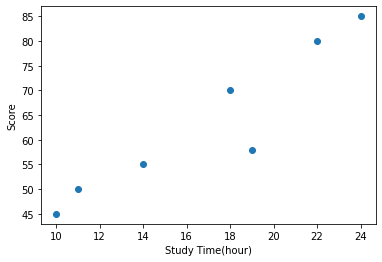
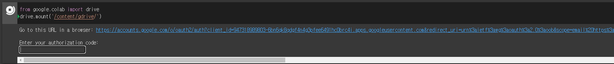
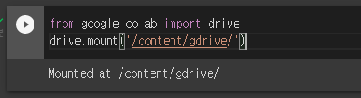
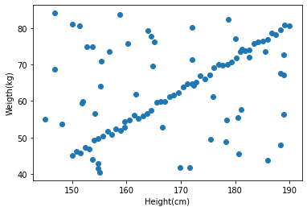
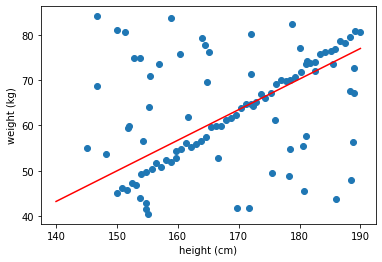

# PyTorch를 활용한 Tensor 개념

---

### PyTorch란?

> PyTorch는 Python을 위한 오픈소스 머신 러닝 라이브러리이다. Torch를 기반으로 하며, 자연어 처리와 같은 애플리케이션을 위해 사용된다. GPU 사용이 가능하기 때문에 속도가 상당히 빠르고 Tensorflow의 사용자도 많지만, 비관적인 구조와 난이도 때문에 Pytorch 사용자도 늘어나고 있는 추세이다.

PyTorch에는 두 가지 주요한 특징이 있다.

* Numpy와 유사하지만 GPU 상에서 실행 가능한 n-차원 Tensor (50배 이상 차이)
* 신경망을 구성하고 학습하는 과정에서의 자동 미분 (Automatic differentiation)


## PyTorch 패키지의 기본 구성

### 1. Torch

- 메인 네임스페이스이다. 텐서 등의 다양한 수학 함수가 포함되어져 있으며 Numpy와 유사한 구조를 가진다.

### 2. torch.autograd

* 자동 미분을 위한 함수들이 포함되어져 있다. 자동 미분의 on/off를 제어하는 콘텍스트 매니저 (enable_grad / no_grad)나 자체 미분 가능 함수를 정의할 때 사용하는 기반 클래스인 `Function` 등이 포함되어져 있다.

### 3. torch.nn

* 신경망을 구축하기 위한 다양한 데이터 구조나 레이어 등이 정의되어져 있다. 예를 들어 RNN, LSTM과 같은 레이어, ReLu와 같은 활성화 함수, MSELoss와 같은 손실 함수들이 있다.

### 4. torch.optim

- 확률적 경사 하강법(Stochastic Gradient Descent, SGD)를 중심으로 한 파라미터 최적화 알고리즘이 구현되어져 있다.

### 5. torch.utils.data

- SGD의 반복 연산을 실행할 때 사용하는 미니 배치용 유틸리티 함수가 포함되어져 있다.

### 6. torch.onnx

- ONNX(Open Neural Network Exchange)의 포맷으로 모델을 export할 때 사용한다. ONNX는 서로 다른 딥 러닝 프레임워크 간에 모델을 공유할 때 사용하는 포멧이다.


## Pytorch dim 확인 및 tensor 생성

```python
import torch
X = torch.rand(3,2,5)
Y = torch.rand(3,5,3)

D = X.matmul(Y) # 행렬 곱 (내적)
print(D)
print(D.shape)
# X.mul(Y)    # X*Y 와 동일. 각 원소 별로 곱하는 연산.
```

### type casting

AI에서는 기본적으로 데이터 타입을 floating 32bit 값들을 자주 쓰인다. 타입이 맞지 않는다면 문제가 생긴다. 따라서 type casting을 잘 해야한다.


## Colab에서 실습

---

### Train data 생성

```python
# Study time
x_train = torch.FloatTensor([[10], [11], [14], [18], [19], [22], [24]])
# Grade
y_train = torch.FloatTensor([[45], [50], [55], [70], [58], [80], [85]])

print(x_train.shape, '|', x_train.dim())

######
# torch.Size([7, 1]) | 2
```


### matplot library 사용

```python
%matplotlib inline 		# jupyter나 colab에서 라이브러리 사용을 위해 inline 설정 필요
import matplotlib.pyplot as plt
```


```python
plt.scatter(x_train, y_train)
plt.xlabel('Study Time(hour)')
plt.ylabel("Score")
plt.show()
```

**시각화 출력**



### 구글 드라이브 Colab 연동

```python
from google.colab import drive
drive.mount('/content/gdrive/')
```



해당 링크에 들어가 인증을 하고 인증 코드가 나오면 복사해서 그대로 입력창에 입력


완료가 된다면



다음과 같이 마운트 되었다는 출력이 생긴다.

이제 데이터를 읽어와야 한다.

```python
import pathlib
# 경로는 구글 드라이브 => 내 드라이브
path = pathlib.Path('/content/gdrive/My Drive/health_data.csv')

data_file = pd.read_csv(path)
data_file.head()
```

해당 데이터는 정제가 되지 않아 데이터가 불완전한 상태이다. 이러한 데이터를 처리하는 전처리 과정이 필요하다.

전처리에 NaN 값은 pandas 라이브러리에서 제공하는 함수를 사용하면 편리하다.

```python
# Null 값 제거
data_file = data_file.dropna(axis=0).reset_index(drop=True)
data_file.head()
```


Pytorch는 기본 데이터 구조가 tensor이기 때문에 csv 파일을 읽어오지 못 한다. 따라서 변환을 해줄 필요가 있다. 해당 health.csv 파일에는 height와 weight라는 매개변수가 있기 때문에 해당 값들을 tensor로 변환해준다.

```python
height = torch.tensor(data_file.height)
weight = torch.tensor(data_file.weight)

x_train = height.view([height.shape[0], 1]).float()
y_train = weight.view([weight.shape[0], 1]).float()
```


랜덤하게 생성 된 데이터를 추가해 주기 위해 생성 후 각 train_data에 concatenate를 시킨다.

heigth의 경우에는 145 ~ 190 사이의 랜덤한 숫자를 넣을 것이고 weight의 경우에는 45에서 85 사이의 랜덤한 숫자 50개를 생성한 후, 이러한 노이즈들이 추가되어도 제대로 된 선형 모델을 찾을 수 있는지 확인하는 과정이다.

```python
x_train = torch.cat((torch.rand(50,1)*45 + 145, x_train), axis = 0)
y_train = torch.cat((torch.rand(50,1)*45 + 40, y_train), axis = 0)
```

이제 랜덤하게 넣어준 노이즈들이 잘 들어갔는지 확인해보자

```python
plt.scatter(x_train, y_train)
plt.xlabel('Height(cm)')
plt.ylabel("Weigth(kg)")
plt.show()
```



선형 그래프를 그리는 데이터와 노이즈들이 잘 들어갔음을 확인할 수 있다. 이제는 학습을 시키며 해당 선형식의 Weight와 Bias를 구해보자.

기존의 임시로 y값 즉, hypothesis를 구하고 이를 학습시키면서 loss 값을 줄이는 최적의 해를 구하는 과정을 진행한다. 현재 데이터에는 Outlier들이 많이 포함되어 있기 때문에 거짓 데이터에 강인한 L1 loss 모델을 사용해서 구해보도록 할 것이다.

```python
iter = 50000    # loss 값을 구하는 횟수로 총 5만번

weight_max = 100    #'[입력범위]'로 random값의 weight 범위 제한 목적 ( -50 < weight < 50 )
bias_max = 150      #오프셋으로 random값의 bias 범위 제한 목적 (-150 < bias < 0)
min_loss = 10000000   #업데이트 된 가장 작은 값의 loss 저장

min_w = 0
min_b = 0

# dataset
x = x_train
y = y_train

def loss_fn(hypo, GT):
    return sum(abs(hypo - GT))

for i in range(iter):
    W = (torch.rand(1) - 0.5) * weight_max    # [-50 ~ 50]
    b = (-torch.rand(1)) * bias_max           # [-150 ~ 0]
    hypothesis = x * W + b

    cur_loss = loss_fn(hypothesis, y)

    if cur_loss < min_loss:
      min_loss = cur_loss
      min_w = W
      min_b = b

print(f'min_loss : {min_loss}')
print(f'min_w : {min_w}')
print(f'min_b : {min_b}')

###################################
'''
min_loss : tensor([832.3812])
min_w : tensor([0.6748])
min_b : tensor([-51.2477])
'''
```

이와 같이 학습시킨 결과를 시각화 해보도록 하자.

```python
x = x_train
y = y_train

plt.scatter(x, y)

t = np.arange(140., 190., 0.001)

plt.plot(t, min_w*t+min_b, 'r')
plt.xlabel('height (cm)')
plt.ylabel('weight (kg)')
plt.show()
```



