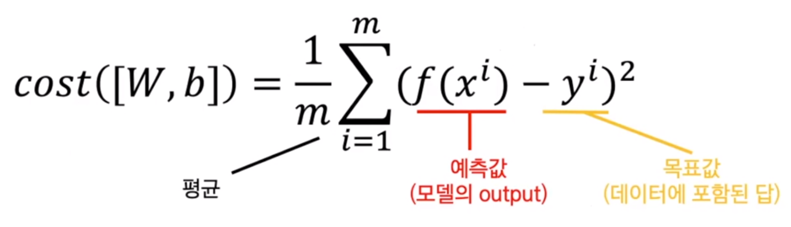
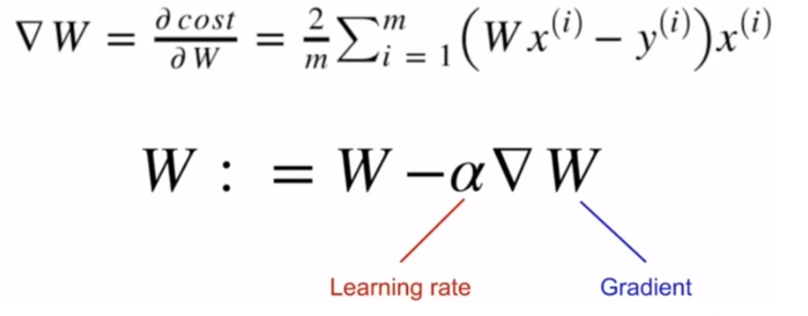

# 04_인공지능 사전학습 02

---

## 기계학습의 구성요소

* 경험 사례 (data)
* 모델 (인공 신경망)
* 평가 기준

### 기계학습이란 무엇인가?

* 함수를 알고 있는 경우 : 해당 공식을 알고 input 값을 넣어주면 연산을 통해 output 값을 알 수 있는 것 (computation / inference) => `V = IR`  or `F = ma`
* input 과 output을 알고 그 사이의 관계인 `f`를 찾는 것 (최적화 => optimization) : 최적화를 통해 찾은 f를 일반화(Generalization) 하는 것

### Gradient Descent (경사하강법)

산을 하산 하는 것과 같이 loss를 줄이는 방법이다. 가장 적은 범위로 찾아 내려가는 방법이다.

어떤 방향으로 Weight를 바꾸면 cost가 떨어지는지를 측정하는 것이다. 그것을 미분하여 찾아가게 되는 것이다. 따라서 최적화된 Weight를 찾아 나가는 과정이다. (Gradient는 현재 방향에서 어떤 위치로 나아갈 것인지, Learning rate는 어떤 방향으로 나아갈 것인지 즉, step size이다.)

* epoch : train dataset 전체를 한번 다  이용하면 1씩 상승
* mini batch : train dataset을 적절하게 나눠 분할된 train set

### Overfitting 예방

* 충분히 많은 양의 데이터
* 모델의 복잡도 줄이기
* 가중치의 Regularization 적용하기
* 드롭아웃 (Drop out) => 랜덤하게 data 값을 0으로 변환

### Machine Learing

Input ==> Feature Extraction ==> Classification ==> Output

### Deep Learning

Input ==> (Feature Extraction & Classification)  ==> Output