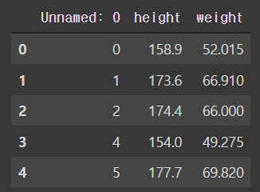
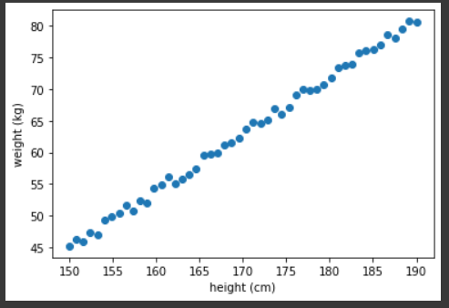
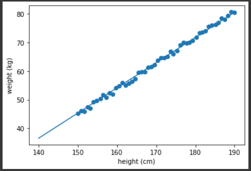

# 05_인공지능 사전 실습 02

---

실습에 들어가기 앞서 **Linear Regression**과 **Logistic Regression**에 대해서 공부하자. 기존에 학부 때 관련 프로젝트도 진행하고 시험을 위해 이론에 대한 공부도 열심히 했으나..... 정말 휘발성이 강하다.... 하나 공부하고 뒤돌아서면 2개 까먹는다.

## Linear Regression (선형 회귀)

> 선형 회귀는 종속 변수(y)와 한 개 이상의 독립 변수(x)와의 선형 상관 관계를 모델링하는 회귀분석 기법이다. 한 개의 설명 변수(x)에 기반한 경우에는 단순 선형 회귀, 둘 이상의 설명 변수에 기반하는 경우에는 다중 선형 회귀라고 한다.

## Logistic Regression (로지스틱 회귀)

> 로지스틱 회귀의 목적은 일반적으로 회귀 분석의 목표와 동일하게 종속 변수와 독립 변수간의 관계를 구체적인 함수로 나타내어 향후 예측 모델에 사용하는 것이다. 하지만 로지스틱 회귀 분석은 종속 변수가 범주형 데이터를 대상으로 하며, 입력 데이터가 주어졌을 때 해당 데이터의 결과가 특정 분류로 나뉘기 떄문에 일종의 Classification 기법으로 볼 수 있다.


### 가설 세우기

실습에 앞서 독립 변수에 따른 종속 변수의 상관관계가 선형적일 것이라는 가정을 한다.
$$
H(x) = Wx + b
$$

```python
hypothesis = x_train * W + b
```


### Cost function(loss)

cost 함수는 가설의 결과(H(x))와 예측 값(y)의 차이를 줄이기 위한 함수로 `linear regression`의 경우 MSE(mean square error)를 사용한다.
$$
cost(W,b) = \frac{1}{m}\sum_{i=1}^m(H(x^i) - y^i)^2
$$

```python
cost = torch.mean((hypothesis - y_train)**2)
```


### Gradient descent

위의 cost 함수로 가설의 결과(y)와 정답과의 차이를 미분하여 (e.g. back-propagation) cost를 줄이는 방향으로 기존 weight에 갱신하게 된다.

Learning rate는 한 번  update 할 때, 해당 기울기로 얼만큼 업데이트 할지 결정하는 하이퍼 파라메터이다.
$$
W := W - \alpha\frac{\partial}{\partial W}cost(W)
$$


## 실습

---

### Data Normalization (데이터 정규화)

기계 학습을 진행하기 전에 데이터 범위를 `normalization`하는 것은 중요하다. 그 이유는 학습을 더 빨리하고 지역 최적의 상태(local optimization)에 빠질 확률을 줄일 수 있는 등 다양한 실용적 이유가 존재한다.

### Normalization

수식 : (요소 값 - 최소 값) / (최대 값 - 최소 값)

설명 : 전체 구간을 0 ~ 1 사이의 값으로 맞춰 준다.

### Standardization

수식 : (요소 값 - 평균) / 표준편차

설명 : 평균은 0 표준편차는
$$
\mu = \frac{1}{m} \sum_{i=1}^{m}x^i
$$

$$
x := x - \mu
$$

$$
\sigma^2 = \frac{1}{m}\sum_{i=1}^{m}(x^i - \mu)^2
$$

Normalization을 하지 않은 데이터는 Learning Rage(alpha)를 매우 작게 설정해야 정상적인 학습이 된다. 그 이유는 cost 그래프가 길기 때문이다. 따라서 경사하강법을 적용하기 매우 힘들다.  Normalization을 하게 된다면 그 형태는 둥근 그릇 형태로 데이터 분포가 변한다. 따라서 경사하강법을 쉽게 적용할 수 있고 빠르게 최적화된 지점을 찾게 된다.


실습에 앞서 필요한 라이브러리들을 입력해주자.

```python
from __future__ import print_function, division
import os
import torch
import pandas as pd
from skimage import io, transform
import numpy as np
import torch
import torch.nn as nn
import torch.nn.functional as F
import torch.optim as optim
import warnings
warnings.filterwarnings("ignore")
```

데이터 불러오기

```python
from google.colab import drive
drive.mount('/content/gdrive')

import pathlib
path = pathlib.Path('/content/gdrive/My Drive/health_data.csv') 

df = pd.read_csv(path)
df = df.dropna(axis = 0).reset_index(drop=True)
height = torch.tensor(df.height)
weight = torch.tensor(df.weight)
x_train = height.view([height.shape[0],1]).float() 
y_train = weight.view([weight.shape[0],1]).float()
df.head()
```




데이터 시각화하기

```python
%matplotlib inline
import matplotlib.pyplot as plt

x = x_train
y = y_train

plt.scatter(x, y)
plt.xlabel('height (cm)')
plt.ylabel('weight (kg)')
plt.show()
```




데이터 normalization

```python
#답안 작성

# Wieght와 bias 
W = torch.zeros(1, requires_grad=True)
b = torch.zeros(1, requires_grad=True)

# Data normlization
x_min, x_max = x_train.min(), x_train.max() # x의 최대, 최솟값
y_min, y_max = y_train.min(), y_train.max() # y의 최대, 최솟값
x = (x_train-x_min)/(x_max-x_min)
y = (y_train-y_min)/(y_max-y_min)

# [Do it yourself] optimizer 설정(Parameter는 W,b이며, learnaing rate는 0.1로 시작해보고, 적당한 값을 튜닝해 보세요.)
# Hint: SGD 또는 많이 사용하는 Adam을 사용해서 optimizer를 생성해보세요
optimizer = optim.Adam([W,b], lr=0.1)

# 경사 하강법을 반복 횟수 설정
epochs = 6000

for epoch in range(epochs + 1):
    # H(x) 계산
    hypothesis = W * x_train + b

    # cost 계산
    cost = torch.mean((hypothesis - y_train) ** 2)

    # [Do it yourself] cost로 H(x) 개선을 위한 update (update 순서 : zero_grad() -> backward() -> step())
    optimizer.zero_grad()
    cost.backward()
    optimizer.step()

    # 1000번마다 로그 출력
    if epoch % 1000 == 0:
        print('Epoch {:4d}/{} W: {:.3f}, b: {:.3f} Cost: {:.6f}'.format(
            epoch, epochs, W.item(), b.item(), cost.item()
        ))
#################################################################################
'''
Epoch    0/5000 W: 0.100, b: 0.100 Cost: 4071.079590
Epoch 1000/5000 W: 0.421, b: -8.170 Cost: 32.347797
Epoch 2000/5000 W: 0.521, b: -25.323 Cost: 20.334225
Epoch 3000/5000 W: 0.649, b: -47.205 Cost: 9.088360
Epoch 4000/5000 W: 0.773, b: -68.411 Cost: 2.557950
Epoch 5000/5000 W: 0.852, b: -81.680 Cost: 0.682819
'''
```


Weight와 bias 적용한 예측 값 시각화

```python
# 직선 시각화
%matplotlib inline
import matplotlib.pyplot as plt
import numpy as np

x = x_train
y = y_train
plt.scatter(x, y)

t = np.arange(140.,190.,0.001)

# t를 normalize한 뒤 y값 예측
t_norm = (t-x_min.numpy())/(x_max.numpy()-x_min.numpy())
output = W.item()*t_norm+b.item()

# y를 denormalize
y_denorm = (output)*(y_max.numpy()-y_min.numpy())+y_min.numpy()

plt.plot(t, W.item()*t+b.item())
plt.xlabel('height (cm)')
plt.ylabel('weight (kg)')
plt.show()
```



