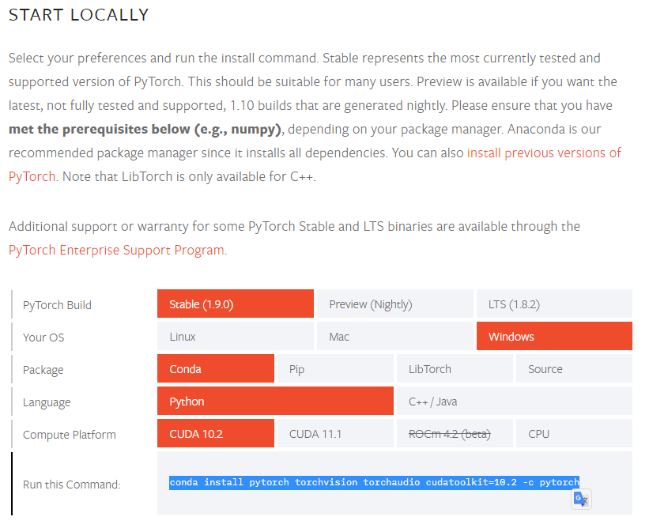

# Pytorch와 GPU를 활용하기 위한 환경 설정

---

**Numpy 대신 pytorch를 사용하는 가장 강력한 이유는 GPU 연산을 제공한다는 점이다.**

해당 환경설정은 anaconda에서 jupyter notebook을 활용해 AI에 대한 학습과 Pytorch에 대한 실습을 진행하기 위함이다.

우선 Anaconda를 먼저 설치한다. 설치는 Individual Edition으로 설치한다.

[아나콘다 설치](https://www.anaconda.com/products/individual)

설치가 완료되면 우선 jupyter notebook을 바로 실행할 수 있지만 관리를 수월하게 하기 위해서 가상환경을 설정한다.

### 가상환경 생성

```shell
conda create -n <가상환경 이름>

## jupyter notebook kernel 생성하기 위해서는
conda create -y -n <가상환경 이름> ipykernel
```

이제 가상환경이 생성되었고 activate 시킨다.

```shell
activate <가상환경 이름>

## or

conda activate <가상환경 이름>
```


### 가상환경에 필요한 모듈들 설치

가상환경에 어떠한 모듈들이 설치되었는지 확인하려면 해당 명령어를 입력한다.

```shell
conda list
```

여기에 jupyter notebook과 torch에 대한 라이브러리들이 설치가 되어 있지 않다면 우선 jupyter notebook 부터 설치를 진행한다. (jupyter notebook이 없는 상태로 가상환경 ipykernel 생성한 경우 다시 생성)

```shell
conda install jupyter notebook

pip install jupyter notebook
```

conda install 명령어나 pip 명령어나 상관은 없어보이지만 또 어떠한 문제가 생길지 모르기 때문에 conda로 통일시키는 것도 좋을 것 같다.

이제 가장 중요한 pytorch 및 GPU 활용을 위해 CUDA를 함께 설치하자.


### Pytorch 및 CUDA 설치

여기서 가장 시간을 많이 낭비하고 헤맸던 부분이다. **중요!!!**

 그래픽 카드가 존재한다면 해당 그래픽 카드를 확인하면 된다. (장치관리자 > 디스플레이 어댑터)

#### CUDA ToolKit 설치

이 드라이버를 설치할 때 가장 중요하다.

[Pytorch install 사이트](https://pytorch.org/get-started/locally/)

해당 사이트에 들어가면 pytorch와  CUDA를 한번에 install 할 수 있도록 도와준다. 하지만 여기서 CUDA가 미리 설치되어야 하고 CUDA의 버전을 꼭!! 확인해야 한다.



현재 Pytorch에서는 CUDA 10.2 ~ 11.1까지 지원을 해주고 있다. 나는 그것도 모르고 CUDA ToolKit을 설치하며 11.4 버전을 설치해 고생을 했다.

[CUDA 다운로드](https://developer.nvidia.com/cuda-toolkit-archive)

해당 아카이브에 CUDA Toolkit이 버전 별로 존재한다. 따라서 위의 Pytorch에서 지원하는 CUDA를 확인한 후 다운로드 받자!

CUDA 및 NDVIA 드라이버 설치가 완료되면 cmd 창에 다음과 같이 확인할 수 있다.

```shell
nvcc -V

## or

nvcc --version
```


따라서 (1) Pytorch 지원 CUDA 확인하기 ==> (2) CUDA 설치 및 NVDIA 드라이버 함께 설치 ==> (3) 위 그림의 명령어로 가상환경에 설치를 하게 되면 설치는 끝난다.

이제 jupyter notebook에 가상환경을 연결해주면 완전 끝!!

켜져있던 가상환경에 가서 커널에 가서

```shell
python -m ipykernel install --user --name <가상환경 이름> --display-name "원하는 내용"
```

display-name 설정은 해줘도 되고 안 해줘도 된다.

이 상태로 jupyter notebook을 켜고 작업 디렉토리에 가서 `import torch`가 잘 되는지 확인하고 GPU 사용도 가능한지 확인한다.


New 버튼을 클릭하고 해당 kernel이 존재하면 가상환경과 연결된 커널에서 작업을 하면 된다.


그리고 `import torch`를 한 후, `torch.cuda.is_available()` 명령어를 입력하면 bool 값으로 사용 유무에 대한 결과를 리턴한다.

이제 GPU 연산이 가능하다 👍

