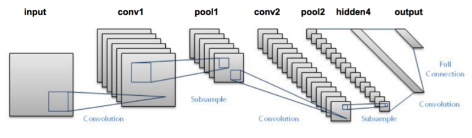

# 인공지능 서전학습 01

---

## 인공지능의 시대

### 클라우드 서비스 제공 (소셜 네트워크 포함)

* 이미지 / 비디오 분류
* 음성 인식
* 자연어 처리

### 의학

* 암 진단
* 당뇨병 진단
* 신약 개발

### 미디어 & 엔터테인먼트

* 영상 자막 생성
* 컨텐츠 개발
* 실시간 번역

### 보안

* 얼굴 인식
* 실시간 감시 기능
* 사이버 보안

### 자율주행

* 보행자 인식
* 차선 인식
* 교통 표지판 인식

## 인공지능이란?

#### 기계 지능을 다루는 컴퓨터 공학 분야

* 인간 같은 인지능력을 구현
* 추론, 문제 해결, 계획, 이해, 학습 그리고 패턴을 인식

#### 퍼셉트론 [Rosenblatt, 1958]

* 1950년대 부터 연구 시작
* 최초로 구현된 인공 신경망
*  하지만 단일 신경망으로는 XOR 문제를 해결할 수 없음

따라서 이러한 문제를 해결하기 위해 단일 퍼셉트론을 여러 개로 쌓는(적층) 구조를 한 신경망, 다중 신경망으로 해결하고자 했지만 성능이 좋지 않았음.

### LeNet - 5 [Lecun et al., Proceedings of the IEEE 1998]

* 첫 번째 컨볼루션 기반 뉴럴 네트워크 by Yann LeCun, 1998
* 우편번호 인식에 큰 성공을 거둠
* 두 개의 Convolution Layer (합성곱)을 사용

### AlexNet

* 기존의 LeNet에서 2개의 Convolution Layer를 사용했다면
* AlexNet은 더 깊게 합성곱을 적층해서 학습함
* GPU 기반의 학습

