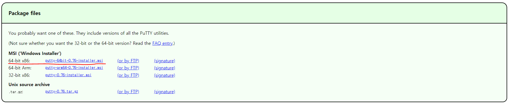
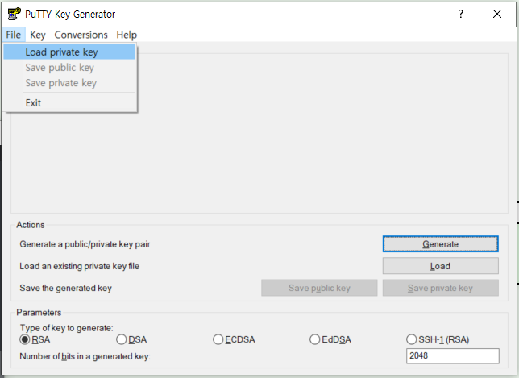
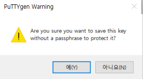
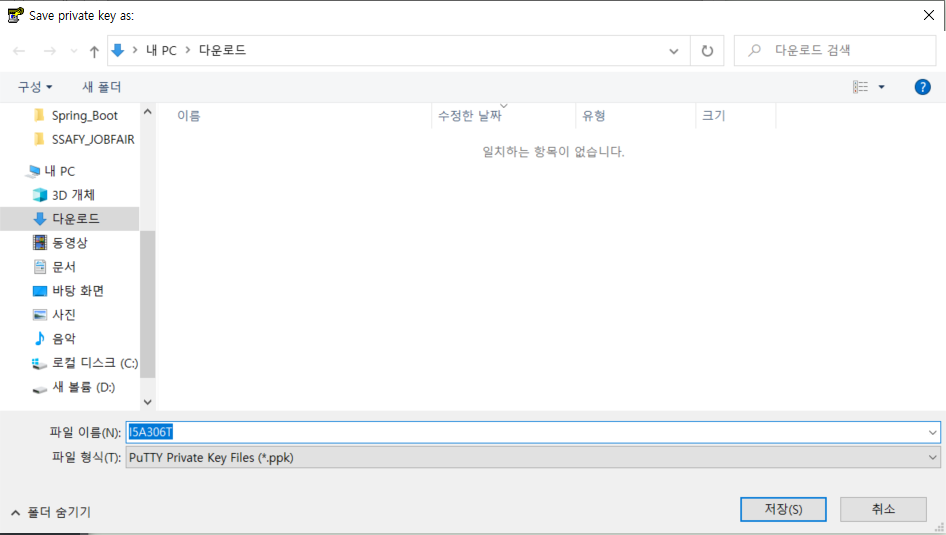
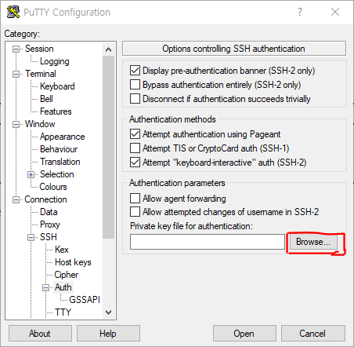
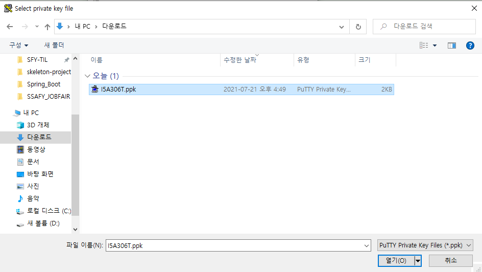
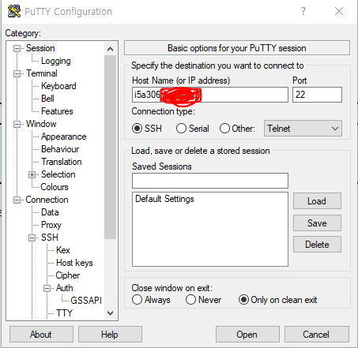
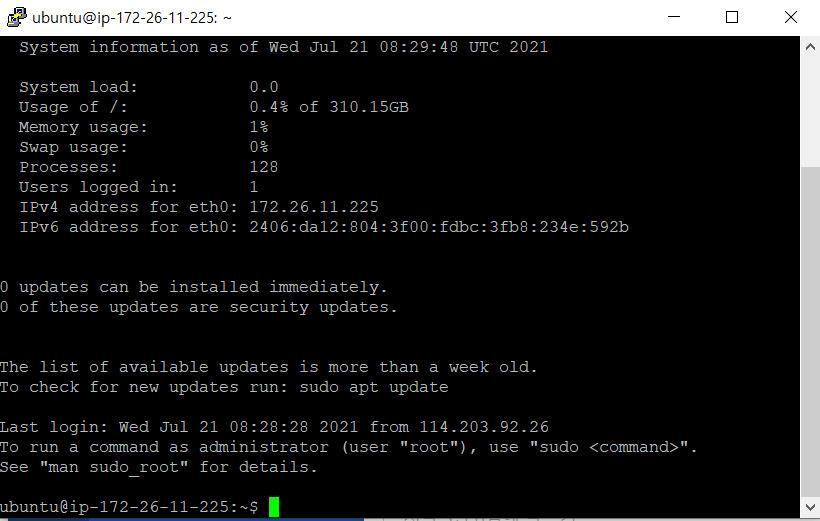

# Windows OS SSH로 EC2 인스턴스 접근

---

## Putty

> 리눅스를 원격 제어 할 때 사용하는 프로그램
>
> SSH, Telnet, rlogin, raw TCP를 위한 클라이언트로 동작하는 자유 및 오픈 소스 단말 에뮬레이터 응용 프로그램

### Putty 다운로드

[putty 다운로드 바로가기](https://putty.org/)

## pem => ppk로 변환

윈도우 키 누른 후 puttygen으로 검색

Putty Key Generator 실행 후 Key Load

다운로드 한 PEM 파일을 All Files 찾기로 변환 후 열기

등록된 후 Save private Key 누르기

저장하게 된다면 다음과 같은 경고가 뜸  ==> 무시하고 진행

PPK 파일명 지정

PPK 파일이 생성되었으므로 접속에 사용할 개인키 등록

Putty로 검색 후 PuTTY Configuration 열기

경로 : `PuTTY => Connection => SSH => Auth`

등록

이제 키 페어 설정이 완료되었으므로 EC2 인스턴스의 퍼블릭 IP로 SSH 접속 시도

경로 : `PuTTY => Session`

생성 후 PuTTY 보안 알람이 뜬다.

Accept 누른 후 

확인!