# 클라우드 네이티브 기반 공유 애플리케이션 만들어보기

---

#### 해당 정리는 AWS Online Builders 영상을 보고 작성된 문서입니다.

## 클라우드 네이티브 방식

> 클라우드의 장점을 활용하여 애플리케이션이 만들어지고 배포되는 방법

기존 개발은 애플리케이션을 고려하고, 이후 호스팅 될 인프라를 신경쓰는 것

**클라우드 네이티브 개발**은 시작부터 모든 요소를 고려하여, 그 플랫폼이 제공하는 서비스와 기술을 최대한 활용하는 것 (비즈니스 이노베이션의 가속화)

### 단계적 개발 접근

1. 환경 설정
2. 인증 기능
3. 사진 목록 기능
4. 사진 포스팅 기능
5. 사진 삭제 기능
6. 좋아요 기능

### 빠르고 쉬운 개발을 위한 선택

* Node.js
* React Native
* AWS Amplify
* Expo
* AWS AppSync (for GraphQL)

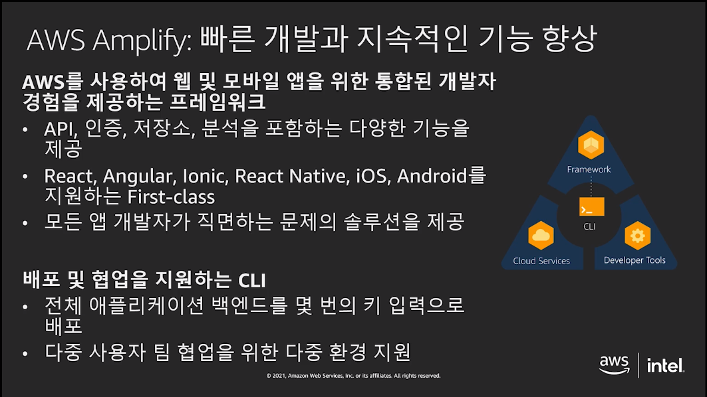

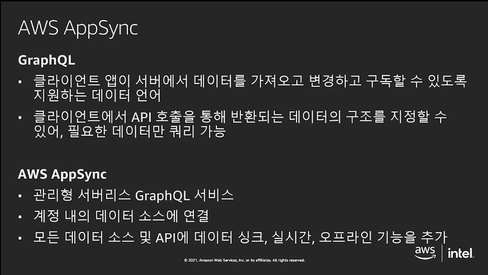

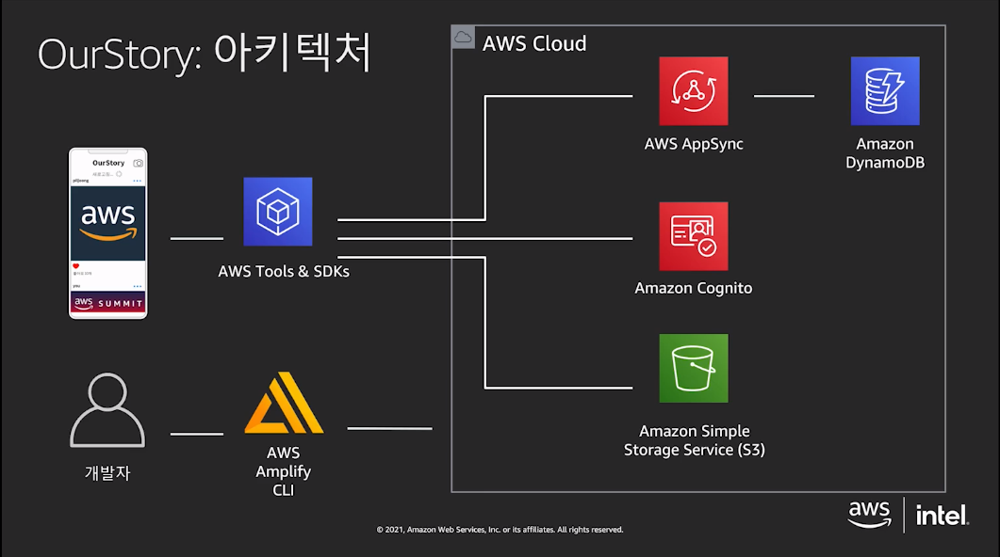

## 환경 설정

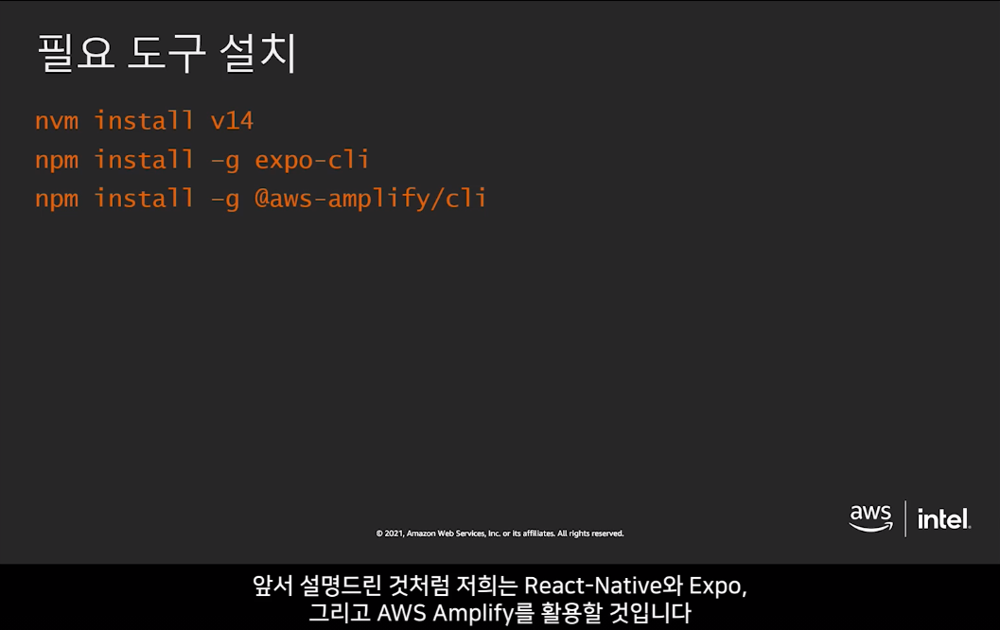

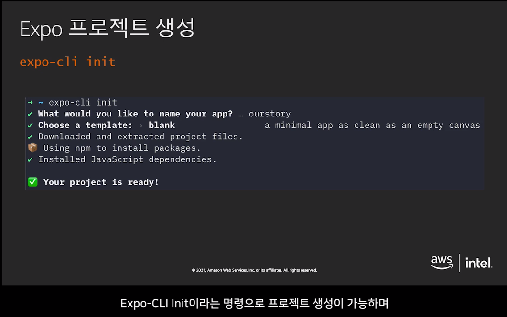

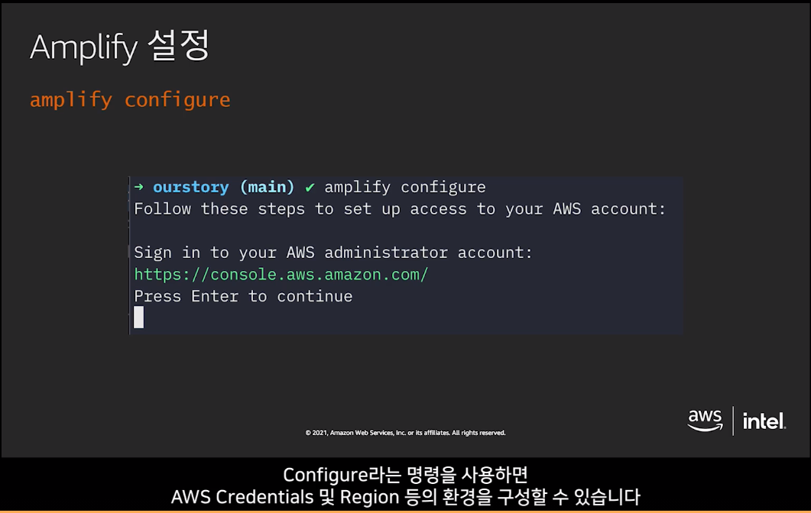

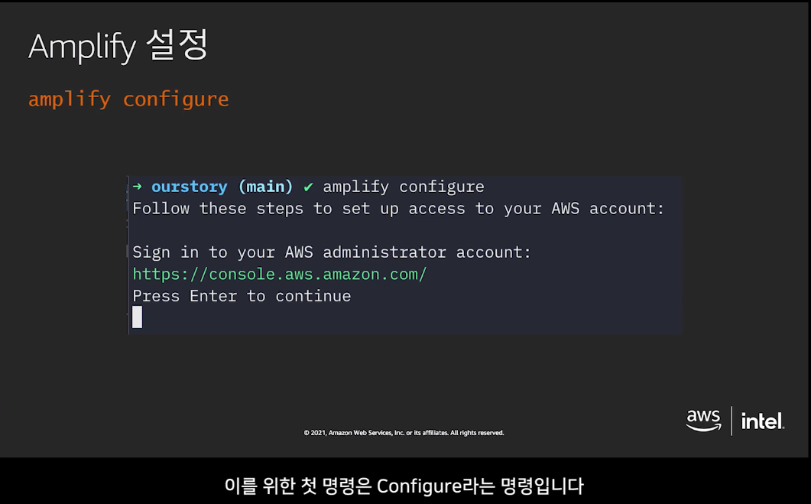

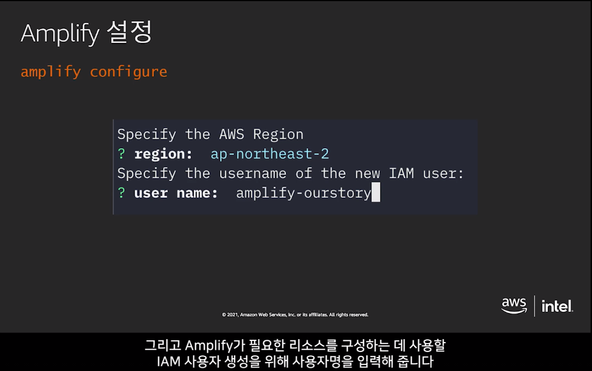

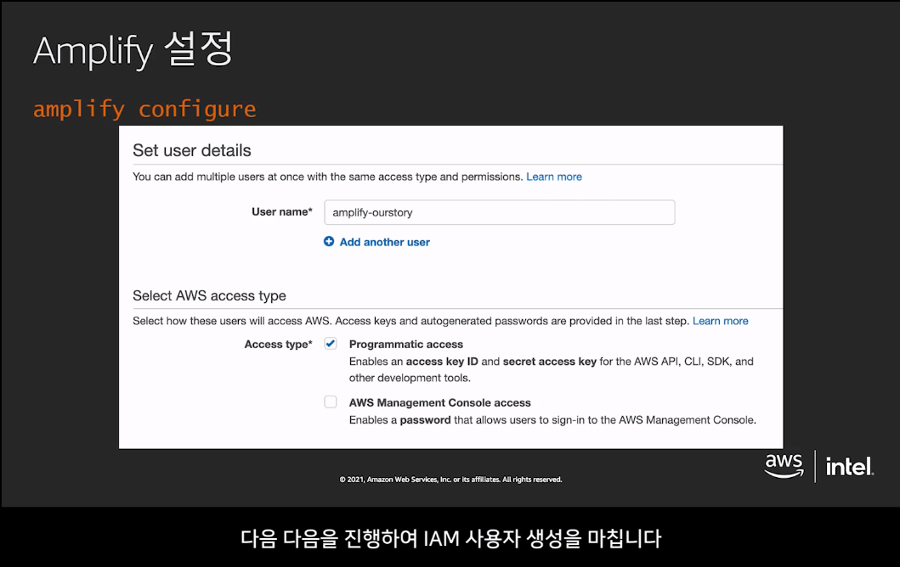

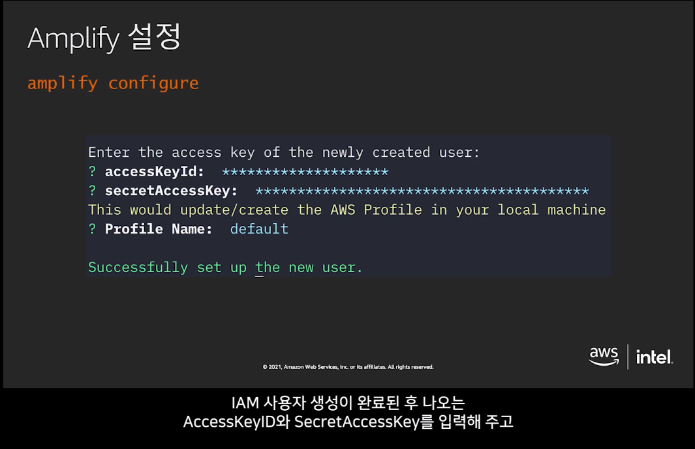

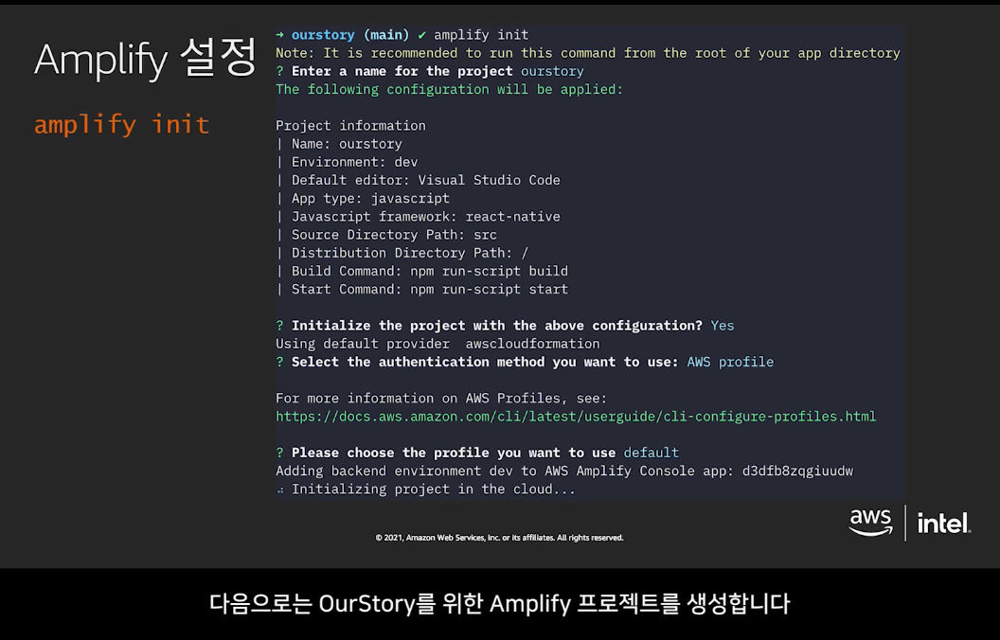

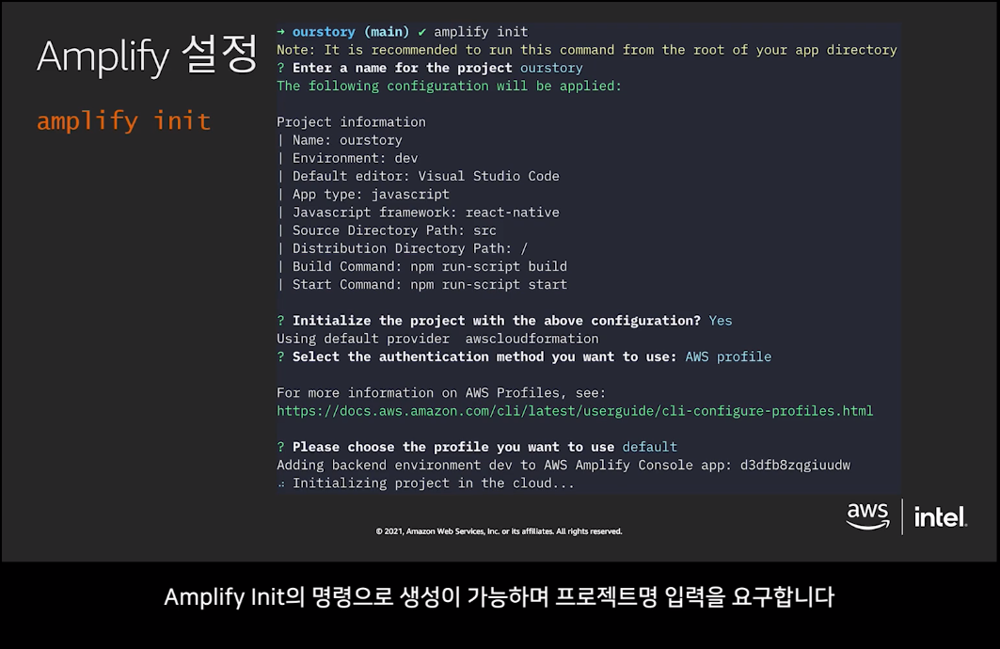

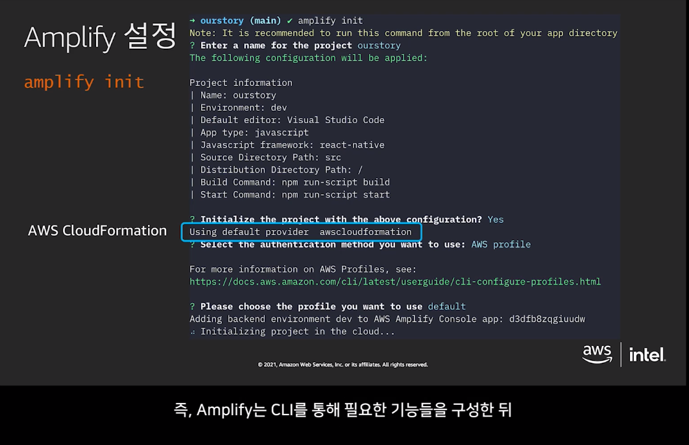

https://bit.ly/BuildModernMobileAppOnAWS