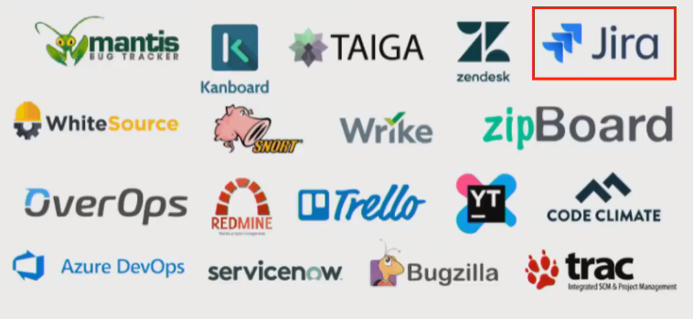
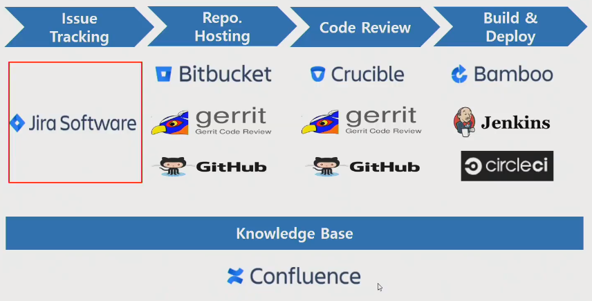

# Jira 및 JQL 활용법

---

## 1. DevOps & Jira

### Issue Tracking Systems

### DevOps를 잘 수행하기 위한 조건

* 반복적인 작업들을 Tool을 이용해서 자동화
* 팀원 모두가 알고 있는 하나의 공유된 지표가 필요
* 장애나 이슈가 있을 때 혼자만 알지 말고 팀원들과 공유 필요

### JIRA

* Story : 사용자가 행하는 과정들을 스토리로 지정
* Task : 하나의 할 일 (로그인 기능 구현할 때 하나의 창 구현 등)
* Bug : 에러
* Epic : 하나의 큰 테마 => 스토리, 테스크, 버그 등 다양하게 들어갈 수 있음 == 소주제?

### JQL

* Jira Query Language
* Jira Issue를 구조적으로 검색하기 위해 제공하는 언어
* SQL과 비슷한 문법
* Jira의 각 필드에 맞는 특수한 예약어들을 제공
* 쌓인 Issue들을 재가공해 유의미한 데이터를 도출해 해는데 활용 (Gadget, Agile Board 등)

### JQL Operators

* `=`, `!=`, `>`, `>=`
* in, not in
* ~(contains), !~(not contains)
* is empty, is not empty, is null, is not null
* Relative Dates
  * 미래 +(x)D  =>(x)는 정수
  * 과거 -(x)D
  * 주 단위 (x)W

### JQL Functions

* endofDay() , startofDay()
* endofWeek() (Saturday),  startOfWeek()(Sunday)
* endOfMonth(), startOfMonth(), endOfYear(), startOfYear()
* currentLogin()
* currentUser()

### Gadget

* Assgined to Me
  * 나에게 할당된 이슈들을 DashBoard 형태로 보여줌
* Filter Results
  * 필터 한 이슈들을 DashBoard 형태로 보여줌
* Pie Chart
  * 필터들을 가지고 항목 별로 분류해서 볼 수 있는 DashBoard
* Heat Map
  * Pie Chart와 비슷하지만 글자 크기로 비율을 나타내서 보여줌

