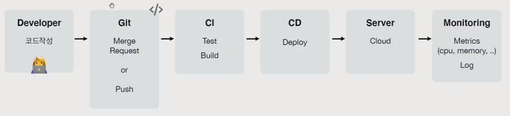
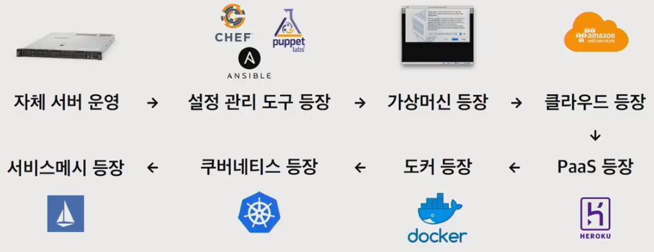
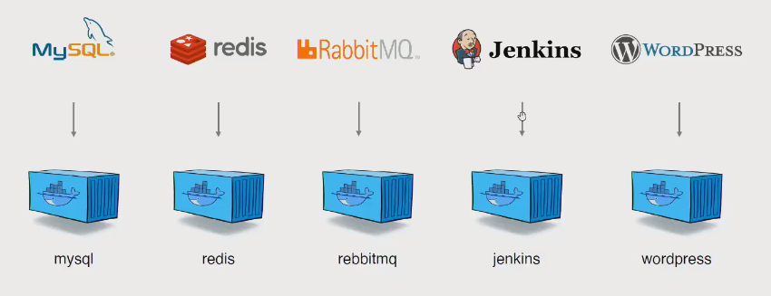
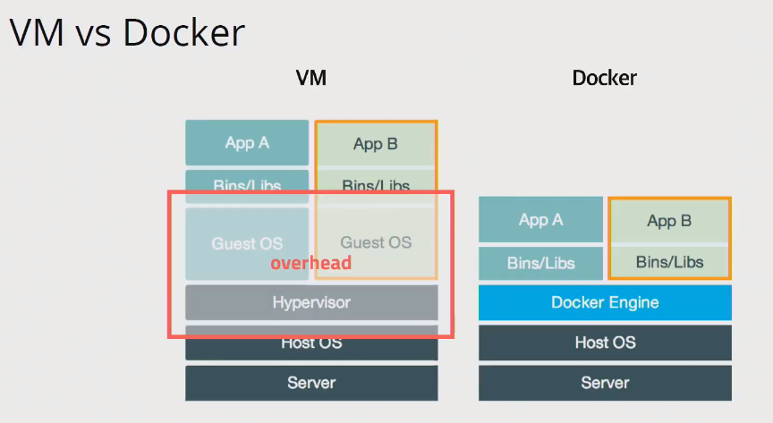
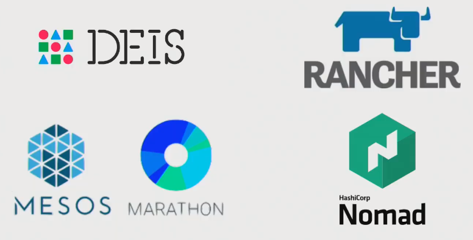
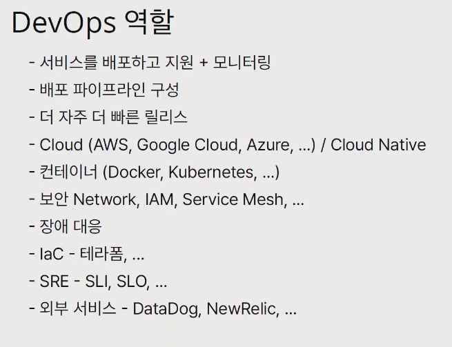

# 도커와 쿠버네티스 실전 활용하기

---



## 서버를 관리한다는 것

---



> 서버의 상태를 관리하기 위한 노력들


### 자체 서버를 운영하게 된다면.....

* 서버 주문 > 서버 설치  > CPU, 메모리, 하드디스크 조립 > 네트워크 연결 > OS 설치 > 계정 설정 > 방화벽 설정 > ///
* 서버를 설정하기 위해 많은 노력과 시간이 필요
* 성능이 좋은 걸 미리 구매하고 효율적인 사용을 위해 여러 애플리케이션을 설치


### 상태관리 도구 등장

> Ansible, Chef, Puppet


### Virtual Machine

​	|

### Cloud

​	|

### Paas


### 도커와 쿠버네티스의 등장

> 도커가 등장하고 서버관리/개발 방식이 완전히 바뀌게 됨



기존의 Jenkins를 설치하거나 Wordpress를 설치하려면 Java 설치나, PHP, SQL 설치 등 다양한 것들을 설치해야 했다. 하지만 도커의 등장 후 `docker compose up` 명령어 하나면 이러한 설치들이 바로 된다. 또한 자원 격리같은 어려운 기술을 사용하기 쉽게한다.


### 도커와 가상머신과의 차이



### 도커가 가져온 변화

* 클라우드 이미지보다 관리하기 쉬움
* 다른 프로세스와 격리되어 가상머신처럼 사용하지만 성능저하가 거의 없음
* 복잡한 기술(namespace, cgroups, network, ...)을 몰라도 사용할 수 있음
* 이미지 빌드 기록이 남음
* 코드와 설정으로 관리 > 재현 및 수정 가능
* 오픈소스 > 특정 회사 기술에 종속적이지 않음


## 쿠버네티스의 등장

---

> Container Orchestration
>
> 복잡한 컨테이너 환경을 효과적으로 관리하기 위한 도구

### 컨테이너 오케스트레이션

* Cluster

  * 중앙제어 (Master-Node) => Cluster 개념으로 묶여있는 컨테이너들을 필요한 컨테이너로 묶어서 관리
  * 네트워킹
  * 노드 스케일

* State

  * 상태관리 => 문제가 발생했을 때 알아서 처리

  * ```json
    {
        image : "app1"
        replicas : 2 => 3
    }
    ```

* Scheduling

  * 배포 관리

* Rollout / Rollback

  * 배포 버전관리

* Service Discovery

  * 서비스 등록 및 조회

* Volume

  * 볼륨 스토리지 확장 및 축소 자동으로 가능



> 여러 컨테이너 오케스트레이션 툴이 나왔지만 Kubernates로 바뀜 ( 컨테이너를 쉽고 빠르게 배포/확장하고 관리를 자동화해주는 오픈소스 플랫폼)


## DevOps 역할

---



