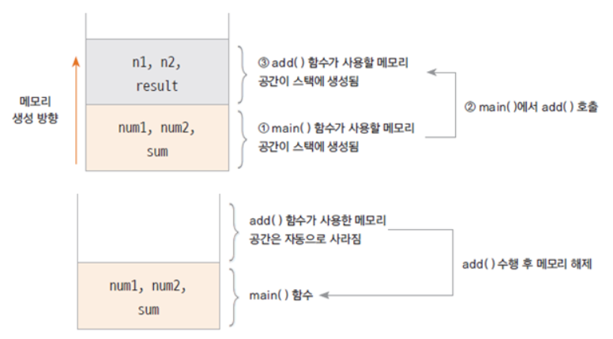
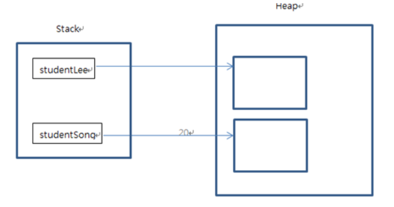

# 객체 지향

---


### 클래스는 객체의 청사진(blueprint) 이다.

* 객체의 속성은 클래스의 **멤버 변수(member variable)**로 선언함


### 객체지향 프로그램을 할 때는

* 객체를 정의하고
* 각 객체의 속성을 멤버 변수로 역할을 메서드로 구현하고
* 각 객체간의 협력을 구현한다.

### 클래스로 코딩하기

* 클래스는 대문자로 시작하는 것이 좋음
* java 파일 하나에 클래스는 여러 개가 있을 수 있지만, **public 클래스는 하나이고, public 클래스와 `.java`파일의 이름은 동일함**
  * 하나의 자바 소스파일에는 여러 개의 클래스를 작성할 수 있지만, 하나의 클래스 파일(.class)에는 반드시 하나의 컴파일된 자바 클래스만이 포함되어야 한다.
  * 즉, 하나의 자바 소스 파일에 작성된 클래스 중 오직 **한 클래스만 public**으로 선언할 수 있음
  * public으로 선언한 클래스의 이름은 소스파일의 이름과 동일하게 작성해야 된다.

* camel notation 방식으로 명명


## 함수와 메서드

---

함수는 이름, 매개 변수, 반환 값, 몸체(body)로 구성됨


### 함수 호출과 스택 메모리

* 스택 : 함수가 호출될 때 지역 변수들이 사용하는 메모리
* 함수의 수행이 끝나면 자동으로 반환되는 메모리




## 메서드(Method)

* 객체의 기능을 구현하기 위해 **클래스 내부에 구현**되는 함수
* 멤버 함수(member function)이라고도 함
* 메서드를 구현함으로써 객체의 기능이 구현됨
* 메서드의 이름은 그 객체를 사용하는 객체(클라이언트)에 맞게 짓는 것이 좋음

> 함수와 메서드의 차이?
>
> ​	함수는 어디에 속해 있지 않고 단독 모듈이며 호출해서 사용하면 된다.
>
> ​	하지만 메서드는 클래스안에 속해 있고 그 클래스의 멤버 변수들을 활용해서 구현된 것이 메서드이다.
>
> ​	함수의 일종이긴 하지만 객체 지향 프로그래밍에서 클래스 안에 있는 것이 메서드라고 한다.


## 05. 인스턴스 생성과 힙 메모리 (heap memory)

---

### 인스턴스 (instance)

* 클래스는 객체의 속성을 정의하고, 기능을 구현하여 만들어 놓은 코드 상태
* 실제 클래스 기반으로 생성된 객체(인스턴스)는 각각 다른 멤버 변수 값을 가지게 됨
  * 가령, 학생의 클래스에서 생성된 각각의 인스턴스는 각각 다른 이름, 학번, 학년등의 값을 가지게 된다.
* new 키워드를 사용하여 인스턴스 생성


### 힙 메모리

* 생성된 인스턴스는 동적 메모리(heap memory)에 할당됨
* C나 C++ 언어에서는 사용한 동적 메모리를 프로그래머가 해제 시켜야 함 (`free()`나 `delete()` 이용)
* 자바에서 `Garbage Collector`가 주기적으로 사용하지 않는 메모리를 수거
* 하나의 클래스로부터 여러 개의 인스턴스가 생성되고 각각 다른 메모리 주소를 가지게 됨



> Stack에 있는 `studentLee`는 **참조변수**라고 하고 그 참조 변수가 가르키고 있는 Heap의 주소 값을 **참조 값**이라고 한다.


### 용어 정리

```
객체 : 객체 지향 프로그램의 대상, 생성된 인스턴스

클래스 : 객체를 프로그래밍 하기 위해 코드로 정의해 놓은 상태

인스턴스 : new 키워드를 사용하여 클래스를 메모리에 생성한 상태

멤버 변수 : 클래스의 속성, 특성

메서드 : 멤버 변수를 이용하여 클래스의 기능을 구현한 함수

참조 변수 : 메모리에 생성된 인스턴스를 가리키는 변수

참조 값 : 생성된 인스턴스의 메모리 주소 값
```

