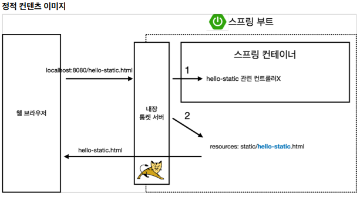

# 02_스프링 구조

---

## Static Content ( 정적 컨텐츠)

Springboot의 Static 파일에 html파일 작성시 해당 이름으로 URL 주소로 입력 시 해당 파일이 load 된다. 대신 어떤 프로그래밍을 할 수 없음.

이 구조는 클라이언트에서 `localhost:8080/hello-static.html`의 주소로 요청이 들어왔을 때 Tomcat 서버에서 스프링 컨테이너 Controller로 해당 hello-static 컨트롤러가 있는지 파악한다. (Controller가 우선순위를 가짐)  해당 컨트롤러가 없다면 resources/static 폴더에서 해당 파일을 찾게 되고 해당 파일이 존재한다면 응답한다.

## MVC와 템플릿 엔진

* MVC : Model, View, Controller

