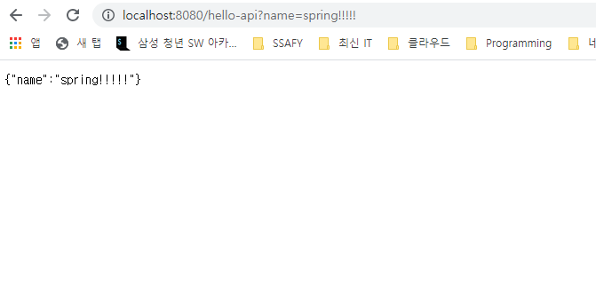

# 02_스프링 구조

---


## Static Content ( 정적 컨텐츠)

Springboot의 Static 파일에 html파일 작성시 해당 이름으로 URL 주소로 입력 시 해당 파일이 load 된다. 대신 어떤 프로그래밍을 할 수 없음.


이 구조는 클라이언트에서 `localhost:8080/hello-static.html`의 주소로 요청이 들어왔을 때 Tomcat 서버에서 스프링 컨테이너 Controller로 해당 hello-static 컨트롤러가 있는지 파악한다. (Controller가 우선순위를 가짐)  해당 컨트롤러가 없다면 resources/static 폴더에서 해당 파일을 찾게 되고 해당 파일이 존재한다면 응답한다.


## MVC와 템플릿 엔진

* MVC : Model, View, Controller


과거에는 View와 Controller를 구분하지 않고 JSP를 통해 개발을 진행했었다. 이를 Model1 방식이라고 한다. View는 화면을 그리는데 모든 역량을 집중하고, Controller나 Model의 역할은 비즈니스 로직에 집중하거나 내부적인 처리를 하는데 집중을 한다.

 Controller를 작성하며 템플릿 엔진이 어떤식으로 화면을 클라이언트에게 보여주는지 코드로 작성을 해보자.

* controller / HelloController.java

  ```java
  package hello.hellospring.controller;
  
  
  import org.springframework.stereotype.Controller;
  import org.springframework.ui.Model;
  import org.springframework.web.bind.annotation.GetMapping;
  import org.springframework.web.bind.annotation.RequestParam;
  
  @Controller
  public class HelloController {
  
      @GetMapping("hello-mvc")
      // @RequestParam은 name이라는 value에 들어갈 값이다. 즉 GET 방식으로 URL에 www.localhost:8080/hello-mvc?name="지정 값"이 들어간다.
      public String helloMvc(@RequestParam("name") String name, Model model) {
          model.addAttribute("name", name);
          // ViewResolver는 template 폴더에서 "hello-template.html" 파일을 찾는다.
          return "hello-template";
      }
  
  }
  ```

* templates / hello-template.html

  ```html
  <html xmlns:th="http://www.thymeleaf.org">
  <body>
  <p th:text="'hello ' + ${name}">hello! empty</p>
  </body>
  </html>
  ```


### @RequestParam 이란?

> @RequestParam("가져올 데이터의 이름") [데이터 타입] [가져온 데이터를 담을 변수]

Controller에서 파라미터 값을 받을 수 있도록 해주는 어노테이션이다. GET 방식으로 넘어온 URI의 queryString을 받기에 적절하다.

`@RequestParam`은 다음과 같은 값들이 들어갈 수 있다.

* String value() => default ""
* String name() => default ""
* boolean required() => default true
* defaultValue()

String으로 값을 받는 value와 name은 사실 상 별 차이가 없다. 또한 여기에 required 값이 들어가는데 default true로 설정되어 있다. 즉, required 값은 파라미터에 값이 들어오지 않는다면 400 에러가 발생하게 된다. 따라서 defaultValue 값을 설정해주면 오류를 방지하고 기본 값을 세팅할 수 있다.


## API

과거의 개발 방식에 API를 통해 데이터를 전송할 때는 XML 형식으로 데이터를 전송했다. 하지만 XML의 무겁고 불편한 점들이 생기면서 요즘에는 JSON 형태로 데이터를 전송한다. JSON 형태는 Key와 Value 값 형태로 되어있다.

API 형태로 데이터를 전송할 때 가장 중요한 어노테이션은 `@RequsetBody`와 `@ResponseBody`이다.  (@RequestBody는 추후에....)


### @ResponseBody

* Http Body에 JAVA 객체 또는 문자열을 매핑하는 역할
* `ViewResolver` 대신에 `HttpMessageConverter`가 동작
* 기본 문자 처리 : `StringHttpMessageConverter`
* 기본 객체 처리 : `MappingJackson2HttpMessageConverter`
* byte 처리 등 기타 여러 `HttpMessageConverter`가 기본으로 등록되어 있음

* Controller / HelloController.java  **(문자 반환)**

  ```java
  package hello.hellospring.controller;
  
  
  import org.springframework.stereotype.Controller;
  import org.springframework.ui.Model;
  import org.springframework.web.bind.annotation.GetMapping;
  import org.springframework.web.bind.annotation.RequestParam;
  import org.springframework.web.bind.annotation.ResponseBody;
  
  @Controller
  public class HelloController {
  
      @GetMapping("hello-string")
      @ResponseBody
      public String helloString(@RequestParam("name") String name) {
          return "hello "+ name;
      }
  }
  
  ```

`@ResponseBody`를 사용하면 `ViewResolver`를 사용하지 않고 HTTP BODY에 문자 내용을 직접 반환한다.


* Controller / HelloController.java  **(객체 반환)**

  ```java
  package hello.hellospring.controller;
  
  
  import org.springframework.stereotype.Controller;
  import org.springframework.ui.Model;
  import org.springframework.web.bind.annotation.GetMapping;
  import org.springframework.web.bind.annotation.RequestParam;
  import org.springframework.web.bind.annotation.ResponseBody;
  
  @Controller
  public class HelloController {
  
      @GetMapping("hello-api")
      @ResponseBody
      public Hello helloApi(@RequestParam("name") String name) {
          Hello hello = new Hello();
          hello.setName(name);
          return hello;
      }
  
      static class Hello {
  
          private String name;
  
          public String getName() {
              return name;
          }
  
          public void setName(String name) {
              this.name = name;
          }
      }
  
  }
  
  ```

`@ResponseBody`를 사용하고 객체를 반환하면 객체가 JSON 형태로 반환됨.


* 결과물

  


