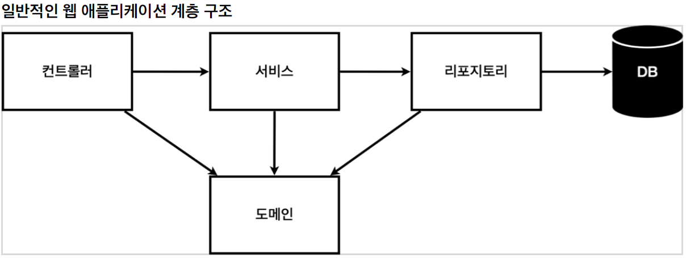
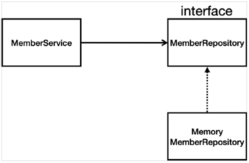

# 회원 관리 예제 - 백엔드 개발

---


## 비즈니스 요구사항 정리

* 데이터 : 회원 ID, 이름
* 기능 : 회원 등록, 조회
* **아직 데이터 저장소가 선정되지 않음 (가상의 시나리오)**


### 일반적인 웹 어플리케이션의 계층 구조




* **Controller**  
  * 웹 MVC의 컨트롤러 역할
  * 사용자가 웹 브라우저를 통해 어떠한 요청을 하면 그 요청을 처리할 컨트롤러를 호출하게 된다.
  * 컨트롤러는 사용자의 요청을 처리하기 위한 비즈니스 로직을 호출하고 그 결괏값을 사용자에게 전달해 주는 역할을 담당
* **Service**
  * 핵심 비즈니스 로직 구현
  * 사용자의 요청을 처리하기 위한 비즈니스 로직이 수행
  * 일반적으로 서비스 영역은 서비스 인터페이스와 인터페이스 구현체로 나뉨
  * `ServiceInterface`
  * `ServiceImplements`
* **Repository **
  * 데이터베이스에 접근
  * 도메인 객체를 DB에 저장하고 관리
* **Domain**
  * 비즈니스 도메인 객체
  * ex) 회원, 주문, 쿠폰 등등 주로 데이터 베이스에 저장하고 관리됨


#### 클래스 의존관계




* 아직 데이터 저장소가 선정되지 않아서, 우선 인터페이스 구현 클라스를 변경할 수 있도록 설계
* 데이터 저장소는 RDB, NoSQL 등등 다양한 저장소를 고민중인 상황으로 가정
* 개발을 진행하기 위해서 초기 개발 단계에서는 구현체로 가벼운 메모리 기반의 데이터 저장소 사용


따라서 domain 패키지를 생성 후, Member 라는 클래스를 통해 Member 정보를 입력 받을 수 있게 만든다.

*  domain / Member.java

  ```java
  package hello.hellospring.domain;
  
  public class Member {
  
      private Long id;
  
      public Long getId() {
          return id;
      }
  
      public void setId(Long id) {
          this.id = id;
      }
  
      public String getName() {
          return name;
      }
  
      public void setName(String name) {
          this.name = name;
      }
  
      private String name;
  }
  ```


이제 Member라는 비즈니스 도메인 객체의 정보를 저장하는 메모리 기반 저장소를 만들 것이다. 패키지 이름은 repository로 설정 후 `MemberRepository`라는 interface와 `MemoryMemberRepository`라는 클래스를 생성한다.

* repository / MemberRepository

  ```java
  package hello.hellospring.repository;
  
  import hello.hellospring.domain.Member;
  
  import java.util.*;
  
  public class MemoryMemberRepository implements MemberRepository{
  
      private static Map<Long, Member> store = new HashMap<>();
      private static long sequence = 0L;
  
      @Override
      public Member save(Member member) {
          member.setId(++sequence);
          store.put(member.getId(), member);
          return member;
      }
  
      @Override
      public Optional<Member> findById(Long id) {
          return Optional.ofNullable(store.get(id));
      }
  
      @Override
      public Optional<Member> findByName(String name) {
          return store.values().stream()
                  .filter(member -> member.getName().equals(name))
                  .findAny();
      }
  
      @Override
      public List<Member> findAll() {
          return new ArrayList<>(store.values());
      }
  }
  
  ```


### Stream

자바 8에서 추가한 `stream`은 람다를 활용할 수 있는 기술 중 하나이다. 이전 자바 버전에서는 `for`나 `foreach`를 통해 loop를 돌며 요소 하나 하나를 꺼내서 다루는 방법이었다. 이러한 경우에는 로직이 복잡해지거나 코드의 양이 많아질 경우에 비효율적인 면이 있었다.

스트림은 말 그대로 ''흐름''이다. 배열 또는 Collection 인스턴스 함수 여러 개를 조합해서 원하는 결과를 필터링 할 수 있고 가공된 결과를 얻을 수 있다.

#### 	filter

​	filter는 스트림 내 요소들을 하나씩 평가해서 걸러내는 작업이다.

* 예시

  ```java
  Stream<String> stream = 
      names.stream()
      .filter(name -> name.contains("a"));
  ```

  예시와 같이 람다식과 name 변수에 `.contains` 와 같이 포함되어 있는 내용도 찾을 수 있다.

