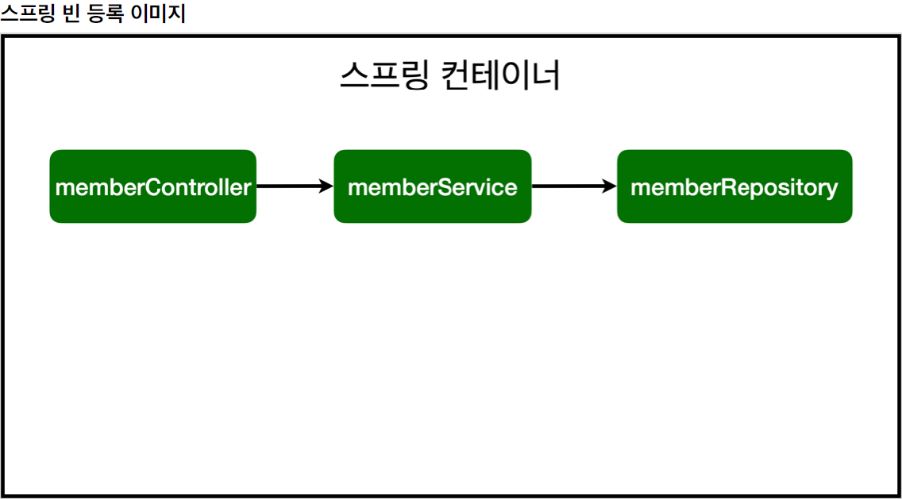
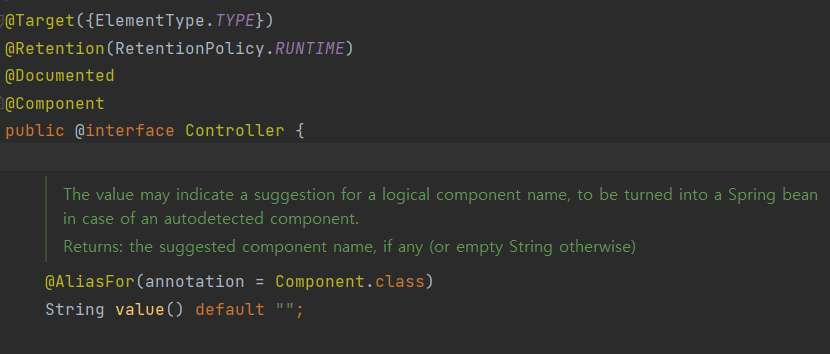

# 스프링 빈과 의존관계 - 컴포넌트 스캔 & 자동 의존관계 설정

---

여태까지 MemberRepository와 MemberService를 만들면서 MemberService에서는 '회원 가입', '회원 조회' 등 서비스 단에서 필요한 기능들을 개발했고 Repository에서는 '회원정보 저장', 'Id로 회원 조회', '이름으로 회원 조회', '회원 전체 조회' 등 DB(현재는 메모리)에서 필요한 정보들을 가져오는 기능들을 개발했다.

Controller의 기능은 사용자가 요청을 했을 때 사용자에게 보여지는 즉, View 단에서 보여주기 위한 정보들을 전달한다.

그렇다면 Controller는 MemberService를 통해서 회원 가입과 회원 조회를 할 수 있어야 한다. 이러한 관계를 의존 관계라고 한다.

우선 MemberController를 생성해보자.

* **controller / MemberController**

```java
package hello.hellospring.controller;

import hello.hellospring.service.MemberService;
import org.springframework.beans.factory.annotation.Autowired;
import org.springframework.stereotype.Controller;

@Controller
public class MemberController {
    // 다음과 같이 MemeberService 객체를 새로 생성해 쓸 수 있지만
    // Spring Container에서 관리할 수 있고 다른 Controller들도 MemberService를 사용할 수 있기 떄문에
    // 의존성 관리를 위해 Container에 등록을 해준다.
    //private final MemberService memberService = new MemberService();
    private final MemberService memberService;

    // Autowired 어노테이션은 Spring Container에 등록된 Bean 객체를 자동으로 연결해줌
    // 이것을 Dependency Injection (DI), 의존성 주입이라고 한다.
    @Autowired
    public MemberController(MemberService memberService) {
        this.memberService = memberService;
    }

}

```

Controller 클래스를 생성하고 `@Controller` 어노테이션을 클래스 상단에 붙여준다. 이 컨트롤러 어노테이션은 Spring Container가 생성이 될 때 Spring에서 해당 어노테이션을 확인하고 Container에 Bean 객체로 생성이 된다. 그리고 Spring이 관리를 한다.

MemberService는 회원 정보를 가져오기 위해 MemberRepository와 의존 관계가 있다. 따라서 스프링 Container에 Service와 Repository를 등록해줘야 한다. 그리고 연결은 `@Autowired` 어노테이션으로 클래스의 생성자에 작성을 해준다. 이것을 바로 **DI(의존성 주입)**이라고 한다.

> 생성자에 `@Autowired`를 사용하면 객체 생성 시점에 스프링 컨테이너에서 해당 스프링 빈을 찾아서 의존성을 주입한다. 생성자가 1개만 있으면 `@Autowired`는 생략할 수 있다.

Service는 `@Service` 어노테이션을 클래스 상단에 작성하고 Repository 또한 `@Repository` 어노테이션으로 Controller와 같이 빈 객체로 등록을 해준다.



> Spring은 Spring Container에 스프링 빈을 등록할 때, 기본으로 **Singleton**으로 등록한다. (유일하게 하나만 등록해서 공유하는 것을 Singleton 이라고 한다.) 따라서 같은 스프링 빈이면 모두 같은 인스턴스이다. 설정으로 싱글톤이 아니게 설정할 수 있지만, 특별한 경우를 제외하면 대부분 싱글톤을 사용한다.


## 스프링 빈을 등록하는 2가지 방법

* 컴포넌트 스캔과 자동 의존관계 설정
* 자바 코드로 직접 스프링 빈 등록하기


현재 어노테이션을 활용해서 스프링 빈을 등록하는 방법은 첫 번째 방법인 컴포넌트 스캔을 활용해서 등록한 것이다.

하지만 여기서 사용한 어노테이션을 `@Service`와 `@Repository`, `@Controller`를 사용했다.  이 어노테이션들을 자세히 확인해보면



이렇게 `@Component` 어노테이션을 가지고 있는 것을 확인할 수 있다. 따라서 해당 방법을 컴포넌트 스캔을 통한 의존 관계 설정이라고 한다.

> 컴포넌트 스캔은 프로젝트 패키지 디렉토리 내에 있는 것만 가능하다.