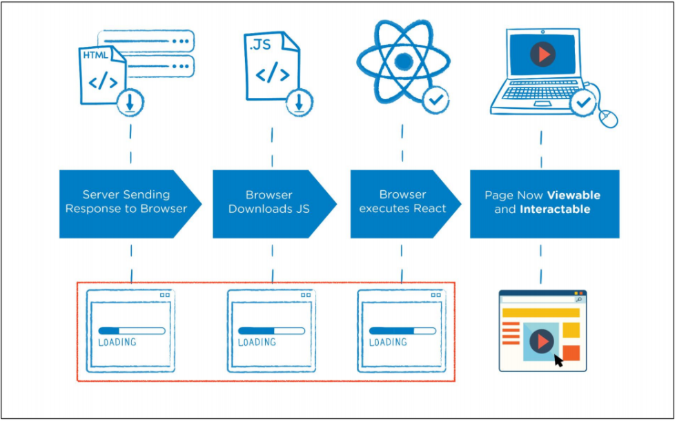
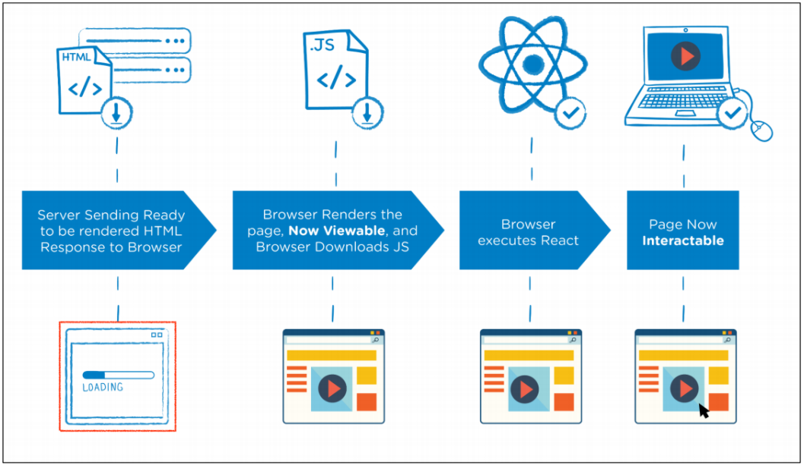
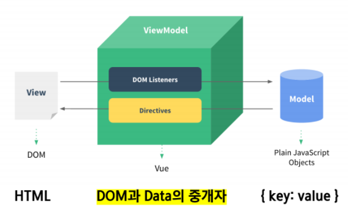

# Vue 01

---

> Vue 란 대표적인 프론트엔드 프레임 워크로 그 외에도 React, Angular 등이 있다.


## What is Vue.js

* 사용자 인터페이스를 만들기 위한 progressive 프레임 워크
* 현대적인 tool과 다양한 라이브러리를 통해 **SPA(Single Page Application)**를 완벽하게 지원


## SPA

* 단일 페이지 애플리케이션 (Single Page Application)
* 현재 페이지를 동적으로 작성함으로써 사용자와 소통하는 웹 어플리케이션
* 단일 페이지로 구성되며 서버로부터 처음에만 페이지를 받아오고 이후에는 동적으로 DOM을 구성
  * 즉, 처음 페이지를 받은 이후에는 서버로부터 완전한 새로운 페이지를 불러오지 않고 현재 페이지를 동적으로 다시 작성함
  * 연속되는 페이지 간의 사용자 경험(UX)을 향상
  * 모바일 사용이 증가하고 있는 현재 트래픽의 감소와 속도, 사용성, 반응성 향상은 매우 중요한 이슈이기 때문
* 동작 원리의 일부가 CSR(Client Side Rendering)의 구조를 따름


## SPA 등장 배경

* 과거 웹 사이트들은 요청에 따라 매번 새로운 페이지를 응답하는 방식이었음
  * Multi Page Form (MPA)
* 스마트폰이 등장하면서 모바일 최적화에 대한 필요성이 생김
  * 모바일 네이티브 앱과 같은 형태의 웹 페이지가 필요해짐
* 이러한 문제를 해결하기 위해 Vue와 같은 프론트엔드 프레임워크가 등장
  * CSR, SPA의 등장
* 1개의 웹 페이지에서 여러 동작이 이루어지며 모바일 앱과 비슷한 형태의 사용자 경험을 제공


## CSR (Client Side Rendering)

* 최초 요성 시 서버에서 빈 문서를 응답하고 이후 클라이언트에서 데이터를 요청해 데이터를 받아 DOM을 렌더링 하는 방식
* SSR(Server Side Rendering)보다 초기 전송되는 페이지의 속도는 빠르지만, 서비스에서 필요한 데이터를 클라이언트(브라우저)에서 추가로 요청하여 재구성해야 하기 때문에 전체적인 페이지 완료 시점은 SSR 보다 느림
* SPA가 사용하는 렌더링 방식




* 장점 
  * 서버와 클라이언트 간의 트래픽 감소
    * 웹 애플리케이션에 필요한 모든 정적 리소스를 최초에 한 번 다운로드
  * 사용자 경험 향상
    * 전체 페이지를 다시 렌더링하지 않고 변경되는 부분만을 갱신


* 단점 : 
  * SEO(검색 엔진 최적화) 문제가 발생할 수 있음


## SSR (Server Side Rendering)

* 서버에서 사용자에게 보여줄 페이지를 모두 구성하여 사용자에게 페이지를 보여주는 방식
* 서버를 이용해서 페이지를 구성하기 떄문에 클라이언트에서 구성하는 CSR 보다 페이지를 구성하는 속도는 늦지만 사용자에게 보여주는 콘텐츠 구성이 완료되는 시점은 빨라짐




* 장점
  * 초기 로딩 속도가 빠르기 떄문에 사용자가 컨텐츠를 빨리 볼 수 있음
  * SEO(검색 엔진 최적화)가 가능
* 단점
  * 모든 요청에 새로고침이 되기 떄문에 사용자 경험이 떨어짐
    * 상대적으로 요청 횟수가 많아져 서버 부담이 커짐


## SEO (Search Engine Optimization 검색 엔진 최적화)

*  웹 페이지 검색엔진이 자료를 수집하고 순위를 메기는 방식에 맞게 웹 페이지를 구성해서 검색 결과의 상위에 노출될 수 있도록 하는 작업
* 인터넷 마케팅 방법 중 하나
* 구글 등장 이후 검색엔진들이 컨텐츠의 신뢰도를 파악하는 기초 지표로 사용됨
  * 다른 웹 사이트에서 얼마나 인용되었나를 반영
  * 결국 타 사이트에 인용되는 횟수를 늘리는 방향으로 최적화


## SPA with SSR

* 예를 들어 Django에서 Axios를 활용한 좋아요 / 팔로우 로직의 경우 대부분은 Server에서 완성된 HTML을 제공하는 구조(SSR)
* 다만, 특정 요소(좋아요 / 팔로우)만 AJAX를 활용한 비동기 요청으로 필요한 데이터를 Client에서 서버로 직접 요청을 보내 받아오고 JS를 활용해 DOM을 조작 (CSR)


# Concepts of Vue.js

---


## MVVM Pattern

* 애플리케이션 로직을 UI로 부터 분리하기 위해 설계된 디자인 패턴
* 구성 요소
  * **Model**
  * **View**
  * **View Model**




## Model

* Vue에서 Model은 JavaScript Object이다.
* JavaScript Object 자료구조
* 이 Object는 Vue Instance 내부에서 data로 사용되는데 이 값이 바뀌면 View(DOM)가 반응


## View

* Vue에서 View는 DOM(HTML)이다.
* Data의 변화에 따라서 바뀌는 대상


## ViewModel

* Vue에서 ViewModel은 모든 Vue Instance이다.
* View와 Model 사이에서 Data와 DOM에 관련된 모든 일을 처리
* ViewModel을 활용해 Data를 얼마만큼 잘 처리해서 보여줄 것인지(DOM)를 고민하는 것


# Quick Start of Vue.js

---

> [공식문서](https://kr.vuejs.org/v2/guide/index.html)


## Django & Vue.js 코드 작성 순서

* Django

  * url  -  views  -  template
  * 데이터의 흐름

* Vue.js

  * Data가 변화하면 DOM이 변경된다.

  1. Data 로직 작성
  2. DOM 작성


# Basic syntax of Vue.js

---


## Vue Instance

* 모든 Vue 앱은 Vue 함수로 새 인스턴스를 만드는 것 부터 시작

* Vue 인스턴스를 생성할 때는 **Options 객체**를 전달해야 함

  * 여러 Options들을 사용하여 원하는 동작을 구현

* Vue Instance === Vue Component

* ```javascript
  const app = new Vue({
      
  })
  ```


## Options/Dom - 'el'

* Vue 인스턴스에 연결(Mount)할 기존 DOM 엘리먼트가 필요

* CSS 선택자 문자열 혹은 HTMLElement로 작성

* new를 이용한 인스턴스 생성때만 사용

* ```javascript
  const app = new Vue({
      el : '#app'
  })
  ```

  


## Options/Data  - 'data'

* Vue 인스턴스의 데이터 객체

* Vue 앱의 상태 데이터를 정의하는 곳

* Vue template에서 interpolation을 통해 접근 가능

* v-bind, v-on과 같은 디렉티브에서도 사용 가능

* Vue 객체 내 다른 함수에서 this 키워드를 통해 접근 가능

* 주의

  * 화살표 함수를 'data'에서 사용하면 안됨
  * 화살표 함수가 부모 컨텍스트를 바인딩하기 때문에 'this'는 예상과 달리 Vue 인스턴스를 가리키지 않음

* ```javascript
  const app = new Vue({
      el : '#app',
      data : {
          message : 'Hello',
      }
  })
  ```


## Options / Data - 'methods'

* Vue 인스턴스에 추가할 메서드
* Vue template에서 interpolation을 통해 접근 가능
* v-on과 같은 디렉티브에서도 사용 가능
* Vue 객체 내 다른 함수에서 this 키워드를 통해 접근 가능
* 주의 
  * 화살표 함수를 메서드를 정의하는데 사용하면 안됨
  * 화살표 함수가 부모 컨텍스트를 바인딩하기 때문에 'this'는 Vue 인스턴스가 아니며 'this.a'는 정의되지 않음

* ```javascript
  const app = new Vue({
      el : '#app',
      data : {
          message: 'Hello',
      },
      methods : {
          greeting: function(){
              console.log('hello')
          }
      }
  })
  ```


## this keyword in vue.js

* Vue 함수 객체 내에서 vue 인스턴스를 가리킴
* 단, JavaScript 함수에서의 this 키워드는 다른 언어와 조금 다르게 동작하는 경우가 있음


* 화살표 함수를 사용하면 안되는 경우
  1. data
  2. method 정의

```javascript
<div id = 'app'>
    <button @click='myFunc'> a </button>
    <button @click='yourFunc'> b </button>
</div>

<scirpt>
    const app = new Vue({
        el: '#app',
        data: {
            a: 1,
        },
        methods: {
            myFunc: function(){
                console.log(this)  // Vue instance
            },
            yourFunc: function(){
                console.log(this) // window
            }
        }
    
    })
</scirpt>
```


## Template Syntax

* 렌더링 된 DOM을 기본 Vue 인스턴스의 데이터에 선언적으로 바인딩 할 수 있는 HTML 기반 템플릿 구문을 사용

1. **Interpolation**
2. **Directive**


## Interpolation (보간법)

1. Text
   * `<span> 메시지 : {{ msg }} </span>`
2. Raw HTML
   * `<span v-html="rawHtml"></span>`
3. Attributes
   * `<span v-bind:id="dynamicID"></span>`
4. JS 표현식
   * `{{ number +  1 }}`
   * `{{ message.split(' ').revers().join(' ') }}`


## Directive (디렉티브)

* v- 접두사가 있는 특수 속성

* 속성 값은 JS 표현식이 됨 (v-for는 예외)

* 표현식의 값이 변경될 때 반응적으로 DOM에 적용하는 역할을 함

* 전달인자(Arguments)

  * `:`(콜론)을 통해 전달인자를 받을 수도 있음

  * ```vue
    <a v-bind:href='url'>...</a>
    <a v-on:click="doSomething">...</a>
    ```

* 수식어 (Modifiers)

  * `.`(점)으로 표시되는 특수 접미사

  * 디렉티브를 특별한 방법으로 바인딩 해야 함을 나타냄

  * ```vue
    <form v-on:submit.prevent="onSubmit">
        ...
    </form>
    ```

  


## v-text

* 엘리먼트의 textContent를 업데이트
* 내부적으로 interpolation 문법이 `v-text`로 컴파일 됨

```vue
<p v-text="message"></p>
	<!--같음 -->
<p>{{ message }}</p>
```


## v-show

* 조건부 렌더링 중 하나
* 엘리먼트는 항상 렌더링 되고 DOM에 남아있음
* 단순히 엘리먼트에 display CSS 속성을 토글


## v-if, v-else-if, v-else

* 조건부 렌더링 중 하나
* 조건에 따라 블록을 렌더링
* 디렉티브 표현식이 true 일때만 렌더링
* 엘리먼트 및 포함된 디렉티브는 토글하는 동안 삭제되고 다시 작성됨


## v-show 와 v-if

* **v-show**
  * CSS display 속성을 hidden으로 만들어 toggle
  * 실제로 렌더링은 되지만 눈에서 보이지 않는 것이기 때문에 딱 1번만 렌더링이 되는 경우라면 v-if에 비해 상대적으로 렌더링 비용이 높음
  * 하지만 자주 변경되는 요소라면 한 번 렌더링 된 이후부터는 보여주는 지에 대한 여부만 판단하면 되기 때문에 토글 비용이 적음
* **v-if**
  * 전달인자가 false인 경우 렌더링 되지 않음
  * 화면에서 보이지 않을 뿐만 아니라 렌더링 자체가 되지 않기 때문에 렌더링 비용이 낮음
  * 하지만 자주 변경되는 요소에 경우 다시 렌더링 해야 하기 때문에 비용이 증가할 수 있음


## v-for

* 원본 데이터를 기반으로 엘리먼트 또는 템플릿 블록을 여러 번 렌더링
* item in items 구문 사용
* item 위치의 변수를 각 요소에서 사용할 수 있음
  * 객체의 경우는 key
* v-for 사용 시 반드시 **key 속성을 각 요소에 작성**
* v-if와 함께 사용하는 경우 v-for는 v-if보다 우선순위가 높음
  * 단, 가능하면 v-if 와 v-for를 동시에 사용하지 말 것


## v-on

* 엘리먼트에 이벤트 리스너를 연결
* 이벤트 유형은 전달인자로 표시
* 특정 이벤트가 발생했을 때, 주어진 코드가 실행 됨
* 약어(shorthand)
  * @
  * v-on : click = ""  === @click=""


## v-bind

* HTML 요소의 속성에 Vue의 상태 데이터를 값으로 할당
* Object 형태로 사용하면 value가 true인 key가 class 바인딩 값으로 할당
* 약어(shorthand)
  * `:` (콜론)
  *  v-bind: href === :href


## v-model

* HTML form 요소의 값과 data를 **양방향 바인딩**
* 수식어
  * `.lazy` : input 대신 change 이벤트 이후에 동기화
  * `.number` : 문자열을 숫자로 변경
  * `.trim` : 입력에 대한 trim을 진행


## Options / Data  - 'computed'

* 데이터를 기반으로 하는 계산된 속성
* 함수의 형태로 정의하지만 함수가 아닌 함수의 반환 값이 바인딩 됨
* 종속된 대상을 따라 저장(캐싱)됨
* **종속된 대상이 변경될 떄만 함수를 실행**
* 즉, `Date.now()`처럼 아무 곳에도 의존하지 않는 computed 속성의 경우 절대로 업데이트 되지 않음
* 반드시 반환 값이 있어야 함


## Computed & Method

* computed 속성 대신 methods에 함수를 정의할 수도 있음
  * 최종 결과에 대해 두 가지 접근 방식은 서로 동일
* 차이점은 computed 속성은 종속 대상을 따라 저장(캐싱)됨
* 즉, computed는 종속된 대상이 변경되지 않는 한 computed에 작성된 함수를 여러 번 호출해도 계산을 다시 하지 않고 계산되어 있던 결과를 반환
* 이에 비해 methods를 호출하면 렌더링을 다시 할 때 마다 항상 함수를 실행


## Options / Data  - 'watch'

* 데이터를 감시
* 데이터에 변화가 일어났을 때 실행되는 함수


## Computed & Watch

* Computed
  * 특정 데이터를 직접적으로 사용 / 가공하여 다른 값으로 만들 때 사용
  * 속성은 계산해야 하는 목표 데이터를 정의하는 방식으로 소프트웨어 공학에서 이야기 하는 **'선언형 프로그래밍'** 방식
  * **"특정 값이 변동하면 특정 값을 새로 계산해서 보여준다."**
* watch
  * 특정 데이터의 변화 상황에 맞춰 다른 data 등이 바뀌어야 할 때 주로 사용
  * 감시할 데이터를 지정하고 그 데이터가 바뀌면 이런 함수를 실행하라는 방식으로 소프트웨어 공학에서 이야기 하는 **'명령형 프로그래밍'** 방식
  * **"특정 값이 변동하면 다른 작업을 한다."**
  * **특정 대상이 변경되었을 때 콜백 함수를 실행 시키기 위한 트리거**
* computed가 코드 반복이 적은 등 우수하다고 평가하는 경향이 있음


## 선언형 & 명령형

* 선언형 프로그래밍
  * 계산해야 하는 목표 데이터를 정의 (computed)
* 명령형 프로그래밍
  * 데이터가 바뀌면 특정 함수를 실행 (watch)


## Options / Assets  - 'filters'

* 텍스트 형식화를 적용할 수 있는 필터
* interpolation 혹은 v-bind를 이용할 때 사용 가능
* 필터는 자바스크립트 표현식 마지막에 `|`(파이프)와 함께 추가 되어야 함.
* 체이닝 가능