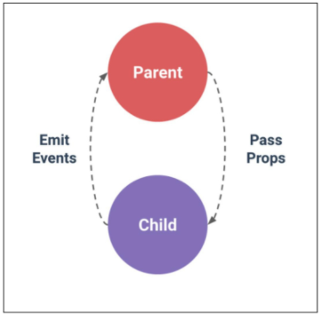

# Vue_02

---

## Vue CLI

## Component ( 컴포넌트 )

* 기본 HTML 엘리먼트를 확장하여 재사용 가능하 코드를 캡슐화 하는데 도움을 줌
* CS에서는 다시 사용할 수 있는 범용성을 위해 개발된 소프트웨어 구성 요소를 의미
* 즉, 컴포넌트는 개발을 함에 있어 유지보수를 쉽게 만들어 줄 뿐만 아니라, 재사용성의 측면에서도 매우 강력한 기능을 제공
* Vue 컴포넌트 === Vue 인스턴스

## SFC (Single File Component)

* Vue의 컴포넌트 기반 개발의 핵심 특징
* 하나의 컴포넌트 .vue라는 하나의 파일 안에서 작성되는 코드의 결과물
* 화면의 특정 영역에 대한 HTML, CSS, JavaScript 코드를 하나의 파일(.vue)에서 관리
* 즉, .vue 확장자를 가진 싱글 파일 컴포넌트를 통해 개발하는 방식
* Vue 컴포넌트 === Vue 인스턴스 == .vue 파일

## Vue CLI

* Vue.js 개발을 위한 표준 도구
* 프로젝트의 구성을 도와주는 역할을 하며 Vue 개발 생태계에서 표준 tool 기준을 목표로 함
* 확장 플러그인 GUI, ES2015 구성 요소 제공 등 다양한 tool 제공

## Node.js

* 자바스크립트를 브라우저가 아닌 환경에서도 구동할 수 있도록 하는 자바스크립트 런타임 환경
  * 브라우저 밖을 벗어날 수 없던 자바스크립트 언어의 태생적 한계를 해결
* Chrome V8 엔진을 제공하여 여러 OS 환경에서 실행할 수 있는 환경을 제공
* 즉, 단순히 브라우저만 조작할 수 있던 자바스크립트를 SSR에서도 사용 가능하도록 함

# Babel & Webpack

---

## Babel

* JavaScript Transcompiler
* 자바스크립트의 신 버전 코드를 구 버전으로 번역 / 변환 해주는 도구

## Webpack

* Static module bundler
* 모듈 간의 의존성 문제를 해결하기 위한 도구

## Module

* 모듈은 단지 파일 하나를 의미 ( 스크립트 하나 === 모듈 하나)
* 모듈의 수가 많아지고 라이브러리 혹은 모듈 간의 의존성이 깊어지면서 특정한 곳에서 발생한 문제가 어떤 모듈 간의 문제인지 파악하기 어려워짐
* Webpack은 모듈 간의 의존성 문제를 해결하기 위해 존재하는 도구

## Bundler

* 모듈 의존성 문제를 해결해주는 작업이 Bundling 이고 이러한 일을 해주는 도구가 Bundler 이고, Webpack은 다양한 Bundler 중 하나
* 모듈들을 하나로 묶어주고 묶인 파일은 하나(혹은 여러 개)로 만들어짐

# Pass Props & Emit Events

---

## Pass Props & Emit Events

* 컴포넌트는 부모 - 자식 관계에서 가장 일반적으로 함께 사용하기 위함
* 부모는 자식에게 데이터를 전달(Pass props)하며, 자식은 자신에게 일어난 일을 부모에게 알림(Emit Event)
  * 부모와 자식이 명확하게 정의된 인터페이스를 통해 격리된 상태로 유지할 수 있음
* props는 아래로, events는 위로
* 부모는 props를 통해 자식에게 데이터를 전달하고, 자식은 events를 통해 부모에게 메시지를 보냄

## Props

* prop는 상위 컴포넌트의 정보를 전달하기 위한 사용자 지정 특성
* 하위 컴포넌트는 props 옵션을 사용하여 수신 하는 props를 명시적으로 선언해야 함
* 즉, 데이터는 props 옵션을 사용하여 하위 컴포넌트로 전달 됨
* 하위 컴포넌트의 템플릿에서 상위 데이터를 직접 참조할 수 없음

### props naming convention

* in HTML = kebab-case
* in script  = camelCase

## 단방향 데이터 흐름

* 모든 props는 하위 속성과 상위 속성 사이의 단방향 바인딩을 형성
* 부모의 속성이 변경되면 자식의 속성에게 전달되지만, 반대 방향으로는 안됨
  * 자식 요소가 의도치 않게 부모 요소의 상태를 변경함으로써 앱의 데이터 흐름을 이해하기 어렵게 만드는 일을 막기 위함
* 부모 컴포넌트가 업데이트 될 때 마다 자식 요소의 모든 props들이 최신 값으로 업데이트 됨

## Emit event

* `$emit(event)`
  * 현재 인스턴스에서 이벤트를 트리거
  * 추가 인자는 리스너의 콜백 함수로 전달
* 부모 컴포넌트는 자식 컴포넌트가 사용되는 템플릿에서 v-on을 사용하여 자식 컴포넌트가 보낸 이벤트를 청취 (v-on을 이용한 사용자 지정 이벤트)

## event 이름

* 컴포넌트 및 props와는 달리, 이벤트는 자동 대소문자 변환을 제공하지 않음
* HTML의 대소문자 구분을 위해 DOM 템플릿의 v-on 이벤트 리스너는 항상 자동으로 소문자 변환되기 때문에 `v-on:myEvent`는 자동으로 `v-on:myevent`로 변환
* 이러한 이유로 이벤트 이름에는 kebab-case를 사용하는 것을 권장

# Vue Router

---

* 중첩된 라우트 / 뷰 매핑 모듈화 된, 컴포넌트 기반의 라우터 설정 등 SPA 상에서 라우팅을 쉽게 개발할 수 있는 기능을 제공
* router - link
  * index.js 파일에 정의한 경로에 등록한 특정 컴포넌트와 매핑
  * HTML5 히스토리 모드에서 rounter-link는 클릭 이벤트를 차단하여 브라우저가 페이지를 다시 로드하지 않도록 함
  * a 태그지만 우리가 알고 있는 GET 요청을 보내는 a 태그와 조금 다르게 기본 GET 요청을 보내는 이벤트를 제거한 형태로 구성
* router - view
  * 실제 component가 DOM에 부착되어 보이는 자리를 의미
  * router - link를 클릭하면 해당 경로와 연결되어 있는 index.js에 정의한 컴포넌트가 위치

## Component vs views

* 컴포넌트를 만들어 갈 때 정해진 구조가 있는 것은 아님
* 주로 아래와 같이 구조화 하여 활용
* App.vue
  * 최상위 컴포넌트
* views/
  * router(index.js)에 매핑되는 컴포넌트를 모아두는 폴더
  * App 컴포넌트 내부에 About & Home 컴포넌트 등록
* components
  * router에 매핑된 컴포넌트 내부에 작성하는 컴포넌트를 모아두는 폴더
  * Home 컴포넌트 내부에 Helloworld 컴포넌트 등록

## History mode

* HTML history API를 사용해서 router를 구현한 것
* 브라우저의 히스토리는 남기지만 실제 페이지는 이동하지 않는 기능을 지원

## Vue Router가 필요한 이유

1. SPA 등장 이전
   * 서버가 모든 라우팅을 통제
   * 요청 경로에 맞는 HTML를 제공
2. SPA 등장 이후
   * 서버는 index.html 하나만 제공
   * 이후 모든 처리는 HTML 위에서 JS 코드를 활용해 진행
   * 즉, 요청에 대한 처리를 더 이상 서버가 하지 않음
3. 라우팅 처리 차이
   * SSR
     * 라우팅에 대한 결정권을 서버가 가짐
   * CSR
     * 클라이언트는 더 이상 서버로 요청을 보내지 않고 응답 받은 HTML 문서 안에서 주소가 변경되면 특정 주소에 맞는 컴포넌트를 렌더링
     * 라우팅에 대한 결정권을 클라이언트가 가짐
   * Vue Router는 라우팅의 결정권을 가진 Vue.js에서 라우팅을 편리하게 할 수 있는 Tool을 제공해주는 라이브러리

