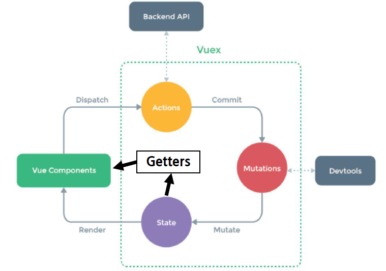

# Vue_03

---

## Vuex

* statement management pattern + library for vue.js
  * 상태 관리 패턴 + 라이브러리
* 상태를 전역 저장소로 관리할 수 있도록 지원하는 라이브러리
  * state가 예측 가능한 방식으로만 변경될 수 있도록 보장하는 규칙 설정
  * 애플리케이션의 모든 컴포넌트에 대한 중앙 집중식 저장소 역할
* Vue의 공식 devtools와 통합되어 기타 고급 기능을 제공

## State

* state는 data이며 해당 어플리케이션의 핵심이 되는 요소
* 각 컴포넌트에서 관리 (.html의 경우 new Vue({}), SFC에서는 .vue에 해당)
* DOM data에 반응하여 DOM을 렌더링

## Pass props & Emit event

* 각 컴포넌트는 독립적으로 데이터를 관리
* 데이터는 단방향으로 흐름 부모 => 자식 간의 전달만 가능하며 반대의 경우 이벤트를 통해 전달
* 장점
  * 데이터의 흐름을 직관적으로 파악 가능
* 단점
  * 컴포넌트 중첩이 깊어지는 경우 동위 관계의 컴포넌트로의 데이터 전달이 불편해짐

## in Vuex

* 중앙 저장소에서 state를 모아놓고 관리
* 규모가 큰 (컴포넌트 중첩이 깊은) 프로젝트에 매우 편리
* 각 컴포넌트에서는 중앙 집중 저장소의 state만 신경쓰면 됨
* 이를 공유하는 다른 컴포넌트는 알아서 동기화

# Vuex Core Concept

---

## 단방향 데이터 흐름

* 상태 (state)는 앱을 작동하는 원본 소스 (data)
* 뷰(view)는 상태의 선언적 매핑
* 액션(action)은 뷰에서 사용자 입력에 대해 반응적으로 상태를 바꾸는 방법 (methods)

## 단방향 데이터 흐름의 단점

* 공통의 상태를 공유하는 여러 컴포넌트가 있는 경우 빠르게 복잡해짐
* 예를 들면, 지나치게 중첩된 컴포넌트를 통과하는 prop

## 상태 관리 패턴

* 컴포넌트의 공유된 상태를 추출하고 이를 전역에서 관리 하도록 함
* 컴포넌트는 커다란 뷰가 되며 모든 컴포넌트는 트리에 상관 없이 상태에 엑세스 하거나 동작을 트리거 할 수 있음
* 상태 관리 및 특정 규칙 적용과 관련된 개념을 정의하고 분리함으로써 코드의 구조와 유지 관리 기능 향상

## Vuex 구성 요소

* State
* Actions
* Mutations
* Getters

## Vuex 구성 요소 - state

* 중앙에서 관리하는 모든 상태 정보 (data)
* Mutations에 정의된 메서드에 의해 변경
* 여러 컴포넌트 내부에 있는 특정 state를 중앙에서 관리
  * 이전의 방식은 state를 찾기 위해 각 컴포넌트를 직접 확인
  * Vuex를 활용하는 방식은 Vuex Store에서 컴포넌트에서 사용하는 state를 한 눈에 파악 가능
* state가 변화하면 해당 state를 공유하는 컴포넌트의 DOM은 알아서 렌더링
* 컴포넌트는 이제 Vuex Store에서 state 정보를 가져와 사용
* **`dispatch()`**를 사용하여 Acitons 내부의 메서드를 호출

## Vuex 구성 요소 - Actions

* Component에서 `dispatch()` 메서드에 의해 호출
* Backend API와 통신하여 Data Fetching 등의 작업을 수행
  * 동기적인 작업 뿐만 아니라 비동기적인 작업을 포함 가능
* 항상 **`context`**가 인자로 넘어옴
  * store.js 파일 내에 있는 모든 요소에 접근해서 속성 접근 & 메서드 호출이 가능
  * 단, state를 직접 변경하지 않음
* mutations에 정의된 메서드를 **`commit`** 메서드로 호출
* state는 오로지 mutaions 메서드를 통해서만 조작
  * 명확한 역할 분담을 통해 서비스 규모가 커져도 state를 올바르게 관리하기 위함

## Vuex 구성 요소 - Mutations

* Actions에서 `commit()`메서드에 의해 호출
* 비동기적으로 동작하면 state가 변화하는 시점이 달라질 수 있기 때문에 동기적인 코드만 작성
* Mutations에 정의하는 메서드의 첫 번째 인자로 state가 넘어옴

## Vuex 구성 요소 - Getters

* state를 변경하지 않고 활용하여 계산을 수행 (computed와 유사)
  * 실제 계산된 값을 사용하는 것 처럼 getters는 저장소의 상태(state)를 기준으로 계산
  * 예를 들어, state에 todo list의 해야 할 일의 목록의 경우 todo가 완료된 목록만 필터링 해서 보여줘야 하는 경우가 있음
  * getters에서 completed의 값이 true인 요소가 필터링 해서 계산된 값을 담아 놓을 수 있음
* getters 자체가 state 자체를 변경하지는 않음
  * state를 특정한 조건에 따라 구분(계산)만 함
  * 즉, 계산된 값을 가져옴