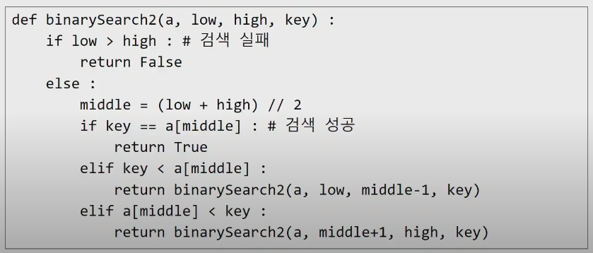

# List2

---

## 순차 검색 (Sequential Search)

### 일렬로 되어 있는 자료를 순서대로 검색하는 방법

* 가장 간단하고 직관적인 검색방법
* 배열이나 연결 리스트 등 순차구조로 구현된 자료구조에서 원하는 항목을 찾을 때 유용함
* 알고리즘이 단순하여 구현이 쉽지만, 검색 대상의 수가 많은 경우에는 수행시간이 급격히 증가하여 비효율적임

### 2가지 경우

* 정렬이 되어 있는 경우
* 정렬이 되어 있지 않은 경우


#### 정렬이 되어 있지 않은 경우

* 첫 번째 원소부터 순서대로 검색 대상과 키 값이 같은 원소가 있는지 비교하며 찾는다.
* 키 값이 동일한 원소를 찾으면 그 원소의 인덱스를 반환한다.
* 자료구조의 마지막에 이를 때까지 검색 대상을 찾지 못하면 검색 실패

찾고자 하는 원소의 순서에 따라 비교 회수가 결정됨

* 정렬되지 않은 자료에서의 순차 검색의 평균 비교 회수
  * =(1/n) * (1+2+3+...+n) = (n+1)/2
* 시간 복잡도 : O(n)

```python
def sequentialSearch(a,n,key):
    i = 0
    while i < n and a[i] != key:
        i+=1
    if i < n : return i
    else : return -1
```


#### 정렬이 되어 있는 경우

* 자료를 순차적으로 검색하면서 키 값을 비교하여, 원소의 키 값이 검색 대상의 키 값보다 크면 찾는 원소가 없다는 것이므로 더 이상 검색하지 않고 검색을 종료한다.

```python
def sequentialSearch2(a, n, key):
    i = 0
    while i < n and a[i] < key:
        i+=1
    if i < n : return i
    else: return -1
```


## 이진 검색 (Binary Search)

---

#### 자료의 가운데에 있는 항목의 키 값과 비교하여 다음 검색의 위치를 결정하고 검색을 계속 진행하는 방법

* 목적 키를 찾을  때까지 이진 검색을 순환적으로 반복 수행함으로써 검색 범위를 반으로 줄여가면서 보다 빠르게 검색을 수행함

이진 검색을 하기 위해서는 자료의 형태가 정렬된 형태여야 한다.

#### 검색 과정

* 자료의 중앙에 있는 원소를 고른다.
* 중앙 원소의 값과 찾고자 하는 목표 값을 비교한다.
* 목표 값이 중앙 원소의 값보다 작으면 자료의 왼쪽 반에 대해서 새로 검색을 수행하고, 크다면 자료의 오른쪽 반에 대해서 새로 검색을 수행한다.
* 찾고자 하는 값을 찾을 때 까지 위 과정을 반복한다.
* 시간 복잡도 O(log n)

#### 구현

* 검색 범위의 시작점과 종료점을 이용하여 검색을 반복 수행한다.
* 이진 검색의 경우, 자료에 삽입이나 삭제가 발생했을 때 배열의 상태를 항상 **정렬 상태로** 유지하는 추가 작업이 필요하다.

```python
def binarySearch(a, key):
    start = 0
    end = len(a)-1
    while start <= end:
        middle = (start + end)//2
        if a[middle] == key :		# 검색 성공
        	return True
       	elif a[middle] > key:
            end = middle -1
        else: start = middle + 1
    return False		# 검색 실패
```


#### 재귀 호출

```python
def binarySearch2(a, low, high, key) :
    if high < low : # 검색 실패, 재귀 탈출
        return False
   	else:
        middle = (low + high) // 2
        if key == a[middle]: 	#검색 성공
            return Ture
        elif key < a[middle] :
            return binarySearch2(a, low, middle-1, key)
        elif a[middle] < key:
            return binarySearch2(a, middle+1, high, key)
```





## 셀렉션 알고리즘 (Selection Algorithm)

---

#### 저장되어 있는 자료로부터 K번째로 큰 혹은 작은 원소를 찾는 방법을 셀렉션 알고리즘이라고 한다.

* 최소값, 최대값 혹은 중간값을 찾는 알고리즘을 의미하기도 한다.

#### 선택과정

* 셀렉션은 아래와 같은 과정을 통해 이루어진다.
  * 정렬 알고리즘을 이용하여 자료 정렬하기
  * 원하는 순서에 있는 원소 가져오기


#### K번째로 작은 원소를 찾는 알고리즘

* 1번부터 k번째까지 작은 원소들을 찾아 배열의 앞쪽으로 이동시키고 배열의 K번째를 반환한다.
* K가 비교적 작을 때 유용하며 O(kn)의 시간복잡도를 가진다.

```python
def select(list, k):
    for i in range(0,k):
        minIndex = i
        for j in range(i+1, len(list)):
            if list[minIndex] > list[j]:
                minIndex = j
        list[i], list[minIndex] = list[minIndex], list[i]
    return list[k-1]
```


## 선택 정렬

---

#### 주어진 자료들 중 가장 작은 값의 원소부터 차례대로 선택하여 위치를 교환하는 방식

* 앞서 살펴본 셀렉션 알고리즘을 전체 자료에 적용한 것이다.

#### 정렬 과정

* 주어진 리스트 중에서 최소값을 찾는다.
* 그 값을 리스트의 맨 앞에 위치한 값과 교환한다.
* 맨 처음 위치를 제외한 나머지를 리스트를 대상으로 위의 과정을 반복한다.

#### 시간 복잡도

* O(n^2)

```python
def selectionSort(a : List[int]) -> List[int]:
    for i in range(0, len(a)-1):		#마지막 원소는 정해진 자리 하나이기 때문에 len(a)-1
        min = i
        for j in range(i+1, len(a)):
            if a[min] > a[j]:
                min = j
        a[i], a[min] = a[min] , a[i]
```

