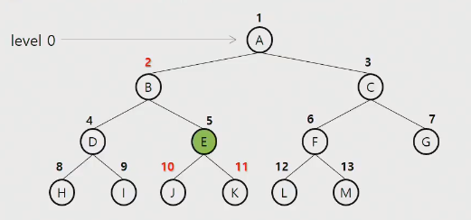
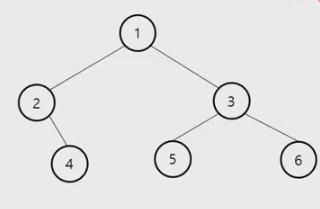
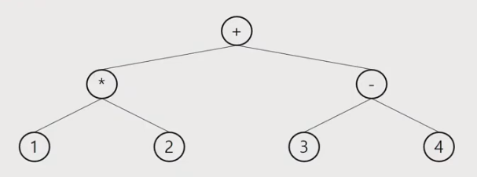
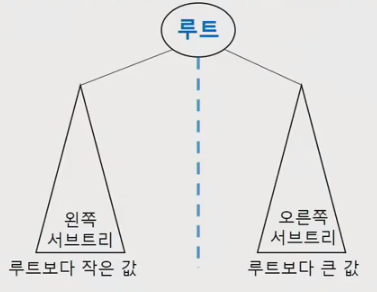

# 이진트리

---

V의 개수가 n개라고 해서 V가 n번 까지 있는 것이 아니다. V의 개수가 나타나는 것은 Edge(간선)의 개수를 나타내는 것이다.

* 자식 노드를 인덱스로 부모 번호를 저장
  *  root를 찾을 때
  * 조상을 찾을 때


### 이진트리의 표현 - 배열

* 배열을 이용한 이진 트리의 표현
* 노드 번호의 성질
  * 노드 번호가 i인 노드의 부모 노드 번호 (ex i가 5이면 floor 연산 = int(5/2) = 2 => 부모노드)
  * 노드 번호가 i인 노드의 왼쪽 자식 노드 번호 (2 * i)
  * 노드 번호가 i인 노드의 오른쪽 자식 노드 번호 (2 * i + 1)
  * 레벨 n의 노드 번호 시작 번호는 (2 ^ n) => Level은 0부터 시작




### 트리의 저장 방법



V = 6

1 2 1 3 2 4 3 5 3 6

* 부모 노드를 인덱스로 자식 번호를 저장
  * ch1 = [0, 2, 4, 5, 0, 0, 0]
  * ch2 = [0, 3, 0, 6, 0, 0, 0]

```sudo code
# 순서 상관 없을 때, 자식 노드의 값이 비어있으면 ch1부터 입력
if ch1[parent] == 0:
    ch1[parent] = child
else:
    ch2[parent] = child
```


* 자식 노드를 인덱스로 부모 번호를 저장
  * parent = [0, 0, 1, 1, 2, 3, 3]
  * 주로 root 노드를 찾을 때 사용 (조상 찾기)


## 수식 트리



* 수식을 표현하는 이진 트리
* 수식 이진트리( Expression Binary Tree)라고 부르기도 함.
* 연산자는 루트 노드이거나 가지 노드
* 피연산자는 모두 잎 노드


## 이진 탐색 트리



* 탐색작업을 효율적으로 하기 위한 자료구조
* 모든 원소는 서로 다른 유일한 키를 갖는다.
* Key(왼쪽 서브트리) < Key(루트 노드) < Key(오른쪽 서브트리)
* 왼쪽 서브트리와 오른쪽 서브트리도 이진 탐색 트리다.
* 중위 순회하면 오름차순으로 정렬된 값을 얻을 수 있다.


### 이진 탐색 트리 - 연산

* 탐색 연산
* 삽입 연산
* 삭제 연산


### 이진 탐색 트리 - 성능

* 탐색( searching), 삽입(insertion), 삭제(deletion) 시간은 트리의 높이 만큼 걸린다.
  * O(h), h: 이진 탐색 트리의 깊이
* 평균의 경우
  * 이진 트리가 균형적으로 생성되어 있는 경우
  * O(log n)
* 최악의 경우
  * 한쪽으로 치우친  경사 이진트리의 경우
  * O(n)
  * 순차탐색과 시간복잡도가 같다.

### 이진 탐색 트리 - 성능2

* 검색 알고리즘 비교
  * 배열에서의 순차 검색 : O(N)
  * 정렬된 배열에서의 순차 검색 : O(N)
  * 정렬된 배열에서의 이진탐색 : O(logN)
    * 고정 배열 크기와 삽입, 삭제 시 추가 연산 필요
  * 이진 탐색트리에서의 평균 : O(logN)
    * 최악의 경우 : O(N)
    * 완전 이진트리 또는 균형 트리로 바꿀 수 잇다면 최악의 경우를 없앨 수 있다.
      * 새로운 원소를 삽입할 때 삽입 시간을 줄인다.
      * 평균과 최악의 시간이 같다. O(logN)
  * 해쉬 검색 : O(1)
    * 추가 저장 공간이 필요


## 힙(heap)

* 완전 이진 트리에 있는 노드 중에서 키 값이 가장 큰 노드나 키 값이 가장 작은 노드를 찾기 위해서 만든 자료구조
* 최대 힙(max heap)
  * 키 값이 가장 큰 노드를 찾기 위한 **완전 이진 트리**
  * 부모노드의 키 값 > 자식 노드의 키 값
  * 루트 노드 : 키 값이 가장 큰 노드
* 최소 힙(min heap)
  * 키 값이 가장 작은 노드를 찾기 위한 **완전 이진 트리**
  * 부모노드의 키 값 < 자식 노드의 키 값
  * 루트 노드 : 키 값이 가장 작은 노드