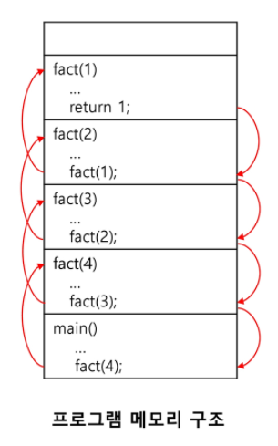
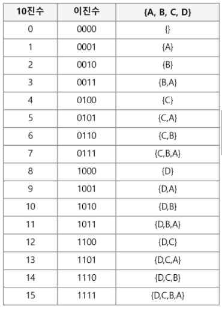

# 완전 검색 & 그리디

---

## 반복(Iteration)과 재귀(Recursion)

* 반복과 재귀는 유사한 작업을 수행할 수 있다.


* 반복은 수행하는 작업이 완료될 때까지 계속 반복
  * 루프(for, while 구조)


* 재귀는 주어진 문제의 해를 구하기 위해 동일하면서 더 작은 문제의 해를 이용하는 방법
  * 하나의 큰 문제를 해결할 수 있는 (해결하기 쉬운) 더 작은 문제로 쪼개고 결과들을 결합한다.
  * 재귀 함수로 구현 (재귀로 복사)
  * 시간 복잡도 O(n) => T(n) = T(n-1)
  * 하지만 같은 기능이여도 재귀 함수는 호출 및 복귀 시간이 있으므로 좀 더 걸릴 수 있음.


#### 반복 구조

* 초기화 (loop Initialization)
  * 시작하는 값
  * 반복되는 명령문을 실행하기 전에 (한 번만) 조건 검사에 사용할 변수의 초기값 설정
* 조건 검사 ( check control expression)
* 반복할 명령문 실행 (action)
* 업데이트 (loop update)
  * 무한 루브가 되지 않게 조건이 거짓( false)이 되게 한다.

* 반복을 이용한 선택정렬

```python
def SelectionSort(A):
    n = len(A)
    for i in range(0, n-1):
        min_n = i
        for j in range(i+1, n):
            if A[j] < A[min_n]:
                min_n = j
        temp = A[min_n]
        A[min_n] = A[i]
        A[i] = temp
```


#### 재귀적 알고리즘

* 재귀적 정의는 두 부분으로 나뉜다.
* 하나 또는 그 이상의 기본 경우(basis case or rule)
  * 집합에 포함되어 있는 원소로 induction을 생성하기 위한 시드(seed) 역할
* 하나 또는 그 이상의 유도된 경우(inductive case of rule)
  * 새로운 집합의 원소를 생성하기 위해 결합되어지는 방법


#### 재귀 함수 (recursive function)

* 함수 내부에서 직접 혹은 간접적으로 자기 자신을 호출하는 함수
* 일반적으로 재귀적 정의를 이용해서 재귀 함수를 구현한다.
* 따라서, 기본 부분(basis part)와 유도 파트(inductive part)로 구성된다.
* 재귀적 프로그램을 작성하는 것은 반복 구조에 비해 간결하고 이해하기 쉽다.
* 함수 호출은 프로그램 메모리 구조에서 스택을 사용한다. 따라서 재귀 호출은 반복적인 스택의 사용을 의미하며 메모리 및 속도에서 성능 저하가 발생한다.

#### 팩토리얼 재귀 함수의 호출

```sudo
fact (n)
    IF n <= 1
        RETURN 1
    ELSE
        RETURN n * fact( n -1 )
```



* **입력 값 n이 커질수록 재귀 알고리즘은 반복에 비해 비효율적일 수 있다.**
* 일반적으로, 재귀적 알고리즘은 반복(Iteration) 알고리즘보다 더 많은 메모리와 연산을 필요로 한다.

|                |                       재귀                        |         반복          |
| :------------: | :-----------------------------------------------: | :-------------------: |
|      종료      | 재귀함수 호출이 종료되는 베이스 케이스(base case) |  반복문의 종료 조건   |
|   수행 시간    |                   (상대적) 느림                   |         빠름          |
|  메모리 공간   |                (상대적) 많이 사용                 |       적게 사용       |
| 소스 코드 길이 |                     짧고 간결                     |         길다          |
| 소스 코드 형태 |               선택 구조(if...else)                | 반복 구조(for, while) |
|  무한 반복 시  |                  스택 오버플로우                  |  CPU를 반복해서 점유  |


### 완전 검색으로 시작하라

* 모든 경우의 수를 생성하고 테스트하기 때문에 수행 속도는 느리지만, 해답을 찾아내지 못할 확률이 작다.
  * 완전 검색은 입력의 크기를 작게 해서 간편하고 빠르게 답을 구하는 프로그램을 작성한다.


* 이를 기반으로 그리디 기법이나 동적 계획법을 이용해서 효율적인 알고리즘을 찾을 수 있다.


* 검정 등에서 주어진 문제를 풀 때, 우선 완전 검색으로 접근하여 해답을 도출한 후, 성능 개선을 위해 다른 알고리즘을 사용하고 해답을 확인하는 것이 바람직하다.


#### 완전 검색

* 많은 종류의 문제들이 특정 조건을 만족하는 경우나 요소를 찾는 것이다.
* 또한, 이들은 전형적으로 순열(Permutation), 조합(Combination), 그리고 부분집합(Subset)과 같은 조합적 문제들과 연관된다.
* 완전 검색은 조합적 문제에 대한 brute-force 방법이다.


## 조합적 문제

### 순열 (Permutation)

* 서로 다른 것들 중 몇 개를 뽑아서 한 줄로 나열하는 것

* 서로 다른 n개 중 r개를 택하는 순열은 아래와 같이 표현한다.

  ​	nPr

* 그리고 nPr은 다음과 같은 식이 성립한다.

  * nPr = n * (n-1) * (n-2) * ... *(n-r+1)

* nPn = n!이라고 표기하며 Factorial이라 부른다.


* 다수의 알고리즘 문제들은 순서화된 요소들의 집합에서 최선의 방법을 찾는 것과 관련 있다.
  * ex) TSP (Traveling Salesman Problem)


#### 재귀 호출을 통한 순열 생성

```sudo
// arr[] : 데이터가 저장된 배열
// swap(i,j): arr[i] <== 교환 ==> arr[j]
// n : 원소의 개수, k: 숫자를 결정할 자리(index), i는 바꿀 자리(바꿀 index)

Perm(n, k)
    IF k == n
    	print array
    ELSE
    	FOR i in k -> n-1
    		swap(k,i);  // swap이라는 함수를 만드는 것이 아니라 바꾸는 기능 구현
    		perm(n, k+1);
    		swap(k, i);

```


### 부분 집합

* 집합에 포함된 원소들을 선택하는 것이다.
* 다수의 중요 알고리즘들이 원소들의 그룹에서 최적의 부분집합을 찾는 것이다.
  * ex) 배낭 짐싸기(knapsack)
* N개의 원소를 포함한 집합
  * 자기 자신과 공집합 포함한 모든 부분집합(power set)의 개수는 2^n개
  * 원소의 수가 증가하면 부분집합의 개수는 지수적으로 증가


### 부분집합 생성 방법

단순하게 반복으로 부분집합 생성 시 원소의 개수가 달라질 때 구하기 힘들다.

* 바이너리 카운팅(Binary Counting)
  * 원소 수에 해당하는 N개의 비트열을 이용한다.
  * n 번째 비트 값이 1이면 n 번째 원소가 포함되었음을 의미한다.



* 바이너리 카운팅을 통한 부분집합 생성 코드

```python
arr = [3,6,7,1,5,4]
n = len(arr)

for i in range(0, (1<<n)):
    # 1 << n : 부분 집합의 개수
    for j in range(0, n):
        # 원소의 수만큼 비트를 비교함
        if i & (1<<j):
            # i의 j번째 비트가 1이면 j 번째 원소 출력
            print("%d, " % arr[j], end='')
    print()
```


### 조합

* 서로 다른 n개의 원소 중 r개를 순서 없이 골라낸 것을 조합(combination)이라고 부른다.
* 조합의 수식 (같은 것이지만 순서가 다른 것을 없애자!)
  * nCr = n! / (n-r)!*r!  (n>=r)
  * nCr = n-1Cr-1 + n-1Cr  => 재귀적 표현(트리구조와 비슷함 왼쪽 트리는 r-1, 오른쪽 트리는 r)

* 재귀 호출을 이용한 조합 생성 알고리즘

```sudo
an[] : n 개의 원소를 가지고 있는 배열
tr[] : r 개의 크기의 배열, 조합이 임시 저장될 배열

comb(n, r)
    IF r == 0 : print_array_t()
    ELIF n < r : RETURN
    ELSE
        tr[n - 1] <= an[n - 1]
        comb(n - 1, r - 1)
        comb(n - 1, r)

```


## 탐욕 알고리즘 (Greedy Algorithm)

---

* 탐욕 알고리즘은 최적해를 구하는 데 사용되는 근시안적인 방법
* 일반적으로, 머리 속에 떠오르는 생각을 검증 없이 바로 구현하면 Greedy 접근이 된다.
* 여러 경우 중 하나를 선택할 때마다 그 순간에 최적이라고 생각되는 것을 선택해 나가는 방식으로 진행하여 최종적인 해답에 도달한다.
* 각 선택 시점에서 이루어지는 결정은 지역적으로는 최적이지만, 그 선택들은 계속 수집하여 최종적인 해답을 만들었다고 하여, **그것이 최적이라는 보장은 없다.**

* 일단, 한번 선택된 것은 번복하지 않는다. 이런 특성 때문에 대부분의 탐욕 알고리즘들은 단순하며, 또한 제한적인 문제들에 적용된다.

* 최적화 문제 (optimization)란 가능한 해들 중에서 가장 좋은 (최대 또는 최소) 해를 찾는 문제이다.

1) 해 선택 : 현재 상태에서 부분 문제의 최적 해를 구한 뒤, 이를 부분해 집합(Solution Set)에 추가한다.

2) 실행 가능성 검사 : 새로운 부분 해 집합이 실행 가능한지를 확인한다. 곧, 문제의 제약 조건을 위반하지 않는 지를 검사한다.

3) 해 검사 : 새로운 부분 해 집합이 문제의 해가 되는지를 확인한다. 아직 전체 문제의 해가 완성되지 않았다면 1의 해 선택부터 다시 시작한다.


### 배낭 짐싸기(Knapsack)

* Knapsack 문제 유형
  * 0-1 Knapsack
    * 배낭에 물건을 통째로 담아야 하는 문제
    * 물건을 쪼갤 수 없는 경우
  * Fractional Knapsack
    * 물건을 부분적으로 담는 것이 허용되는 문제
    * 물건을 쪼갤 수 있는 경우


### 탐욕 알고리즘의 필수 요소

* 탐욕적 선택 속성
  *  탐욕적 선택은 최적해로 갈 수 있음을 보여라
  * 즉, 탐욕적 선택은 항상 안전하다.
* 최적화 문제를 정형화하라
  * 하나의 선택을 하면 풀어야 할 하나의 하위 문제가 남는다.


* **[원 문제의 최적해 = 탐욕적 선택 + 하위 문제의 최적해] 임을 증명하라.**

#### 탐욕 기법과 동적 계획법의 비교

|                          탐욕 기법                           |                       동적 계획법                       |
| :----------------------------------------------------------: | :-----------------------------------------------------: |
| 매 단계에서 가장 좋게 보이는 것을 빠르게 선택한다. => 지역 최적 선택(local optimal choice) | 매 단계의 선택은 해결한 하위 문제의 해를 기반으로 한다. |
|    하위 문제를 풀기 전에 (탐욕적) 선택이 먼저 이루어진다.    |               하위 문제가 우선 해결된다.                |
|                        Top-down 방식                         |                     Bottom-up 방식                      |
|                 일반적으로, 빠르고 간결하다.                 |                 좀 더 느리고, 복잡하다.                 |

