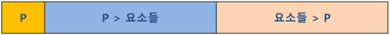
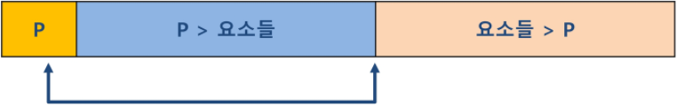
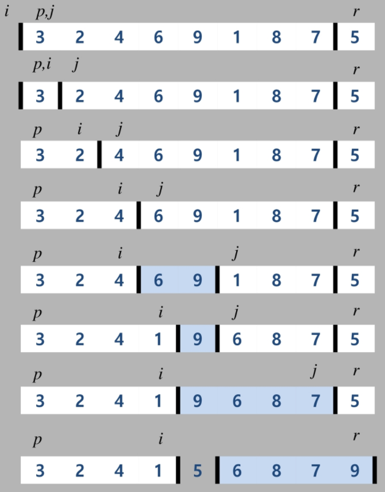

# 분할정복 & 백트래킹

---

* 목표
  * 문제를 분할해서 해결하는 분할 정복 (Divide and Conquer) 기법을 이해하고 대표적인 알고리즘인 퀵 정렬과 병합 정렬에 대해 학습한다.
  * 상태 공간 트리의 모든 노드를 검색하는 백트래킹에 대해 학습한다.
  * 이진 트리(Binary Tree)의 특성을 이해하고 이진 트리의 중요한 연산인 탐색, 삽입, 삭제 알고리즘을 학습한다.

* 설계 전략
  * 분할(Divide) : 해결할 문제를 여러 개의 작은 부분으로 나눈다.
  * 정복(Conquer) : 나눈 작은 문제를 각각 해결한다.
  * 통합(Combine) : (필요하다면) 해결된 해답을 모은다.


### 거듭 제곱

* 분할 정복 기반의 알고리즘 :  **O(logn)**

```sudo
Recursive_Power(x, n):
    IF n == 1 : RETURN x
    IF n is even:
    	y <= Recursive_Power(x, n/2)
    	RETURN y * y
    ELSE:
    	y <= Recursive_Power(x, (n-1)/2)
    	RETURN y * y * x
```


## 병합 정렬 (Merge Sort)

* 여러 개의 정렬된 자료의 집합을 병합하여 한 개의 정렬된 집합으로 만드는 방식
* 분할 정복 알고리즘 활용
  * 자료를 최소 단위의 문제까지 나눈 후에 차례대로 정렬하여 최종 결과를 얻어냄
  * top-down 방식
* 시간 복잡도
  * O(n log n)

#### 알고리즘 : 분할 과정

```sudo
merge_sort(LIST m)
	IF length(m) == 1 : RETURN m
	
	LIST left, right
	middle <= length(m) / 2
	FOR x in m before middle
		add x to left
	FOR x in m after or equal middle
		add x to right
	
	left <= merge_sort(left)
	right <= merge_sort(right)
	
	RETURN merge(left, right)
```

#### 알고리즘 : 병합 과정

```sudo
merge(LIST left, LIST right)
	LIST result
	
	WHILE length(left) > 0 OR length(right) > 0
		IF length(left) > 0 AND length(right) > 0
			IF first(left) <= first(right)
				append popfirst(left) to result
			ELSE
				append popfirst(right) to result
	RETURN result
```


## 퀵 정렬

* 주어진 배열을 두 개로 분할하고, 각각을 정렬한다.
* **병합 정렬과 다른점**
  * 병합 정렬은 그냥 두 부분으로 나누는 반면에, 퀵 정렬은 분할할 때, 기준 아이템(pivot item) 중심으로, 이보다 작은 것은 왼편, 큰 것은 오른편에 위치시킨다.
  * 각 부분 정렬이 끝난 후, 병합 정렬은 "병합"이란 후 처리 작업이 필요하나, 퀵 정렬은 필요로 하지 않는다.

#### 알고리즘

```sudo
quickSort(A[], l, r)
	if l < r
		s <= partition(a, l, r)
		quickSort( A[], l, s-1 )
		quickSort( A[], s+1, r )
```

**Hoare - Partition 알고리즘**

```sudo
partition(A[], l, r)
	p <= A[l]		// p: 피봇 값
	i <= l,  j <= r
	WHILE i <= j
		WHILE A[i] <= p : i++
		WHILE A[j] >= p : j--
		IF i < j : swap(A[i], A[j])
		
	swap(A[l], A[j])
	RETURN j
```

#### 아이디어

* P(피봇)값들 보다 큰 값은 오른쪽, 작은 값들은 왼쪽 집합에 위치하도록 한다.



* 피봇을 두 집합의 가운데에 위치시킨다.




**Lomuto partition 알고리즘**

```sudo
partition(A[], p, r)
	x <= A[r]
	i <= p - 1
	
	FOR j in p => r - 1
		IF A[j] <= x
			i++, swap(A[i], A[j])
	swap(A[i+1], A[r])
	RETURN i + 1
```




## 백트래킹(Backtracking) 개념

---

### 백트래킹과 깊이 우선 탐색(DFS)과의 차이

* 어떤 노드에서 출발하는 경로가 해결책으로 이어질 것 같지 않으면 더 이상 그 경로를 따라가지 않음으로써 시도의 횟수를 줄임(**Prunning** 가지치기)
* 깊이 우선 탐색이 모든 경로를 추적하는데 비해 백트래킹은 불필요한 경로를 조기에 차단.
* 깊이 우선 탐색을 가하기에는 경우의 수가 너무나 많음
* 즉 **N!** 가지의 경우의 수를 가진 문제에 대해 깊이 우선 탐색을 가하면 당연히 처리 불가능한 문제
* 백트래킹 알고리즘을 적용하면 일반적으로 경우의 수가 줄어들지만 이 역시 최악의 경우에는 여전히 지수함수 시간(Exponential Time)을 요하므로 처리 불가능

### 백트래킹을 이용한 알고리즘은 다음과 같은 절차로 진행된다.

1. 상태 공간 트리의 깊이 우선 검색을 실시한다.
2. 각 노드가 유망한지를 점검한다.
3. 만일 그 노드가 유망하지 않으면, 그 노드의 부모 노드로 돌아가서 검색을 계속한다.

#### 일반 백트래킹 알고리즘

```sudo
checknode (node V)
	IF promising(V)
		If there is a solution at V
			write the solution
		ELSE
			FOR each child u of V
				checknode(u)
```

