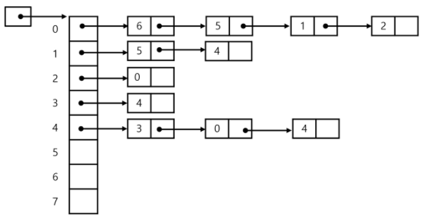

# Graph

---

## 학습 목표

* 그래프 탐색 기법인 BFS와 DFS에 대해 학습한다.
* 그래프 알고리즘에 활용되는 상호베타 집합(Disjoint - Sets)의 자료구조에 대해 학습한다.
* 최소 신장 트리(Minimum Spanning Tree)를 이해하고 탐욕 기법을 이용해서 그래프에서 최소 신장트리를 찾는 알고리즘을 학습한다.
* 그래프의 두 정점 사이의 최단 경로를 찾는 방법을 학습한다.


## 그래프 기본

* 그래프는 아이템(사물 또는 추상적 개념)들과 이들 사이의 연결 관계를 표현한다.
* 그래프는 정점(Vertex)들의 집합과 이들을 연결하는 간선(Edge)들의 집합으로 구성된 자료 구조
  * V 개의 정점을 가지는 그래픈느 최대 V * (V-1)/2 간선이 가능
    * ex) 5개 정점이 있는 그래프의 최대 간선 수는 10(= 5*4/2)개이다.
* 선형 자료구조나 트리 자료구조로 표현하기 어려운 N : M 관계를 가지는 원소들을 표현하기에 용이하다.


## 그래프 유형

* 무향 그래프 (Undirected Graph)
* 유향 그래프(Directed Graph)
* 가중치 그래프(Weighted Graph)
* 사이클이 없는 방향 그래프(DAG, Directed Acycle Graph)
* 완전 그래프
  * 정점들에 대해 가능한 모든 간선들을 가진 그래프
* 부분 그래프
  * 원래 그래프에서 일부의 정점이나 간선을 제외한 그래프


## 그래프 표현

* 간선의 정보를 저장하는 방식, 메모리나 성능을 고려해서 결정
* 인접 행렬(Adjacent Matrix)
  * V * V 크기의 2차원 배열을 이용해서 간선 정보를 저장
  * 배열의 배열(포인터 배열)
* 인접 리스트 (Adjacent List)
  * 각 정점마다 해당 정점으로 나가는 간선의 정보를 저장
* 간선의 배열
  * 간선(시작 정점, 끝 정점)을 배열에 연속적으로 저장

### 인접 행렬

* 두 정점을 연결하는 간선의 유무를 행렬로 표현
* **무향 그래프**
  * i 번째 행의 합 = i 번째 열의 합 = V(i)의 차수
* **유향 그래프**
  * 행 i의 합 = V(i)의 진출 차수
  * 열 i의 합 = V(i)의 진입 차수


### 인접 리스트

* 각 정점에 대한 인접 정점들을 순차적으로 표현
* 하나의 정점에 대한 인접 정점들을 각각 노드로 하는 연결 리스트로 저장




## 그래프 탐색

* 그래프 순회는 비선형구조의 그래프로 표현된 모든 자료(정점)를 빠짐없이 탐색하는 것을 의미한다.
* 두 가지 방법
  * 깊이 우선 탐색
  * 너비 우선 탐색


### DFS(깊이 우선 탐색)

* 시작 정점의 한 방향으로 갈 수 있는 경로가 있는 곳까지 깊이 탐색해 가다가 더 이상 갈 곳이 없게되면, 가장 마지막에 만났던 갈림길 간선이 있는 정점으로 되돌아와서 다른 방향의 정점으로 탐색을 계속 반복하여 결국 모든 정점을 방문하는 순회방법
* 가장 마지막에 만났던 갈림길의 정점으로 되돌아가서 다시 깊이 우선 탐색을 반복해야 하므로 후입 선출 구조의 스택 사용

### BFS (너비 우선 탐색)

* 너비 우선 탬색은 탐색 시작점의 인접한 정점들을 먼저 모두 차례로 방문한 후에, 방문했던 정점을 시작점으로 하여 다시 인접한 정점들을 차례로 방문하는 방식
* 인접한 정점들에 대해 탐색을 한 후, 차례로 다시 너비우선탐색을 진행해야 하므로, 선입선출 형태의 자료구조인 큐를 활용한다.


## 서로소 집합들 ( Disjoint- Sets )

* 서로소 또는 상호배타 집합들은 서로 중복 포함된 원소가 없는 집합들이다.
* 다시 말해 교집합이 없다.
* 집합에 속한 하나의 특정 멤버를 통해 각 집합들을 구분한다.
* 상호 배타 집합을 표현하는 방법
  * 연결 리스트
  * 트리
* 상호 배타 집합 연산
  * Make-set(x) <= 자기 자신이 대표( or 초기화 단계)
  * Find-Set(x)  <= 그룹 대표 찾기
  * Union(x,y)  <= x와 y의 서로의 대표자를 뽑아서 합병

* **Make-Set(x)** : 유일한 멤버 x를 포함하는 새로운 집합을 생성하는 연산

```sudo
Make-Set(x)
	p[x] <= x
```

* **Find-Set(x)** : x를 포함하는 집합을 찾는 연산

```sudo
Find-Set(x):
	IF x == p[x] : RETURN x
	ELSE	: RETURN Find-Set(p[x])		// x를 포함하는 집합을 찾을 때 까지 재귀
```

> Find-Set 연산은 특정 노드에서 루트까지의 경로를 찾아가면서 노드의 부모 정보를 갱신한다.


* **Union(x,y)** : x와 y를 포함하는 두 집합을 통합하는 연산

```sudo
Union(x, y)
	p[Find-Set(y)]  <= Find-Set(x)		// x와 y 둘 다 Find-Set 과정을 거쳐야 함
```


## 최소신장트리(MST)

* 그래프에서 최소 비용 문제
  1. 모든 정점을 연결하는 간선들의 가중치의 합이 최소가 되는 트리
  2. 두 정점 사이의 최소 비용의 경로 찾기
* 신장 트리
  * n개의 정점으로 이루어진 **무향 그래프**에서 n개의 정점과 n-1개의 간선으로 이루어진 트리
* 최소신장트리(Minimum Spanning Tree)
  * 무향 가중치 그래프에서 신장 트리를 구성하는 간선들의 가중치의 합이 최소인 신장 트리
* 정점을 모두 연결된 상태로 만들기 위한 최소비용의 간선들의 집합을 찾는 것

### Prim 알고리즘

* 하나의 정점에서 연결된 간선들 중에 하나씩 선택하면서 MST를 만들어 가는 방식
  1. 임의 정점을 하나 선택해서 시작
  2. 선택한 정점과 인접하는 정점들 중의 최소 비용의 간선이 존재하는 정점을 선택
  3. 모든 정점이 선택될 때까지 1, 2 과정을 반복
* 서로소인 2개의 집합(2 disjoint-sets) 정보를 유지
  * 트리 정점들 - MST를 만들기 위해 선택된 정점들
  * 비트리 정점들 - 선택 되지 않은 정점들

```python
'''
5 6
1 2 3
1 3 7
2 3 1
3 4 4
2 5 2
5 4 2
u v w
'''

V, E  = map(int, input().split())
INF = 10000     # 인접 행렬 초기 값
adj = [[INF]*(V+1) for _ in range(V+1)]

# 인접 행렬 좌상우하 대각선은 0
for i in range(V+1):
    adj[i][i] = 0
for _ in range(E):
    u, v, w = map(int, input().split())
    adj[u][v] = w
    adj[v][u] = w   # MST 는 무향 그래프 이므로 양방향 weight 설정

key = [INF]*(V+1)   # key[i]는 i가 MST에 연결되는 비용
key[1] = 0
MST = [0] * (V+1)
pi = [0] * (V+1)

for _ in range(V):     # 모든 정점이 MST에 포함될 때 까지
    # MST에 포함되지 않은 정점 중 key[u]가 최소인 u 값 찾기
    u = 0
    minV = INF
    for v in range(1, V+1):
        if MST[i] == 0:
            if key[v] < minV:
                u = i
                minV = key[i]

    MST[u] = 1      # key[u]가 최소인 u를 MST에 추가
    for v in range(1, V+1):     # u에 인접인 v에 대해
        if MST[v] == 0 and u != v and adj[u][v] < INF:
            if key[v] > adj[u][v]:      # 기존보다 더 작은 비용으로 MST에 연결된다면
                key[v] = adj[u][v]
                pi[v] = u       # v는 u와 연결해서 MST에 포함될 예정
print(key)
```

```python
'''
5 6
1 2 3
1 3 7
2 3 1
3 4 4
2 5 2
5 4 2
'''
def prim(start, V): # MST 가중치의 합을 리턴하는 함수. 1~V번 노드인 경우
    key = [INF] * (V + 1)  # key[i] i가 MST에 연결되는 비용
    key[1] = 0
    MST = [0] * (V + 1)
    pi = [0] * (V + 1)
    for _ in range(V):  # 모든 정점이 MST에 포함될 때 까지
        # MST에 포함되지 않은 정점 중 key[u]가 최소인 u 찾기
        u = 0
        minV = INF
        for i in range(1, V + 1):
            if MST[i] == 0:
                if key[i] < minV:
                    u = i
                    minV = key[i]
        MST[u] = 1  # key[u]가 최소인 u를 MST에 추가
        for v in range( V + 1):  # u에 인접인 v에 대해
            if MST[v] == 0 and adj[u][v] != 0:
                if key[v] > adj[u][v]:  # u를 이용해 기존보다 더 작은 비용으로 MST에 연결된다면
                    key[v] = adj[u][v]
                    pi[v] = u  # v는 u와 연결해서 MST에 포힘될 예정
    return sum(key[start:])  # MST 가중치의 합 리턴

V, E = map(int, input().split())
INF = 10000
# 인접행렬
adj = [[0]*(V+1) for _ in range(V+1)]

for _ in range(E):
    u, v, w = map(int, input().split())
    adj[u][v] = w
    adj[v][u] = w  #  무방향 그래프에서 MST 구성

#print(prim(0, V))  # 노드 시작 번호 0인 경우(교재 예시)
print(prim(1, V))  # 노드 시작 번호 1인 경우(코드 주석의 예시)
```


### KRUSKAL 알고리즘

* 간선을 하나씩 선택해서 MST를 찾는 알고리즘
  1. 최초, 모든 간선을 가중치에 따라 **오름차순**으로 정렬
  2. 가중치가 가장 낮은 간선부터 선택하면서 트리를 증가시킴
     * 사이클이 존재하면 다음으로 가중치가 낮은 간선 선택
  3.  n-1 개의 간선이 선택될 때가지 2. 를 반복

```python
def find_set(x):
    while x != p[x]:        # 대표원소가 아니면
        x = p[x]        # x가 가리키는 정점으로 이동
    return x


V, E = map(int, input().split())
edge = []
for _ in range(E):
    u, v, w = map(int, input().split())
    edge.append((w,u,v))    # 가중치를 맨 앞으로(정렬하기 쉽게)

edge.sort()     # 가중치 기준 오름차순 정렬

p = [i for i in range(V+1)]          # 대표 원소 초기화 (자기 자신을 대표로 하는 Make-Set(x))

# N개의 정점이 있으면 사이클이 생기지 않도록 N-1개의 간선을 선택
# MST에 포함된 간선의 가중치의 합 구하기
N = V+1     # 0~V번 까지의 정점
cnt = 0
total = 0   # 가중치의 합

for w, u, v in edge:        # N-1개의 간선 선택 루프
    repU = find_set(u)
    repV = find_set(v)
    if repU != repV:      # 사이클을 형성하지 않으면 선택
        cnt+=1
        total += w  # 가중치 누적 합
        p[repV] = repU        # v의 대표원소를 u의 대표원소로 바꿈
        if cnt == N-1:
            break
print(total)
```


## 최단 경로

* 최단 경로 정의
  * 간선의 가중치가 있는 그래프에서 두 정점 사이의 경로들 중에 간선의 가중치의 합이 최소인 경로

* 하나의 시작 정점에서 끝 정점까지의 최단 경로
  * 다익스트라(Dijkstra) 알고리즘
    * 음의 가중치(w)를 허용하지 않음
  * 벨만-포드(Bellman-Ford) 알고리즘
    * 음의 가중치(w) 허용
* 모든 정점들에 대한 최단 경로
  * 플로이드-워샬(Floyd-Warshall) 알고리즘


### Dijkstra 알고리즘

* 시작 정점에서 거리가 최소인 정점을 선택해 나가면서 최단 경로를 구하는 방식이다.
* 시작 정점(s)에서 끝 정점(t) 까지의 최단 경로에 정점 x가 존재한다.
* 이 때, 최단경로는 s에서 x까지의 최단 경로와 x에서 t 까지의 최단 경로로 구성된다.
* 탐욕 기법을 사용한 알고리즘으로 MST의 프림 알고리즘고 유사하다.

```python
def dijkstra(s, V): # 시작정점 s, 마지막 정점 V
    U = [0] * (V+1)
    U[s] = 1
    for v in range(V+1):
        D[v] = adj[s][v]

    #while len(U) != V:
    for _ in range(V):  # V = 정점개수-1과 같으므로..남은 정점개수와 같음
        minV = INF
        w = 0
        for i in range(V+1):
            if U[i]==0 and minV>D[i]:
                minV = D[i]
                w = i
        U[w] = 1  # 선택된 집합에 포함

        for v in range(V+1):   # 정점 v가
            if 0<adj[w][v]<INF:  # w에 인접이면 , 시작정점에서 w를 거쳐 v로 가능 비용과
                D[v] = min(D[v], D[w]+adj[w][v])  # 시작정점에서 v로 가는 기존 비용을 비교 후 선택


INF = 10000
V, E = map(int, input().split())
adj = [[INF]*(V+1) for _ in range(V+1)]
for i in range(V+1):
    adj[i][i] = 0
for _ in range(E):
    u, v, w = map(int, input().split())
    adj[u][v] = w  # 방향성 그래프

D = [0]*(V+1)
dijkstra(0, V)
print(D)  # 시작 정점 0에서 각 정점으로 가는 최소 비용
```

