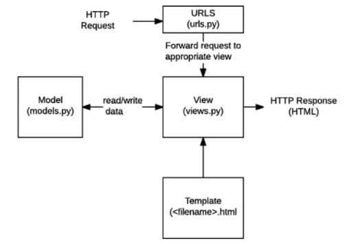
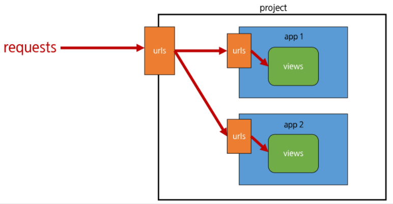

# Django 01 

---

## Python Web Framework

* Why django?
  * Ridiculosuly fast
  * Fully loaded
  * Reassuringly secure
  * Exceedingly scalable
  * Incredibly versatile
* django는 Python으로 작성된 오픈소스 웹 어플리케이션 프레임워크로, MVC(MTV) 모델 패턴을 따르고 있다.
* Model => 데이터베이스 관리
* Template => 레이아웃(화면)
* View => 중심 컨트롤러(심장)




### 프로젝트 생성

```bash
$ django-admin startproject 프로젝트 이름			# 프로젝트 생성

$ python manage.py runserver					# 서버 가동

$ python manage.py startapp 앱 이름			    # 앱 이름 관련 MTV 파일 생김
```


## Template

> Django Template Language ( DTL )

* django template에서 사용하는 built-in template system

* 조건, 반복, 변수 치환, 필터 등의 기능을 제공

* 단순히 Python이 HTML에 포함된 것이 아니며,

  * 프로그래밍적 로직이 아니라 프레젠테이션을 표현하기 위한 것

* Python처럼 일부 프로그래밍 구조 (if, for)등을 사용할 수 있지만,

  이것은 해당 Python 코드로 실행되는 것이 아님


### DTL Syntax

1. Variable
2. Filters
3. Tags
4. Comments


* Variable
  * {{ variable }}
  * render( )를 사용하여 `views.py`에서 정의한 변수를 template 파일로 넘겨 사용하는 것
  * 변수명은 영어, 숫자와 밑줄(_)의 조합으로 구성될 수 있으나 밑줄로는 시작할 수 없음 (공백, 구두점 문자 또한 X)
  * dot( . )을 사용하여 변수 속성에 접근할 수 있음
  * render()의 세 번째 인자로 `{'key': value}`와 같이 딕셔너리 형태로 넘겨주며, 여기서 정의한 key에 해당하는 문자열이 template에서 사용 가능한 변수명이 됨
* Filters
  * {{ variable|filter }}
  * 표시할 변수를 수정할 때 사용
  * e.g
    * {{ name|lower }}
    * name 변수를 모두 소문자로 출력
  * 60개의 built-in template filters를 제공
  * chained가 가능하며 일부 필터는 인자를 받기도 함
    * {{ variable|truncatewords:30 }}

* Tags
  * 
  * 출력 덱스트를 만들거나, 반복 또는 논리를 수행하여 제어 흐름을 만드는 등 변수보다 복잡한 일들을 수행
  * 일부 태그는 시작과 종료 태그가 필요
    *   . . .  {}
  * 약 24개의 built-in templates tags를 제공

## Template inheritance
* 템플릿 상속은 기본적으로 코드의 재사용성에 초점을 맞춤
* 템플릿 상속을 사용하면 사이트의 모든 공통 요소를 포함하고, 하위 템플릿이 재정의(override) 할 수 있는 블록을 정의하는 기본 'skeleto' 템플릿을 만들 수 있음

### 
* 자식(하위) 템플릿이 부모 템플릿을 확장한다는 것을 알림
* 반드시 **템플릿 최상단**에 작성 되어야 함

### 
* 하위 템플릿에서 재지정(overriden) 할 수 있는 블록을 정의
* 즉, 하위 템플릿이 채울 수 있는 공간


## HTML form element
* 웹에서 사용자 정보를 입력하는 여러 방식 (text button, checkbox, file, hidden, image, password, radio, reset, submit)을 제공하고, 사용자로부터 할당된 데이터를 서버로 전송하는 역할을 담당

* 핵심속성
  * 	**action** : 입력 데이터가 전송될 URL 지정
  * 	**method** : 입력 데이터 전달 방식 지정 (e.g. GET, POST)


## HTTP request method - GET

* 서버로부터 **정보를 조회**하는 데 사용
* 데이터를 가져올 때만 사용해야 함
* 데이터를 서버로 전송할 때 body가 아닌 Query String Parameters를 통해 전송
* 우리는 서버에 요청을 하면 HTML 문서 파일 한 장을 받는데 이때 사용하는 요청의 방식이 GET


## App URL mapping

* app의 view 함수가 많아지면서 사용하는 `path()` 또한 많아지고, app 또한 더 작성되기 때문에 프로젝트 `url.py`에서 모두 관리하는 것은 코드 유지보수에 좋지 않음
* 이제는 각 app에 `urls.py`를 작성하게 됨




## Naming URL patterns

* 이제는 링크에 url을 직접 작성하는 것이 아니라 `path()` 함수의 name 인자를 정의해서 사용

* Django Template Tag 중 하나인 url 태그를 사용해서 `path()`함수에 작성한 name을 사용할 수 있음

* url 설정에 정의된 특정한 경로들의 의존성을 제거할 수 있음

  * e.g) `urls.py`

  ```python
  from . import views
  path('index/', views.index, name = 'index')
  ```

  * e.g) `index.html`

    ```django
    <a href = "">메인 페이지</a>
    ```


## namespace(이름공간)

* namespace는 객체를 구분할 수 있는 범위를 나타내는 말로 일반적으로 하나의 이름 공간에서는 하나의 이름이 단 하나의 객체만을 가리키게 된다.
* 프로그래밍을 하다보면 모든 변수명과 함수명 등 이들 모두를 겹치지 않게 정하는 것은 매우 어려운 일
* django에서는
  * 서로 다른 app의 같은 이름을 가진 url name은 이름공간을 설정해서 구분
  * templates, static 등 django는 정해진 경로 하나로 모아서 보기 때문에 중간에 폴더를 임의로 만들어 줌으로써 이름 공간을 설정

```python
from django.urls import path
from . import views
app_name = 'articles'
urlpatterns = [
    path('admin/', admin.site.urls),
    path('index/', views.index, name = 'index')
]
```

```django
<a href="">메인 페이지</a>
```

## 관용적 규칙


1. App 이름은 복수형
2. App 생성(startapp) 후 등록

