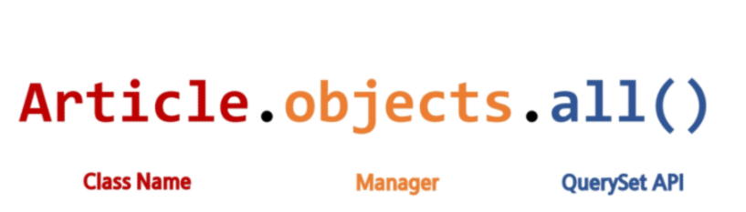

# Django 02

---

## Model

> 웹 어플리케이션의 데이터를 구조화하고 조작하기 위한 도구

* 단일한 데이터에 대한 정보를 가짐
  * 사용자가 저장하는 데이터들의 필수적인 필드들과 동작들을 포함
* 저장된 데이터베이스의 구조(layout)
* django는 model을 통해 데이터에 접속하고 관리
* 일반적으로 각각의 model은 하나의 데이터베이스 테이블에 매핑

## Database

* 데이터베이스(DB)

  * 체계화된 데이터의 모임

* 쿼리(Querry)

  * 데이터를 조회하기 위한 명령어
  * 조건에 맞는 데이터를 추출하거나 조작하는 명령어

  

## ORM

> Object - Relational - Mapping은 객체 지향 프로그래밍 언어를 사용하여 호환되지 않는 유형의 시스템간에(Django - SQL)데이터를 변환하는 프로그래밍 기술이다. => '가상 객체 데이터베이스'를 만들어 사용

* 장점
  * SQL을 잘 알지 못해도 DB 조작이 가능
  * SQL의 절차적 접근이 아닌 객체 지향적 접근으로 인한 높은 생산성
* 단점
  * ORM 만으로 완전한 서비스를 구현하기 어려운 경우가 있음
* 현대 Web Framework의 요점은 웹 개발의 속도를 높이는 것 (생산성)

## Migrations

* django가 model에 생긴 변화 (필드를 추가했다던가 모델을 삭제했다던가 등)를 반영하는 방법
* Migration 실행 및 DB 스키마를 다루기 위한 몇 가지 명령어
  * `makemigrations`
  * `migrate`
  * `sqlmigrate`
  * `showmigrations`

### Migrations Command - 1

* `makemigrations`
  *  model을 변경한 것에 기반한 새로운 마이그레이션(설계도)을 만들 때 사용

* `migrate`
  * 마이그레이션을 DB에 반영하기 위해 사용
  * 설계또를 실제 DB에 반영하는 과정
  * 모델에서의 변경 사항들과 DB의 스키마가 동기화를 이룸

* `sqlmigrate`
  * 마이그레이션에 대한 SQL 구문을 보기 위해 사용
  * 마이그레이션이 SQL문으로 어떻게 해석되어서 동작할지 미리 확인 할 수 있음

* `showmigrations`
  * 프로젝트 전체의 마이그레이션 상태를 확인하기 위해 사용
  * migrate 됐는지 안됐는지 여부를 확인할 수 있음

## Migrations 할 때 반드시 기억해야 할 3단계

1. `models.py`
   * model **변경사항 발생**
2.  `python manage.py makemigrations`
   * migrations **파일 생성**
3.  `python manage.py migrate`
   * DB **적용**

## Database API

* DB를 조작하기 위한 도구
* django가 기본적으로 ORM을 제공함에 따른 것으로 DB를 편하게 조작할 수 있도록 도와줌
* Model을 만들면 django는 객체들을 만들고 읽고 수정하고 지울 수 있는 database-abstract API를 자동으로 만듦
* database-abstract API 혹은 database-access API 라고도 함

### Manager

* django 모델에 데이터베이스 query 작업이 제공되는 인터페이스
* 기본적으로 모든 django 모델 클래스에 objects라는 Manager를 추가

### QuerySet

* 데이터베이스로부터 전달받은 객체 목록
* Queryset 안의 객체는 0개, 1개 또는 여러 개일 수 있음
* 데이터베이스로부터 조회, 필터, 정렬 등을 수행할 수 있음

## CRUD

* 대부분의 컴퓨터 소프트웨어가 가지는 기본적인 데이터 처리 기능인 Create(생성), Read(읽기), Update(갱신), Delete(삭제)를 묶어서 일컫는 말

### Create

* `save()` Method
  * Saving objects
  * 객체를 데이터베이스에 저장
  * 데이터 생성 시 `save()`를 호출하기 전에는 객체 ID 값이 무엇인지 알 수 없음.

### Read

* QuerySet API method를 사용한 조회를 하는 것이 중요
* 크게 2가지로 분류
  1. Methods that return new querysets
  2. Methods that do not return querysets

### Field lookups

* 조회 시 특정 조건을 적용시키기 위해 사용
* QuerySet Method(get, filter, exclude)에 대한 키워드 인수로 사용 됨
* 사용은 Article.object.filter(field명__조건=값)