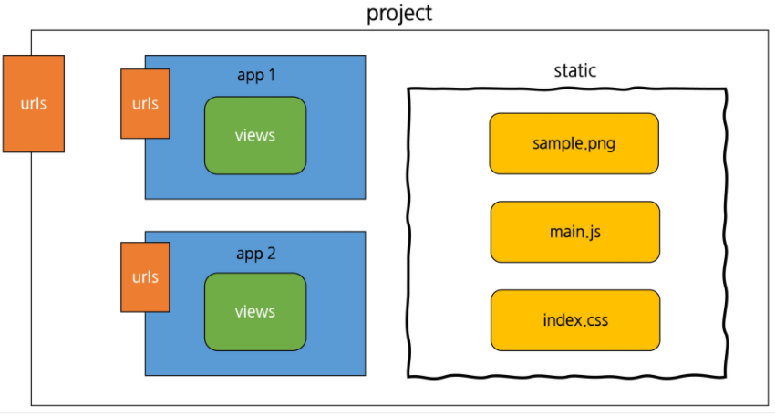

# Django 03

---

## django Form


### Form

* Form은 django 프로젝트의 주요 유효성 검사 도구들 중 하나이며, 공격 및 우연한 데이터 손상에 대한 중요한 방어수단
* django는 Form에 관련된 작업의 아래 세 부분을 처리해 줌
  1. 렌더링을 위한 데이터 준비 및 재구성
  2. 데이터에 대한 HTML forms 생성
  3. 클라이언트로부터 받은 데이터 수신 및 처리

### Form Class

* django Form 관리 시스템의 핵심
* form 내 field, field 배치, 디스플레이 widget, label, 초기값, 유효하지 않는 field에 관련된 에러메세지를 결정
* django는 사용자의 데이터를 받을 때 해야 할 과중한 작업(데이터 유효성 검증, 필요시 입력된 데이터 검증 결과 재출력, 유효한 데이터에 대해 요구되는 동작 수행 등)과 반복 코드를 줄여 줌

### Form Class 작성

```python
class ArticleForm(forms.Form):
    title = forms.CharField(max_length=10)
    content = forms.CharField(widget=forms.Textarea)
```


### ModelForm Class

* model을 통해 Form Class를 만들 수 있는 Helper
* 일반 Form Class와 완전히 같은 방식(객체 생성)으로 view에서 사용 가능
* Meta Class
  * Model의 정보를 작성하는 곳
  * 해당 model에 정의한 field 정보를 Form에 적용하기 위함

```python
class ArticleForm(forms.ModelForm):
    class Meta:
        model = Article
        fields = ('title', 'content',)
```


### Form & ModelForm

* **Form**
  * 어떤 model에 저장해야 하는지 알 수 없으므로 유효성 검사 이후 cleaned_data 딕셔너리를 생성 (cleaned_data 딕셔너리에서 데이터를 가져온 후 `.save()` 호출)
  * model에 연관되지 않은 데이터를 받을 때 사용
* **ModelForm**
  * django가 해당 model에서 양식에 필요한 대부분의 정보를 이미 정의
  * 어떤 레코드를 만들어야 할 지 알고 있으므로 바로 `.save()` 호출 가능

### Widgets

* Django의 HTML input element 표현
* HTML 렌더링을 처리
* 주의사항
  * Form Field와 혼동되어서는 안됨
  * Form Fields는 input 유효성 검사를 처리
  * Widgets은 웹페이지에서 input element의 단순 raw한 렌더링 처리


## Django의 2가지 HTML input 요소 표현 방법

1. **Form fields**
   * input에 대한 유효성 검사 로직을 처리하며 템플릿에서 직접 사용됨
2. **Widgets**
   * 웹 페이지의 HTML input 요소 렌더링 및 제출(submitted)된 원시 데이터 추출을 처리
   * 하지만 widgets은 반드시 form fields에 할당 됨


## View decorators

### decorator (데코레이터)

* 어떤 함수에 기능을 추가하고 싶을 때, 해당 함수를 수정하지 않고 기능을 **'연장'**하게 해주는 함수
* django는 다양한 기능을 지원하기 위해 view 함수에 적용할 수 있는 여러 데코레이터를 제공

### Allowed HTTP methods

* 요청 메서드에 따라 view 함수에 대한 엑세스를 제한
* 요청이 조건을 충족시키지 못하면 HttpResponseNotAllowed을 return
* `require_http_methods()`, `require_GET()`, `require_POST()`, `require_safe()`


## Static

### 정적 파일 (static files)

* 웹 사이트의 구성 요소 중에서 image, css, js 파일과 같이 해당 내용이 고정되어, 응답을 할 때 별도의 처리 없이 파일 내용을 그대로 보여주면 되는 파일
* 즉, 사용자의 요청에 따라 내용이 바뀌는 것이 아니라 요청한 것을 그대로 응답하면 되는 파일
* 기본 static 경로
  * app_name / static / 



* static 작성

```django



```


### Static Files in settings.py

* **STATIC_ROOT**
  * collectstatic이 배포를 위해 정적 파일을 수집하는 절대 경로
  * collectstatic : 프로젝트 배포 시 흩어져 있는 정적 파일들을 모아 특정 디렉토리로 옮기는 작업
* **STATIC_URL**
  * STATIC_ROOT에 있는 정적 파일을 참조 할 때 사용할 URL
* **STATICFILES_DIRS**
  * app내의 static 디렉토리 경로를 사용하는 것 외에 추가적인 정적 파일 경로 정의


## MEDIA

### 미디어 파일 (media files)

* 사용자가 웹에서 업로드 하는 정적 파일
  * image, pdf, video 등


### Media Files in settings.py

* MEDIA_ROOT
  * 사용자가 업로드 한 파일을 보관할 디렉토리의 절대 경로
  * 실제 해당 파일의 업로드가 끝나면 어디에 파일이 저장되게 할지 경로
* MEDIA_URL
  * MEDIA_ROOT에서 제공되는 미디어를 처리하는 URL
  * 업로드 된 파일의 주소(URL)를 만들어 주는 역할
* MEDIA_URL 및 STATIC_URL은 서로 다른 값을 가져야함


### 미디어 파일 제공 설정 (개발 단계)

* 개발 단계에서는 `django.views.static.serve()` view를 사용하여 MEDIA_ROOT에서 사용자가 업로드 한 미디어 파일을 제공해야 함

```python
from django.conf import settings
from django.conf.urls.static import static

url_patterns = [
    path('admin/', admin.site.urls),
    path('articles/', include('articles.urls')),
] + static(settings.MEDIA_URL, document_root=settings.MEDIA_ROOT)
```

