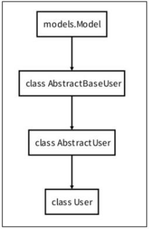

# django04

---

## Authentication System

* Authentication
  * 인증
  * 자신이 누구라고 주장하는 사람의 신원을 확인하는 것
* Authorization
  * 권한, 허가
  * 가고 싶은 곳으로 가도록 혹은 원하는 정보를 얻도록 허용하는 과정

### Django Authentication System

* 인증(authentication)과 권한(authorization) 부여를 함께 제공하며, django에서는 이러한 기능이 어느 정도 결합되어 있기 때문에 일반적으로 **authentication system**(인증 시스템)이라고 함
* 크게 **User object**와 **Web request**에 대한 인증 시스템을 알아보자.

### Authentication Built-in Forms

* django는 기본적으로 인증에 관련된 built-in form들을 제공
* 회원가입(UserCreationForm), 로그인(AuthenticationForm) 등

## Login & Logout

### Login

* 로그인은 Session을 Create하는 로직과 같음
* login()
  * Request 객체와 User 객체를 통해 로그인 진행
  * Django의 session framework를 통해 사용자의 ID를 세션에 저장

### Logout

* 로그아웃은 세션을 세션을 Delete하는 로직과 같음
* logout()
  * Request 객체를 받으며 return이 없음
  * 현재 요청에 대한 DB의 세션 데이터를 삭제하고 클라이언트 쿠키에서도 sessionid를 삭제

### HTTP(HyperText Transfer Protocol)

* HTML 문서와 같은 리소스들을 가져올 수 있도록 해주는 프로토콜(규칙, 약속)
* 웹에서 이루어지는 모든 데이터 교환의 기초

* HTTP 특징
  * 비연결지향(connectionless) : 서버는 응답 후 접속을 끊음
  * 무상태(stateless) : 접속이 끊어지면 클라이언트와 서버간의 통신이 끝나며 상태를 저장하지 않음

### Cookie(쿠키)

* 클라이언트의 로컬에 저장되는 키-값의 작은 데이터 파일
* 웹 페이지에 접속하면 요청한 웹 페이지를 받으며 쿠리를 로컬에 저장하고, 클라이언트가 재요청시마다 웹 페이지 요청과 함께 쿠기 값도 전송
* 사용 예시
  * 아이디 자동완성, 공지 하루 안보기, 팝업 체크, 비로그인 장바구니 담기 등
  * 편의를 위하되 지워지거나 유출 되어도 큰 문제 없을 정보들을 저장

### Session(세션)

* 사이트와 특정 브라우저 사이의 'state(상태)'를 유지시키는 것
* 클라이언트가 서버에 접속하면 서버가 특정 session id를 발급하고 클라이언트는 session id를 쿠키를 사용해 저장. (즉 쿠키는 클라이언트 로컬에 저장하는 것인데 그 안에 세션 정보가 들어있음.)
* 클라이언트가 다시 서버에 접속할 때 해당 쿠키(session id가 저장된)를 이용해 서버에 session id를 전달
* Django는 특정 session id를 포함하는 쿠키를 사용해서 각각의 브라우저와 사이트가 연결된 세션을 알아냄. 세션 정보는 django DB의 django_session 테이블에 저장
* 주로 로그인 상태 유지에 사용

### Cookie & Session

* Cookie
  * 클라이언트 로컬에 파일로 저장
* Session
  * 서버에 저장 (이때 session id는 쿠키의 형태로 클라이언트 로컬에 저장)
* HTTP 쿠키는 상태가 있는 세션을 만들도록 해준다.

### 로그인 사용자에 대한 접근 권한

* django는 session과 middleware를 통해 인증 시스템을 request 객체에 연결

* **`is_authenticated`**
  
  * User class의 속성(attributes) => `user.is_authenticated`
  * 사용자가 인증되었는지 확인하는 방법
  * User에 항상 True이며, AnonymousUser에 대해서만 항상 False
  * 단, 이것은 권한(permission)과는 관련이 없으며 사용자가 활성화 상태(active)이거나 유효한 세션(valid session)을 가지고 있는지도 확인하지 않음
  * e.g. 사용자가 로그인 되어 있는데 다시 로그인 하려고 할 때
  
  
  
* **`login requried`** decorator
  
  * 사용자가 로그인 했는지 확인하는 view를 위한 데코레이터 =>`@login_required`
  * 로그인 하지 않은 사용자를 `settings.LOGIN_URL`에 설정된 경로로 redirect 시킴
  * `LOGIN_URL`의 기본 값은 `/accounts/login/`
  * 로그인 된 사용자의 경우 해당 view 함수를 실행
  * 로그인 되지 않은 사용자가 강제 접속 시 로그인 페이지로 redirect 하도록 구현 가능
  
* `next` **query string parameter**

  * `@login_required` 데코레이터는 기본적으로 인증 성공 후 사용자를 리다이렉트 할 경로를 `next`라는 문자열 매개변수에 저장한다.
  * 로직 상 로그인 하지 못하면 접근할 수 없는 페이지에 접근했을 경우 django가 로그인 페이지로 강제로 redirect 시켰는데, 로그인을 다시 정상적으로 하면 원래 요청했던 주소로 보내 주기 위해 keep 해주는 것이다.
  * 따로 처리 해주지 않으면 우리가 view에 설정한 redirect 경로로 이동하지만, next에 저장된 주소로 이동되도록 만들기 위해 작업을 해줘야 된다.

## User

### User objects

* django 인증 시스템의 핵심
* Users가 django 인증 시스템에서 표현되는 모델
* 일반적으로 사이트와 상호작용 하는 사람들을 나타냄
* django 인증 시스템에서는 오직 하나의 User Class만 존재
* AbstractUser Class의 상속을 받음

* **AbstractUser**
  * User model을 구현하는 완전한 기능을 갖춘 기본 클래스

### User 참조

* **`get_user_model()`**
  * User를 직접 참조하는 대신 django.contrib.auth.get_user_model()을 사용하여 user model을 참조해야 함
  * **현재 프로젝트에서 활성화(active)된 user model을 return**

