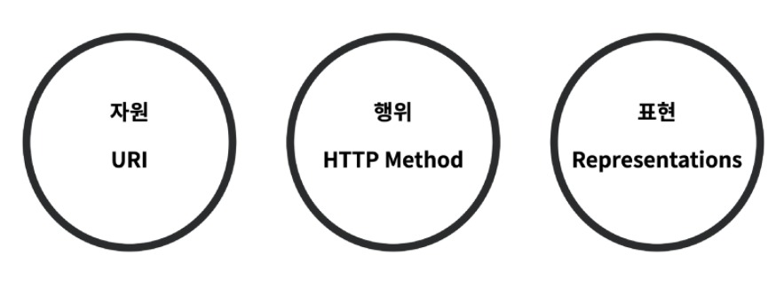

# REST API

---

## API (Application Programming Interface)

* 프로그래밍 언어가 제공하는 기능을 수행할 수 있게 만든 인터페이스
  * 어플리케이션과 프로그래밍으로 소통하는 방법
* 프로그래밍을 활용해서 할 수 있는 어떤 것
* CLI, GUI는 각각 명령줄과 그래픽(아이콘)을 통해서 특정 기능을 수행하는 것이며 API는 프로그래밍을 통해 그 일을 수행할 수 있음

## Web API

* 웹 어플리케이션 개발에서 다른 서비스에 요청을 보내고 응답을 받기 위해 정의된 명세
* 현재 웹 개발은 추가로 직접 모든 것을 개발하지 않고 여러 Open API를 가져와서 활용하는 추세
* ex ) 구글, 카카오 지도 API, 우편번호, 도로명, 지번 소 검색 API 등

### API Server

- 프로그래밍을 통한 요청에 JSON을 응답하는 서버를 만들자

## REST API (REpresentational State Transfer)

* 웹 설계 상의 장점을 최대한 활용할 수 있는 아키텍쳐 방법론
* 네트워크 아키텍쳐 원리의 모음
  * 자원을 정의
  * 자원에 대한 주소를 지정하는 방법
* REST 원리를 따르는 시스템 혹은 API를 RESTful API라고 하기도 함

## REST 구성

### URI

* Uniform Resource Identifier
* 통합 자원 식별자
* 인터넷의 자원을 나타내는 유일한 주소
* 인터넷에서 자원을 식별하거나 이름을 지정하는 데 사용되는 간단한 문자열
* 하위 개념 (URL, URN)

### URL

* Uniform Resource Locator
* 통합 자원 위치
* 네트워크 상에 자원(리소스)이 어디 있는지(주소)를 알려주기 위한 약속
* 자원은 HTML 페이지, CSS 문서, 이미지 등이 될 수 있음
* '웹 주소' 또는 '링크'라고도 불림

### URN

* Uniform Resource Name
* 통합 자원 이름
* URL과 달리 자원의 위치에 영향을 받지않는 유일한 이름 역할을 함 ( 독립적 이름 )
* 자원의 이름이 변하지 않는 한 자원의 위치를 이곳저곳 옮겨도 문제없이 동작

### URL과 URN

* URN은 자원의 ID를 정의하고, URL은 자원을 찾는 방법을 제공
* 따라서 URN과 URL은 상호 보완적

fragment - 브라우저가 특정 위치로 이동할 수 있게 해주는 역할(북마크) => 서버로 전송되는 것은 아님

### JSON

> JavaScript Object Notation

* lightweight data-interchange format
* 자바스크립트 객체 문법을 따르며, 구조화된 데이터를 표현하기 위한 문자 기반 데이터 포맷
* 일반적으로 웹 어플리케이션에서 클라이언트로 데이터를 전송할 때 사용

### JSON 특징

* 사람이 읽고 쓰기 쉽고 기계가 파싱(해석 & 분석)하고 만들어 내기 쉬움
* 자바스크립트가 아니어도 JSON을 읽고 쓸 수 있는 기능이 다양한 프로그래밍 언어 환경에서 지원됨

## REST 핵심 규칙

1. URI는 정보의 자원을 표현해야 한다.
2. 자원에 대한 (어떠한)행위는 HTTP Method로 표현한다.

### API Server

> 프로그래밍을 통해 요청에 RESTful한 방식으로 JSON을 응답하는 서버 만들기

## Django REST Framework

### DRF

- Web API 구축을 위한 강력한 toolkit을 제공
- REST framework 개발에 필요한 다양한 기능을 제공

### Serialization (직렬화)

* 데이터 구조나 객체 상태를 동일하거나 다른 컴퓨터 환경에 저장하고 나중에 재구성할 수 있는 포맷으로 변환하는 과정
* 예를 들어 DRF의 Serializer는 Django의 Queryset 및 Model Instance와 같은 복잡한 데이터를, JSON, XML 등의 유형으로 쉽게 변환 할 수 있는 Python 데이터 타입으로 만들어 줌
* DRF의 Serializer는 Django의 Form 및 ModelForm 클래스와 매우 유사하게 작동

|          |  Django   |       DRF       |
| :------: | :-------: | :-------------: |
| Response |   HTML    |      JSON       |
|  Model   | ModelForm | ModelSerializer |

