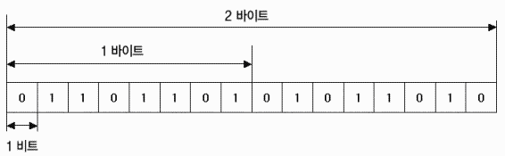

# 1장 네트워크 첫 걸음

___

## LESSON 02. 정보의 양을 나타내는 단위

### 1. 비트와 바이트란?

> Digital Data(디지털 데이터)란?
>
> - 모든 컴퓨터는 숫자 0과 1만을 다루는데, 그 0과 1의 집합을 디지털 데이터라고 한다.

0과 1의 정보를 나타내는 최소 단위를 비트(bit)라고 한다.

0과 1을 표현한느 1 비트는 0과 1인 숫자가 여덟 개를 모아 표시할 수 있다. 이 단위를 **바이트(byte)**라고 한다. 따라서 **8 비트는 1 바이트**가 된다.

그렇다면 컴퓨터는 모든 것을 0과 1의 집합으로 다루는데 어떻게 키보드로 문자를 입력할 수 있을까? 그 이유는 숫자와 문자의 대응표를 미리 만들어두었기 때문이다. 이러한 대응표를 **문자코드(Character Code)**라고 한다.

문자코드 중 (ASCII Code) => (American Standard Code for Information Interchange)

> ASCII 코드는 라틴 문자와 숫자, 몇몇 특수문자를 128개의 코드값에 1:1 대응 시키는 법을 고안했고 이것이 아스키코드이다. 초기에는 8비트 중 7비트는 문자를 표현하고 1비트는 통신 에러 감지를 위한 체크섬(check sum)으로 사용했으나 현재에는 사용하지 않고 문자를 표현한 7비트 앞에 0을 집어넣는 방식으로 사용하고 있다.
>
> > 영문자로만 표현이 되어 유럽, 아랍, 아시아 등에서는 아스키 코드만으로는 컴퓨터에서 문자를 표현하기 어려워 **유니코드**가 개발됨.

문자도 사진과 마찬가지로 상대방에게 이 숫자를 패킷으로 나누어서 보내면 받은 쪽에서 패킷을 원래 값으로 되돌릴 수 있다. 따라서 문자 데이터도 패킷으로 나누어서 네트워크에 전송한다.

하지만 네트워크에 데이터를 전송하는 경우에는 비트 정보를 전기 신호로 변환하기 때문에 실제로는 네트워크에 **전기 신호**가 전송된다.

* Lesson 02 정리
  * 컴퓨터는 0과 1밖에 이해하지 못한다.
  * 정보를 나타내는 최소 단위를 비트라고 하며, 비트 여덟 개를 1 바이트라고 한다.
  * 숫자와 문자의 대응표를 문자 코드라고 한다.