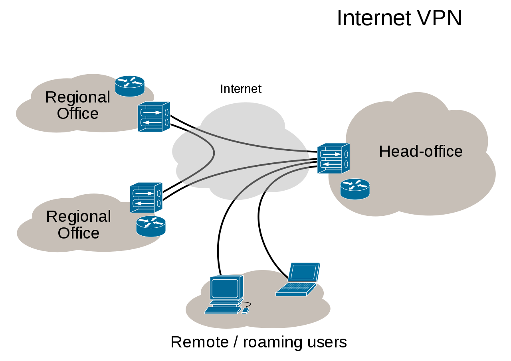

# 2장 네트워크의 기본 규칙

---

## LESSON 08 캡슐화와 역캡슐화

> 데이터를 송수신할 때는 캡슐화와 역캡슐화가 이루어진다. 이에 대해 알아보자.

### 1. 캡슐화와 역캡슐화란?

컴퓨터 A에 컴퓨터 B로 데이터를 보낸다고 생각하자. <u>데이터를 보내려면 데이터의 앞부분에 전송하는 데 필요한 정보를 붙여서 다음 계층으로 보내야 된다.</u> 이 정보를 ==**헤더**==라고 하는데, 헤더에는 **데이터를 전달받을 상대방에 대한 정보**도 포함되어 있다.

이처럼 헤더를 붙여 나가는 걸 **캡슐화**라고 한다. 한편 데이터를 받는 쪽에서는 헤더를 하나씩 제거해야된다. 이것을 **역캡슐화**라고 한다.

우선 송신 측 컴퓨터에서 웹 사이트에 접속하려고 하면

1. 응용 계층(세션 + 표현 + 응용)에서는 웹 사이트를 접속하기 위한 요청 데이터가 만들어진다.
2. 해당 데이터는 전송 계층에 전달되는데, 전송 계층에서 신뢰할 수 있는 통신이 이루어지도록 <u>응용 계층에서 만들어진 데이터에</u> **헤더**를 붙인다.
3. 전송 계층에서 만들어진 데이터를 다른 네트워크와 통신하기 위해 네트워크 계층에서 **헤더**를 붙인다.
4. 또 네트워크 계층에서 만들어진 데이터에 물리적인 통신 채널을 연결하기 위해 데이터 링크 계층에서 **헤더**와 **트레일러**를 붙인다.

> 트레일러란 데이터를 전달할 때 데이터의 마지막에 추가하는 정보를 말한다.

이렇게 데이터 링크 계층에서 만들어진 데이터는 최종적으로 **전기 신호**로 변환돼서 수신 측에 도착한다. 이처럼 필요한 데이터를 추가해 나가는 것을 캡슐화 라고 한다.

역캡슐화는 수신 측에서 캡슐화의 역순으로 헤더를 제거해 나가는 것을 말한다.

## VPN이란?

> 위키백과 : [VPN](https://ko.wikipedia.org/wiki/%EA%B0%80%EC%83%81%EC%82%AC%EC%84%A4%EB%A7%9D)

VPN은 Virtual Private Network(가상 사설망)의 약어이다. 가상 통신 터널을 만들어 기업 본사나 지사와 같은 거점 간을 연결하여 통신하거나 외부에서 인터넷으로 사내망에 접속하는 것을 말한다.

예를 들어 서울에 본사가 있고 부산에 지사가 있다면 본사 내부 랜에서 지사 내부 랜에 접속해 통신하는 것은 물리적인 거리가 멀어 어렵다. 이럴 때는 VPN을 사용하여 본사와 지사를 연결하여 통신할 수 있다.

VPN의 종류는 다음과 같이 두 종류로 구성되어 있다.

* 인터넷 VPN

  * 인터넷 VPN에는 <u>거점 간 접속</u>과 <u>원격 접속 연결</u>이 있다. 둘 다 일반 인터넷망을 사용한다.
    * 거점 간 접속 : IPsec이라는 암호 기술 프로토콜을 사용하여 접속
    * 원격 접속 연결 : 외부에서 사용하는 컴퓨터와 사내 네트워크를 연결하기 때문에 암호화된 통신로를 만듦.

* IP - VPN

  * IP - VPN은 MPLS라는 기술을 사용하며 인터넷망이 아닌 **통신 사업자 전용 폐쇄망**을 사용한다. MPLS는 폐쇄망을 사용하기 때문에 제 3자에 의한 해킹이나 데이터 변조의 위험이 없어 암호화 기능이 필요하지 않다.

    * > MPLS(Multiprotocol Label Switching) : 고성능 통신 네트워크를 위한 일종의 데이터 전달 기법
      >
      > > 위키백과 : [MPLS](https://ko.wikipedia.org/wiki/%EB%8B%A4%EC%A4%91_%ED%94%84%EB%A1%9C%ED%86%A0%EC%BD%9C_%EB%A0%88%EC%9D%B4%EB%B8%94_%EC%8A%A4%EC%9C%84%EC%B9%AD)

* LESSON 08 정리
  * 데이터를 보낼 때는 필요한 정보를 데이터에 추가해야 하는데 이 정보를 **헤더**라고 한다.
  * 데이터를 상대방에게 보낼 때 각 계층에서 헤더(데이터 링크 계층의 트레일러도 포함)를 붙여 나가는 것을 캡슐화라고 한다.
  * 데이터를 수신할 때 각 계층에서 헤더(데이터 링크 계층의 트레일러도 포함)를 제거해 나가는 것을 역캡슐화라고 한다.
  * 송신 측의 데이터 링크 계층에서 만들어진 데이터가 전기 신호로 변환되어 수신 측에 전송된다.

* 용어 정리
  * **프로토콜** : 컴퓨터 간에 정보를 주고받을 때의 통신 방법에 대한 규칙이나 표준
  * **OSI 모델** : 국제표준화기구(ISO)가 1977년에 정의한 국제 통신 표준 규약이다. 네트워크의 기본 구조를 일곱 개 계층으로 나눠서 표준화한 통신 규약으로 현재 다른 모든 통신 규약의 기반이 된다.
  * **TCP/IP 모델** : OSI 모델 7계층의 네트워크에서 데이터를 전송하는 과정을 네 개 계층으로 단순화시켜 사용하는 모델이다. 인터넷 모델이라고도 한다.
  * **캡슐화/역캡슐화** : 캡슐화는 컴퓨터 통신에서 상위 계층의 통신 프로토콜 정보를 데이터에 추가하여 하위 계층으로 전송하는 기술이다. 반대로 역캡슐화는 상위 계층의 통신 프로토콜에서 하위 계층에서 추가한 정보와 데이터를 분리하는 기술이다.
  * **헤더(header)** : 저장되거나 전송되는 데이터의 맨 앞에 위치하는 추가적인 정보 데이터다. 데이터의 내용이나 성격을 식별 또는 제어하는 데 사용한다.