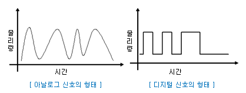
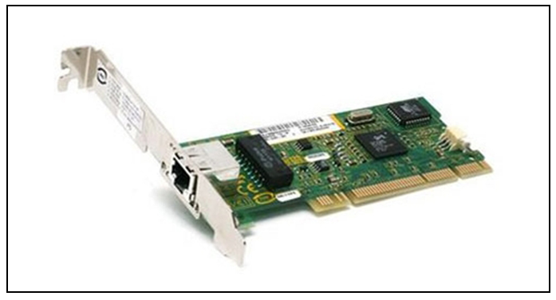

# 3장 물리 계층 : 데이터를 전기 신호로 변환하기

---

## LESSON 09 물리 계층의 역할과 랜 카드의 구조

> 데이터는 전기 신호로 변환되어 네트워크를 통해 전송된다. 전기 신호에 대해서 알아보자.

### 1. 전기 신호란?

0과 1만으로 이루어진 비트열을 전기 신호로 변환하려면 맨 아래 계층인 **물리 계층**의 기술이 필요하다. 

> 물리 계층 : 데이터를 전기 신호로 변환하기 위해 필요하다.

네트워크 통신에서는 0과 1만 사용된다. 네트워크를 통해 데이터를 주고받을 때는 0과 1의 비트열을 전기 신호로 변환해야 한다. 이 전기 신호의 종류에는 아날로그 신호와 디지털 신호가 있다.

그림 왼쪽과 같이 물결 모양 전기 신호를 **아날로그 신호**라고 한다. 아날로그 신호는 전화 회선이나 라디오 방송에 사용되는 신호이다.

그림 오른쪽과 같이 막대 모양 전기 신호를 **디지털 신호**라고 한다.

데이터 송신 측 컴퓨터가 전송하는 0과 1의 비트열 데이터는 전기 신호로 변환되어 네트워크를 통해 수신 측 컴퓨터에 도착한다. 수신 측 컴퓨터에서는 전기 신호를 0과 1의 비트열 데이터로 복원한다.

### 2. 랜 카드란?

> 외부와 가장 빠른 속도로 데이터를 주고 받을 수 있는 PC의 통신장치로, 근거리 통신망을 뜻하는 랜(LAN)과 비디오카드나 모뎀처럼 PC의 확장슬롯에 꽂혀 사용되는 장치를 의미하는 카드(card)를 합친 용어이다.

컴퓨터는 네트워크를 통해 데이터를 송수신할 수 있도록 **랜 카드**가 메인 보드에 포함되어 있는 내장형 랜 카드나 별도의 랜 카드를 가지고 있다. 0과 1의 정보가 컴퓨터 내부에 있는 랜 카드로 전송되고, 랜 카드는 0과 1을 전기 신호로 변환하는 것이다.

물리 계층은 컴퓨터와 네트워크 장비를 연결하고 컴퓨터와 네트워크 장비 간에 전송되는 데이터를 전기 신호로 변환하는 계층이다.

* LESSON 9 정리
  * 전기 신호에는 아날로그 신호와 디지털 신호가 있다.
  * 아날로그 신호는 전화 회선이나 라디오 방송에 사용되는 신호다.
  * 네트워크를 통해 상대방에게 데이터를 전송할 때 0과 1의 비트열은 전기 신호로 변환되어 전송된다. 상대방이 받은 전기 신호는 다시 0과 1의 비트열로 복원된다.