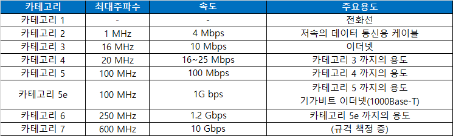
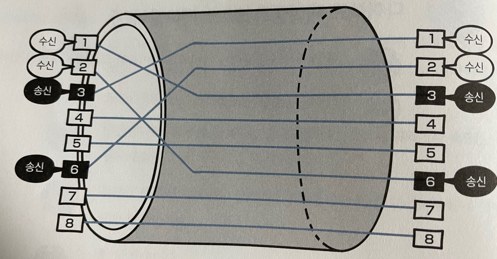
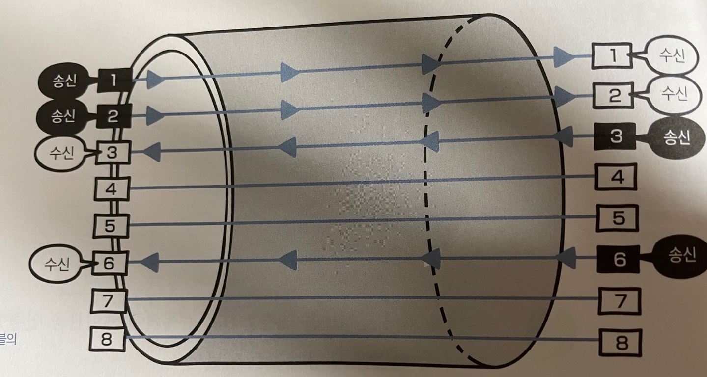

# 3장 물리 계층 : 데이터를 전기 신호로 변환하기

---

## LESSON 10 케이블의 종류와 구조

> 네트워크 전송 매체의 종류에는 유선과 무선이 있다. 이번에는 유선 전송 매체로 사용되는 네트워크 케이블 커넥터에 대해 알아보자.

### 1. 트위스트 페어 케이블이란?

들어가기 앞서 네트워크의 전송 매체에 대해서 알아보자. 전송 매체란 **데이터가 흐르는 물리적인 선로**로 종류가 크게 **유선**과 **무선**으로 나눠진다. 

* 유선
  * 트위스트 페어 케이블
  * 광 케이블
  * etc
* 무선
  * 라디오파
  * 마이크로파
  * 적외선
  * etc

유선에서 가장 많이 사용되는 트위스트 페어 케이블(Twisted Pair Cable)에 대해서 알아보자. 우선, 트위스트 페어 케이블의 종류에는 ==UTP 케이블==과 ==STP 케이블==이 있다.

* **UTP(Unshielded Twist Pair) 케이블**

  > 구리 선 여덟 개를 두 개씩 꼬아 만든 네 쌍의 전선으로, **실드**(shield)로 보호되어 있지 않은 케이블이다.
  >
  > > 실드: 금속 호일이나 금속의 매듭과 같은 것으로 외부에서 발생하는 노이즈(noise)를 막는 역할을 한다.
  >
  > UTP 케이블은 실드로 보호되어 있지 않아서 노이즈의 영향을 받기 쉽지만 저렴하기 때문에 일반적으로 많이 사용되는 케이블이다.

* **STP(Shielded Twist Pair) 케이블**

  > 두 개씩 꼬아 만든 선을 실드로 보호한 케이블이다. UTP 케이블과 달리 노이즈의 영향을 매우 적게 받지만 비싸기 때문에 보편적으로 사용하지 않는다.

노이즈는 케이블에 전기 신호가 흐를 때 발생하는 것이다. 그래서 노이즈의 영향을 적게 받도록 구리 선 두 개를 비틀어 꼬아서 케이블을 만든다.

UTP 케이블은 노이즈의 영향을 쉽게 받지만 저렴하기 때문에 일반적으로 사용된다. 또한 UTP 케이블은 데이터 전송 품질에 따라 다음과 같이 분류한다.

트위스트 페어 케이블(UTP, STP)은 일반적으로 **랜 케이블**(LAN cable, 랜 선)이라고  한다. 보통은 랜 선이라는 용어를 더 많이 사용한다.

랜 케이블의 양쪽 끝에는 **RJ-45**라고 부르는 커넥터가 붙어 있다. 이 커넥터를 컴퓨터의 랜 포트나 나중에 설명하는 네트워크 기기에 연결하는 것이다.

### 2 다이렉트 케이블과 크로스 케이블이란?

랜 케이블의 종류에는 다이렉트 케이블과 크로스 케이블이 있다.

* 크로스 케이블

크로스 케이블은 위 그림과 같이 구리 선 여덟 개 중 한쪽 커넥터의 **1번**과 **2번**에 연결되는 구리 선을 다른 쪽 커넥터의 **3번**과 **6번**에 연결한 케이블이다.

* 다이렉트 케이블

다이렉트 케이블은 위 그림과 같이 구리 선 여덟 개를 **같은 순서**로 커넥터에 연결한 케이블이다.

다이렉트 케이블이나 크로스 케이블 모두 실제로는 1번, 2번, 3번, 6번 구리 선을 사용한다.

나머지 4개는 사용하지 않으며, <u>다이렉트 케이블</u>은 **컴퓨터와 스위치를 연결할 때** 사용하고, <u>크로스 케이블</u>은 **컴퓨터 간에 직접 랜 케이블로 연결할 때** 사용한다. 컴퓨터 간에 직접 데이터를 보낼 때는 양쪽 컴퓨터 모두 1번과 2번 선을 사용한다. 하지만 다이렉트 케이블에서 양쪽 컴퓨터 모두가 1번과 2번으로 데이터를 전송한다면 어떻게 될까?

데이터가 충돌하게 된다. 따라서 크로스 케이블은 일부러 중간에 전선을 교차시켜서 송신 측과 수신 측이 올바르게 연결되도록 하고 있다. 이것을 잘 기억하도록 하자.

* Lesson 10 정리
  * 트위스트 페어 케이블에는 UTP(Unshielded Twisted Pair) 케이블과 STP(Sheild Twisted Pair) 케이블이 있다.
  * UTP 케이블은 실드로 보호되어 있지 않아 노이즈의 영향을 쉽게 받는다.
  * STP 케이블은 실드로 보호되어 있어 노이즈의 영향을 매우 적게 받는다.
  * 트위스트 페어 케이블은 일반적으로 랜 케이블이라고 부른다.
  * 랜 케이블은 통신 규격에 따라 몇 가지 분류로 나눌 수 있다.
  * 랜 케이블의 양쪽 끝에는 RJ-45라는 커넥터가 있다.
  * 랜 케이블에는 다이렉트 케이블과 크로스 케이블이 있다.