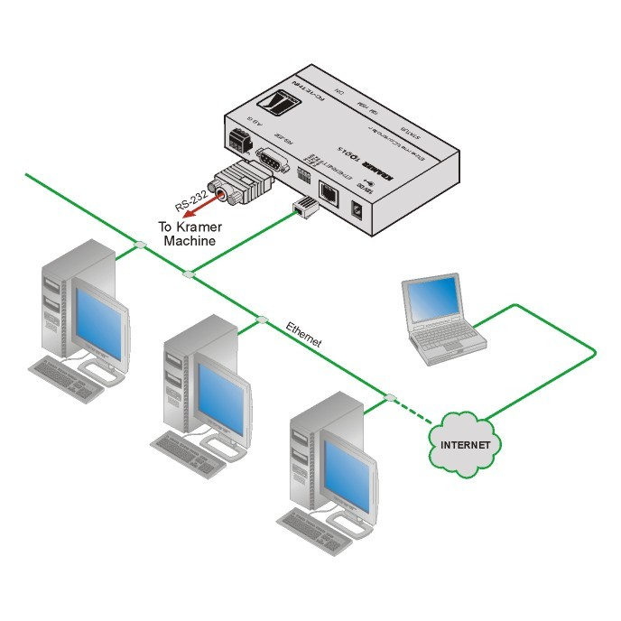
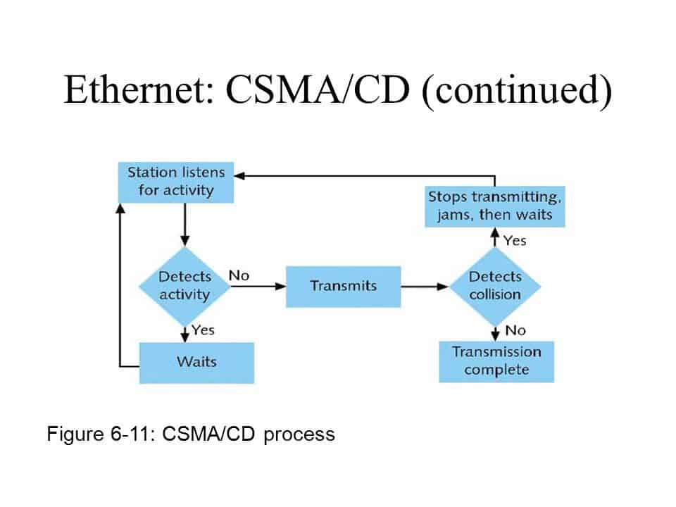

# 4장 데이터 링크 계층 : 랜에서 데이터 전송하기

---

## LESSON 12 데이터 링크 계층의 역할과 이더넷

> 랜에서는 데이터를 주고받는 규칙으로 이더넷을 사용한다. 이더넷에 대해 알아보자.

### 1. 이더넷이란?

> 위키백과 : [이더넷 ( Ethernet )](https://ko.wikipedia.org/wiki/%EC%9D%B4%EB%8D%94%EB%84%B7)
>
> 이더넷은 컴퓨터 네트워크 기술의 하나로, 일반적으로 LAN, WAN에서 가장 많이 활용되는 기술 규격이다.
>
> 이더넷은 OSI 모델의 물리 계층에서 신호와 배선, 데이터 링크에서 MAC 패킷과 프로토콜의 형식을 정의한다.

LAN에서 데이터를 주고받으려면 OSI 모델의 두 번째 계층인 데이터 링크 계층의 기술이 필요하다.

데이터 링크 계층은 **네트워크 장비 간에 신호를 주고받는 규칙**을 정하는 계층으로, LAN에서 데이터를 정상적으로 주고받기 위해 필요한 계층이다. 그 규칙들 중 일반적으로 가장 많이 사용되는 규칙이 **이더넷**(Ethernet)이다. 즉, 랜에서 적용되는 규칙인 것이다.

이더넷은 허브와 같은 장비에 연결된 컴퓨터와 데이터를 주고 받을 때 사용한다.

> 허브 다시 기억하기!!
>
> > 허브는 약해지거나 파형이 뭉그러진 전기 신호를 복원시키고(리피터와 동일) 해당 전기 신호를 전달받은 포트를 제외한 나머지 포트에 전달한다. 같은 허브를 사용하는 랜 환경에서는 특정한 컴퓨터 한 대에 데이터를 보내려고 해도 다른 모든 컴퓨터에 전기 신호가 전달된다.

허브의 단점인 특정 컴퓨터에 데이터를 보내려고 해도 같은 허브에 연결된 모든 컴퓨터에 데이터가 전송되는 경우 이를 방지하고자 데이터의 내용을 못 보게 하는 확실한 규칙이 정해져 있다.

보내려는 데이터에 **목적지** 정보를 추가해서 보내고 목적지 이외의 컴퓨터는 데이터를 받더라도 무시하게 되어있다. (확실히 무시하도록 규칙이 정해져 있어 무시하지 않을 컴퓨터 생기는 걱정 X )

허브는 들어온 데이터를 그대로 모든 포트에 보내기만 한다. 그래서 더미 허브로 불린다. 따라서 컴퓨터 여러 대가 동시에 데이터를 보내면 데이터들이 서로 부딪힐 수도 있다. 이것을 **충돌**(collision)이라고 한다.

그래서 이더넷은 **여러 컴퓨터가 동시에 데이터를 전송해도 충돌이 일어나지 않는 구조**로 되어 있다. 데이터가 동시에 케이블을 지나가면 충돌할 수밖에 없다. 그래서 데이터를 보내는 시점을 늦추는 것이다.

이처럼 이더넷에서 시점을 늦추는 방법을 **CSMA/CD**라고 한다.

* CSMA/CD : Carrier Sense Multiple Access with Collision Detection(반송파 감지 다중 접속 및 충돌 탐지)의 약어

  

우선 CSMA/CD에서 **CS**는 '데이터를 보내려고 하는 컴퓨터가 케이블에 신호가 흐르고 있는지 아닌지를 확인한다'는 규칙이다.

그리고 **MA**는 '케이블에 데이터가 흐르고 있지 않다면 데이터를 보내도 좋다'는 규칙이다.

마지막으로 **CD**는 '충돌이 발생하고 있는지를 확인한다'는 규칙이다.

이러한 규칙으로 데이터를 주고받으면 충돌이 이러나지 않는다. 하지만 지금은 효율이 좋지 않다는 이유로 CSMA/CD는 거의 사용하지 않는다. =>(스위치 사용해서)

* Lesson 12 정리
  * 이더넷은 LAN에서 데이터를 정상적으로 주고받기 위한 규칙이다.
  * 이더넷은 데이터 충돌을 막기 위한 규칙으로 CSMA/CD 방식을 사용한다.
  * CSMA/CD에서 CS는 데이터를 보내려고 하는 컴퓨터가 케이블에 신호가 흐르고 있는지 확인하는 규칙, MA는 케이블에 데이터가 흐르고 있지 않으면 데이터를 보내도 된다는 규칙, CD는 충돌이 발생하고 있는지 확인하는 규칙이다.