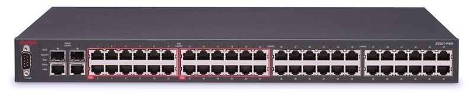

# 4장 데이터 링크 계층 : 랜에서 데이터 전송하기

---

## LESSON 14. 스위치의 구조

> 스위치는 허브와 달리 데이터 충돌이 발생하지 않는다. 네트워크 구성에서 빠질 수 없는 스위치에 대해 알아보자.

### 1. MAC 주소 테이블이란?

> 위키백과 : [스위치](https://ko.wikipedia.org/wiki/%EB%84%A4%ED%8A%B8%EC%9B%8C%ED%81%AC_%EC%8A%A4%EC%9C%84%EC%B9%98)
>
> 네트워크 스위치는 처리 가능한 패킷의 숫자가 큰 것으로, 네트워크 단위들을 연결하는 통신 장비로서 소규모 통신을 위한 허브보다 전송 속도가 개선된 것이다. 간단히 **스위치**라고 부르는 경우가 많으며, **브리징 허브**, **MAC 브리지**, **스위칭 허브**, **포트 스위칭 허브**라고도 한다.

스위치는 **데이터 링크 계층**에서 동작하고 **레이어 2 스위치** 또는 **스위칭 허브**라고도 불린다. (장비 외형은 허브와 비슷하다)

하지만 기능은 완전히 다르다. 스위치 내부에는 **MAC 주소 테이블**(MAC Address table)이라는 것이 있다. MAC 주소 테이블은 스위치의 **포트 번호**와 해당 포트에 연결되어 있는 컴퓨터의 MAC 주소가 등록되는 데이터베이스이다.

스위치의 전원을 켠 상태에서는 아직 MAC 주소 테이블에 아무것도 등록되어 있지 않다. 하지만 컴퓨터에서 목적지 MAC 주소가 추가된 **프레임**이라는 데이터가 전송되면 MAC 주소 테이블을 확인하고 출발지 MAC 주소가 등록되어 있지 않으면 MAC 주소를 포트와 함께 등록한다.

이를 **MAC 주소 학습 기능**이라고 한다.

하지만 컴퓨터 1에서 컴퓨터 3에 데이터를 전송한 시점에서는 아직 컴퓨터 3의 목적지 MAC 주소가 MAC 주소 테이블에 등록되어 있지 않아서 송신 포트1 이외의 포트인 2~5에 데이터(프레임)가 전송되는데 이러한 데이터(프레임) 전송을 **플러딩**(Flooding, 홍수)이라고 불린다.

MAC 주소 테이블에 목적지 MAC 주소가 등록되어 있다면 컴퓨터 3에만 데이터가 전송된다. 이와 같이 MAC 주소를 기준으로 목적지를 선택하는 것을 **MAC 주소 필터링**이라고 한다. 이것으로 불필요한 데이터를 네트워크에 전송하지 않게 된다.

* Lesson 14 정리
  * 스위치는 데이터 링크 계층에서 동작하며, Layer 2(L2)스위치 또는 스위칭 허브라고도 부른다.  => 리피터, 허브는 물리 계층에서 동작.
  * 스위치에는 MAC 주소 테이블이 있다.
  * MAC 주소 테이블은 스위치의 포트 번호와 그 포트에 연결되어 있는 컴퓨터의 MAC 주소가 등록된 데이터베이스다.
  * 스위치가 수신 포트 이외의 모든 포트에서 데이터를 송신하는 것을 플러딩이라고 한다.
  * 스위치에서 MAC 주소를 기준으로 목적지를 선택하는 것을 MAC 주소 필터링이라고 한다.