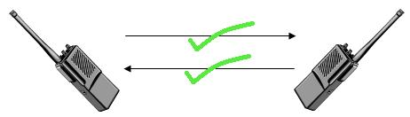
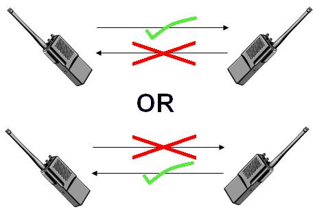

# 4장 데이터 링크 계층 : 랜에서 데이터 전송하기

---

## LESSON 15. 데이터가 케이블에서 충돌하지 않는 구조

> 케이블에 데이터가 아무리 많이 전송되어도 데이터가 충돌하지 않는 구조에 대해서 알아보자.

### 1. 전이중 통신과 반이중 통신

* **전이중 통신**(Full Duplex) : 두 대의 단말기가 데이터를 송수신하기 위해 동시에 각각 독립된 회선을 사용하는 통신 방식이다. 대표적으로 전화망, 고속 데이터 통신을 들 수 있다.

  

  

* **반이중 통신**(Half Duplex) : 한 쪽이 송신하는 동안 다른 쪽에서 수신하는 통신 방식으로, 전송 방향을 교체한다. 마스터 슬레이브 방식의 센서 네트워크가 대표적이다.

  

  

* **단방향 통신**(Simplex) : 한쪽 방향으로만 전송할 수 있는 것으로 방송, 감시 카메라 등을 들 수 있다.

**전이중 통신 방식**은 데이터의 송수신을 **동시에** 통신하는 방식이고, **반이중 통신 방식**은 회선 하나로 송신과 수신을 **번갈아가면서** 통신하는 방식이다.

전이중 통신 방식은 데이터를 동시에 전송해도 충돌이 발생하지 않지만, 반이중 통신 방식은 데이터를 동시에 전송하면 **충돌**이 발생한다.

예를 들면 컴퓨터 1과 컴퓨터 2를 직접 랜 케이블로 연결한다면 여덟 개 즉, 선을 네 쌍을 사용하기 때문에 **전이중 통신 방식**이며, 스위치도 마찬가지이다.

하지만 허브는 **반이중 통신 방식**이므로 충돌이 발생할 수 있다. 따라서 네트워크로 스위치를 사용하는 것이 표준이다.

### 2. 충돌 도메인이란?

충돌 도메인이란 충돌이 발생할 때 그 영향이 미치는 범위를 말한다. 따라서 허브는 충돌이 발생했을 경우 모든 컴퓨터에 영향을 미치기 때문에 충돌 도메인이 넓으나 스위치는 충돌 도메인이 좁다. 따라서 충돌 도메인의 범위가 넓을수록 네트워크가 지연된다.

### 보강

**ARP**(Address Resolution Protocol)

> ARP는 주소 결정 프로토콜로 네트워크 상에서 IP 주소를 물리적 네트워크 주소로 대응(bind)시키기 위해 사용되는 프로토콜이다.

ARP란 목적지 컴퓨터의 IP 주소를 이용하여 MAC 주소를 찾기 위한 프로토콜이다. 

이더넷 프레임을 전송하려면 목적지 컴퓨터의 MAC 주소를 지정해야 한다.

출발지 컴퓨터가 목적지 주소를 모르면 MAC 주소를 알아내기 위해 네트워크에 브로드캐스트를 하는데 이것을 **'ARP 요청(request)'**이라고 한다. 이 요청에 대해 지정된 IP주소를 가지고 있지 않은 컴퓨터는 응답하지 않지만, 지정된 IP주소를 가진 컴퓨터는 MAC 주소를 응답으로 보낸다. 이것을 **'ARP 응답(reply)'**라고 한다.

이것으로 출발지 컴퓨터는 MAC 주소를 얻고 이더넷 프레임을 만들 수 있다. 출발지 컴퓨터에서는 MAC 주소를 얻은 후에 MAC 주소와 IP 주소의 매핑 정보를 메모리에 보관한다. 이 정보를 **'ARP 테이블'**이라고 한다. 이후 데이터 통신은 자신의 컴퓨터에 보관된 ARP 테이블을 참고하여 전송된다.

하지만 IP 주소가 변경되면 해당 MAC 주소도 함께 변경되므로 제대로 통신할 수 없다. 그래서 ARP 테이블에서는 보존 기간을 ARP 캐시로 지정하고 일정 시간이 지나면 삭제하고 다시 ARP 요청을 한다.

윈도우에서 ARP 캐시의 내용을 확인하려면 `arp -a`  명령어를 사용하고 ARP 캐시를 강제로 삭제하려면 `arp -d` 명렁어를 사용한다.

* Lesson 15 정리
  * 전이중 통신 방식이란 데이터의 송신과 수신을 동시에 수행하는 통신 방식이다.
  * 반이중 통신 방식은 회선 한 개로 송신과 수신을 번갈아가며 수행하는 통신 방식이다.
  * 데이터 충돌이 발생하고 그 충돌 영향이 미치는 범위를 충돌 도메인이라고 한다.