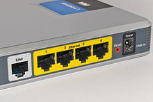
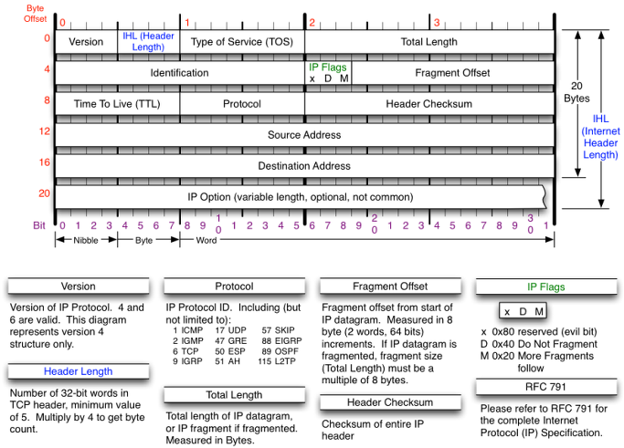

# 5장 네트워크 계층 : 목적지에 데이터 전달하기

---

## LESSON 17 네트워크 계층의 역할

> 전 세계에는 수많은 네트워크가 있고, 그 네트워크들은 서로 연결되어 거대한 인터넷을 이루고 있다. 네트워크 간의 연결에 대해서 알아보자.

### 1. 네트워크 간의 연결 구조

다른 네트워크에 있는 목적지로 데이터를 전달하려면 OSI 7계층에서의 네트워크 계층의 기술이 필요하다.

데이터 링크 계층에서는 이더넷 규칙을 기반으로 데이터의 전송을 담당한다. 이 규칙에 따라 같은 네트워크에 있는 컴퓨터로는 데이터를 전송할 수 있지만, 인터넷이나 다른 네트워크는 데이터를 전송할 수 없다.

수많은 네트워크가 연결된 환경에서 데이터 링크 계층의 기능만으로는 다른 네트워크로 데이터를 전송하기 힘들다.

이처럼 **네트워크 간의 통신을 가능하게 하는 것**이 **네트워크 계층의 역할**이다. 이 계층을 통해 다른 네트워크로 데이터를 전송하려면 **라우터**(router)라는 네트워크 장비가 필요하다.

라우터는 데이터의 목적지가 정해지면 **해당 목적지까지 어떤 경로로 가는 것이 좋을지**를 알려주는 기능을 한다. 하지만 데이터를 보내려는 상대가 어디에 있는지 모르면 라우터도 목적지까지의 경로를 알려주지 못한다.

LAN에서는 MAC 주소만으로도 통신할 수 있지만 다른 네트워크에는 데이터를 보낼 수 없다. 그래서 MAC 주소가 아닌 네트워크를 식별할 수 있는 다른 주소가 필요하다. 그 주소를 **IP 주소**라고 한다.

IP 주소는 **어떤 네트워크의 어떤 컴퓨터인지**를 구분할 수 있도록 하는 주소다. 이 IP 주소가 있으면 다른 네트워크에 있는 목적지를 지정할 수 있다.

그런데 IP 주소로 목적지를 지정하는 것뿐만 아니라 데이터를 **어떤 경로**로 보낼지도 결정해야 한다. 이처럼 목적지 IP 주소까지 어떤 경로로 데이터를 보낼지 결정하는 것을 **라우팅**(routing)이라고 한다.

라우팅은 라우터라는 장비가 한다. **Layer 3 Switch**라는 장비도 라우팅을 할 수 있다.

> L3 스위치 : 네트워크를 분할하여 라우팅을 할 수 있는 네트워크 장비
>
> > 위키피디아 : [LAN Switching](https://ko.wikipedia.org/wiki/%EB%9E%9C_%EC%8A%A4%EC%9C%84%EC%B9%AD)

라우터는 다음과 같은 장비이다. 이 라우터를 사용하여 거리에 관계없이 다른 네트워크로 데이터를 보낼 수 있다. 또 라우터는 **라우팅 테이블**이 있어서 경로 정보를 등록하고 관리한다.

### 2. IP란?

네트워크 계층에는 IP(Internet Protocol)라는 프로토콜이 있다. 방금 전에 데이터를 다른 네트워크에 있는 목적지까지 보내려면 라우터가 필요하다고 했다. 사실은 이 IP가 있어서 가능한 것이다. 네트워크를 공부하다 보면 자주 나오는 TCP/IP 용어의 IP를 말하는 것이다.

네트워크 계층에서는 캡슐화할 때 **IP 헤더**를 붙인다.

​																								- [IPv4 header] -

IPv4의 헤더에는 1) 버전(4bit),   2) 헤더 길이(4bit),  3) 서비스 유형=> 서비스의 우선 순위 제공,   4) 전체 패킷 길이(16bit),  5) ID(일련번호),  6) 조각 상태(IP-Flags, 3bit),  7) 조각의 위치(fragment offset, 13bit),  8)TTL(Time-to-live, 8bit),   9)프로토콜(8bit),  10) 헤더 체크섬,  11) 출발지 IP,  12) 목적지 IP 주소

이처럼 IP 프로토콜을 사용하여 캡슐화할 때는 데이터에 IP 헤더가 추가되는데, 이렇게 만들어진 것을 **IP 패킷**이라고 한다.

데이터 링크 계층에서는 **프레임**이고, 네트워크 계층에서는 IP 패킷이다.

* Lesson 17 정리
  * 서로 다른 네트워크 간에 통신을 하려면 라우터가 필요하다.
  * LAN 안에서는 MAC 주소만으로도 통신할 수 있었지만 네트워크 간에 통신을 하려면 IP 주소가 필요하다.
  * 경로를 선택하고 목적지 IP 주소까지 어떻게 전달할지 결정하는 것을 라우팅이라고 한다.
  * 라우터의 라우팅 테이블에는 경로 정보가 등록되어 있다.
  * 네트워크 계층의 대표적인 프로토콜에는 IP가 있다.
  * 네트워크 계층에서는 캡슐화할 때 IP 헤더를 추가한다.