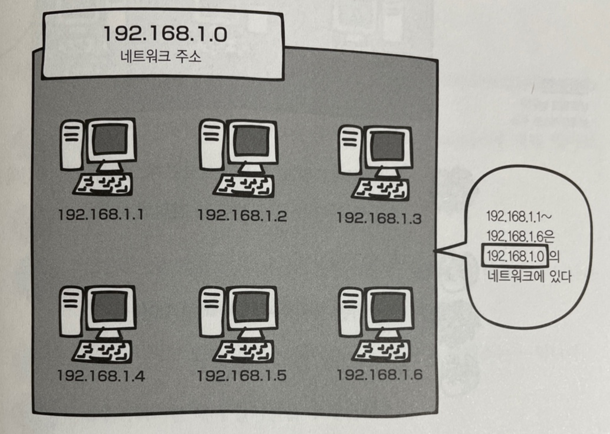

# 5장 네트워크 계층 : 목적지에 데이터 전달하기

---

## LESSON 20 네트워크 주소와 브로드캐스트 주소의 구조

> 컴퓨터에 할당할 수 없는 IP 주소인 네트워크 주소와 브로드캐스트 주소에 대해서 알아보자.

### 1. 네트워크 주소와 브로드캐스트 주소란?

IP 주소에는 **네트워크 주소**와 **브로드캐스트 주소**가 있다. 이 두 주소는 특별한 주소로 컴퓨터나 라우터가 자신의 IP로 사용하면 안 되는 주소이다.

예를 들어 C 클래스의 사설 IP 주소가 있다고 가정해보자. 네트워크 주소는 호스트 ID가 10진수로 0이고, 2진수면 00000000인 주소이다. 또한 브로드캐스트 주소는 호스트 ID가 10진수로 255고, 2진수면 11111111인 주소이다.

* 네트워크 주소

  (C class) => 192.168.1(네트워크 ID)//.0(호스트 ID)

* 브로드캐스트 주소

  (C class) => 192.168.1(네트워크 ID)//.255(호스트 ID)

**네트워크 주소**는 전체 네트워크에서 **작은 네트워크**를 식별하는 데 사용되고, 호스트 ID가 10진수로 0이면 그 네트워크 전체를 대표하는 주소가 된다. 쉽게 말해 전체 네트워크의 대표 주소라고 생각하면 된다.

위 그림과 같이 **192.168.1.1 ~ 192.168.1.6**의 IP 주소를 가진 컴퓨터는 **192.168.1.0**(네트워크 주소)의 네트워크에 있다고 할 수 있다.

**브로드캐스트 주소**는 네트워크에 있는 컴퓨터나 장비 모두에게 **한 번에 데이터를 전송**하는 데 사용되는 전용 IP 주소이다. 따라서 전체 네트워크에 데이터를 전송하려면 호스트 ID에 255를 설정하면 된다.

그래서 <u>**네트워크 주소와 브로드캐스트 주소는 자신의 IP 주소로 설정하면 안 된다를 꼭 기억하자.**</u>

* Lesson 20 정리
  * 네트워크 주소와 브로드캐프트 주소는 컴퓨터에 설정할 수 없다.