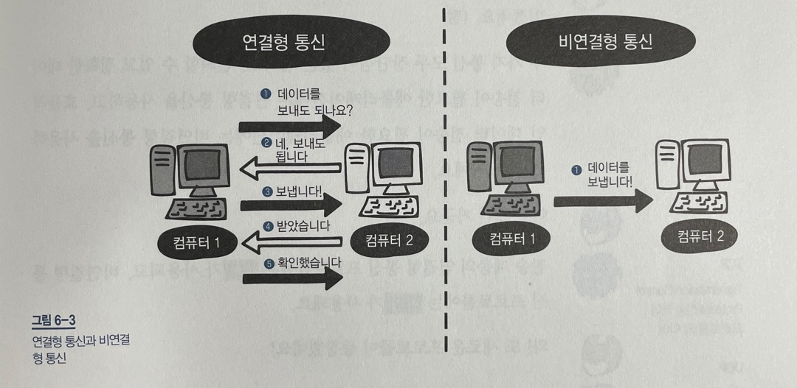

# 6장 전송 계층 : 신뢰할 수 있는 데이터 전송하기

---

## LESSON 23. 전송 계층의 역할

> 네트워크 계층이 하는 역할이 있는 것처럼 전송 계층도 하는 역할이 있다. 전송 계층의 역할에 대해서 알아보자.

### 1. 전송 계층의 두 가지 역할

물리 계층, 데이터 링크 계층, 네트워크 계층의 3 계층이 있으면 목적지에 데이터를 보낼 수 있다. 하지만 데이터가 손상되거나 유실되더라도 이들 계층에서는 아무것도 해주지 않는다.

따라서 **전송 계층**은 목적지에 신뢰할 수 있는 데이터를 전달하기 위해 필요하다.

전송 계층에는 두 가지 기능이 있다. 첫 번째는 **오류를 점검하는 기능**이다. 오류가 발생하면 데이터를 재전송하도록 요청한다. 

두 번째는 **전송된 데이터의 목적지가 어떤 애플리케이션인지 식별하는 기능**이다. 컴퓨터가 데이터를 받아도 어떤 애플리케이션에 전달해야 하는지 모르면 곤란할 것이다. 따라서 전송 계층에서는 해당 데이터가 어떤 애플리케이션에서 사용하는 데이터인지 판단한다. ( e.g. 홈페이지에서 사용하는 데이터인데 메일 프로그램에 전송하는 경우.  )

### 2. 연결형 통신과 비연결형 통신

전송 계층의 특징을 간단히 설명하면 **신뢰성/정확성**과 **효율성**으로 구분할 수 있다. 신뢰성/정확성은 데이터를 목적지에 문제없이 전달하는 것이고, 효율성은 데이터를 빠르고 효율적으로 전달하는 것이다.

여기서 신뢰할 수 있고 정확한 데이터를 전달하는 통신을 **연결형 통신**이라고 하고, 효율적으로 데이터를 전달하는 통신을 **비연결형 통신**이라고 한다.

그림과 같이 연결형 통신은 상대편과 확인해 가면서 통신하는 방식이고 비연결형 통신은 상대편을 확인하지 않고 일방적으로 데이터를 전송하는 방식이다.

연결형 통신은 **신뢰성/정확성**이 우선인 통신이라서 여러 번 확인하고 보내는 데 반해, 비연결형 통신은 신뢰성과 정확성보다는 **효율성**이 우선인 통신이므로 확인 절차 없이 일방적으로 보내는 것이다.

대게 동영상을 볼 때 비연결형 통신을 사용한다. 동영상은 신뢰할 수 있고 정확한 데이터 전송보다 빠른 전송이 필요하기 때문이다.

전송 계층의 연결형 통신 프로토콜에는 **TCP**가 사용되고, 비연결형 통신 프로토콜에는 **UDP**가 사용된다.

* Lesson 23 정리
  * 전송계층은 데이터를 제대로 전달하는 역할을 하며, 오류를 점검하는 기능도 한다.
  * 전송 계층은 전송된 데이터의 목적지가 어떤 애플리케이션인지 확인한다.
  * 연결형 통신은 신뢰할 수 있고 정확하게 데이터를 전송하는 통신 방식이다.
  * 비연결형 통신은 신뢰성을 보장하지 않지만 효율적으로 데이터를 전송하는 통신 방식이다.

