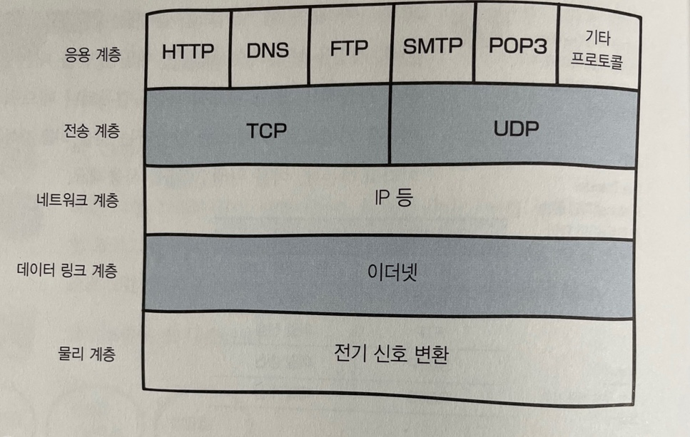

# 7장 응용 계층 : 애플리케이션에 데이터 전송하기

---

## LESSON 28. 응용 계층의 역할

> OSI 모델의 응용 계층에 대해서 알아보자.

### 1. 응용 계층의 역할

크롬(웹 브라우저)을 통해 웹 검색을 하고, G mail이나 naver mail과 같은 메일 프로그램을 사용해 본 경험이 있을 것이다. 이것을 애플리케이션이라고 하는데 애플리케이션은 사용자가 하고 싶은 일을 할 수 있도록 도와준다.

이러한 애플리케이션은 **서비스**를 요청하는 측(사용자 측)에서 사용하는 애플리케이션으로 분류할 수 있다.

일반적으로 서비스를 이용하는(요청하는) 측을 **클라이언트**, 서비스를 제공하는 측을 **서버**라고 한다.

이러한 애플리케이션은 **응용 계층**에서 동작한다.

여기서 응용 계층은 5 계층의 세션 계층과 6 계층의 표현 계층을 포함하는 것으로 생각한다.

응용 계층에서는 클라이언트의 요청을 전달하기 위해 통신 대상(서버 등)이 이해할 수 있는 메시지(데이터)로 변환하고 전송 계층으로 전달하는 역할을 한다.

클라이언트 측 애플리케이션이 서버 측 애플리케이션과 통신하려면 응용 계층의 **프로토콜**을 사용해야 한다.

| 프로토콜 |      내용      |
| :------: | :------------: |
|   HTTP   | 웹 사이트 접속 |
|   DNS    |   이름 해석    |
|   FTP    |   파일 전송    |
|   SMTP   |   메일 송신    |
|   POP3   |   메일 수신    |

위 표와 같이 웹 사이트를 볼 때는 **HTTP**, 파일을 전송할 때는 **FTP** 등 각각 다른 프로토콜을 사용한다. 또한 네트워크에서 컴퓨터나 네트워크 장비에 붙여진 이름을 기반으로 IP 주소를 알아내는 것을 **Name resolution(이름 해석)**이라고 하는데 이를 위해 **DNS**를 사용한다.

응용 계층은 각가의 애플리케이션에 대응되는 데이터를 전송하는 역할을 한다. 그리고 응용 계층에서 보내려는 데이터는 하위 계층인 전송, 네트워크, 데이터 링크, 물리 계층 순서로 처리된다.

* Lesson 28 정리
  * 서비스를 요청하는 측을 클라이언트, 서비스를 제공하는 측을 서버라고 한다.
  * 클라이언트에서 사용하는 애플리케이션과 서버에서 사용되는 서버 프로그램 간의 통신은 응용 계층의 프로토콜을 사용한다.
  * 응용 계층의 주요 프로토콜에는 HTTP, SMTP, DNS, POP3, FTP 등이 있다.

