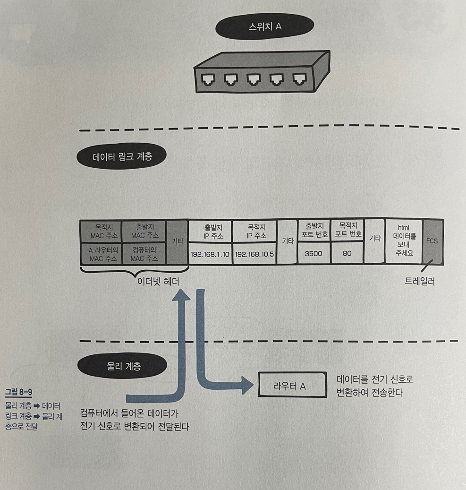

# 8장 네트워크의 전체 흐름 살펴보기

---

## LESSON 33. 스위치와 라우터에서의 데이터 전달과 처리

> 스위치와 라우터에서 데이터가 처리되는 과정을 알아보자.

### 1. 스위치에서의 데이터 전달과 처리

스위치는 **데이터 링크 계층**에서 데이터를 **전기 신호**로 변환하여 라우터로 전송한다.

스위치 즉 데이터 링크 계층에서 전달되는 패킷은 이더넷 헤더와 트레일러가 있다는 것을 잘 기억하자.

### 2. 라우터에서의 데이터 전달과 처리

스위치에서 데이터가 **전기 신호**로 변환되어 케이블을 통해 흘러가 라우터에 도착하면 라우터는 **데이터 링크 계층**에서 이더넷 프레임의 **목적지 MAC 주소**와 자신의 MAC 주소를 비교한다. 이 때 주소가 같으면 이더넷 헤더와 트레일러를 분리하는 역캡슐화를 수행한다. 다음으로 **네트워크 계층**에 전달하고 자신의 **라우팅 테이블**과 **목적지 IP 주소**를 비교한다.

라우터의 라우팅 테이블에서 목적지 IP 주소의 경로를 알 수 있으므로 라우팅을 할 수 있다. 따라서 출발지 IP 주소 예)192.168.1.10을 라우터의 외부 IP 주소(실제로는 WAN 측)인 172.16.0.1로 변경한다.

그런 다음 **데이터 링크 계층**으로 전달하여 목적지의 라우터로 보내지도록 이더넷 헤더와 트레일러를 붙인 후에 **물리 계층**에서 데이터를 전기 신호로 변환하여 네트워크로 전달한다.

그 다음 데이터는 전기신호 형태로 출발지 라우터에서 목적지 라우터로 전달된다.

그 후 목적지 라우터에서는 이더넷 프레임의 목적지 MAC 주소와 자신의 MAC 주소를 비교한다. 주소가 같으면 이더넷 헤더와 트레일러를 역캡슐화하여 네트워크 계층으로 전송한다.

네트워크 계층에서는 자신의 라우팅 테이블과 목적지 IP 주소를 비교한다.

* Lesson 33 정리
  * 스위치 내에 대응되는 OSI 모델의 계층은 물리 계층과 데이터 링크 계층이다.
  * 라우터 내에 대응되는 OSI 모델의 계층은 물리 계층, 데이터 링크 계층, 네트워크 계층이다.