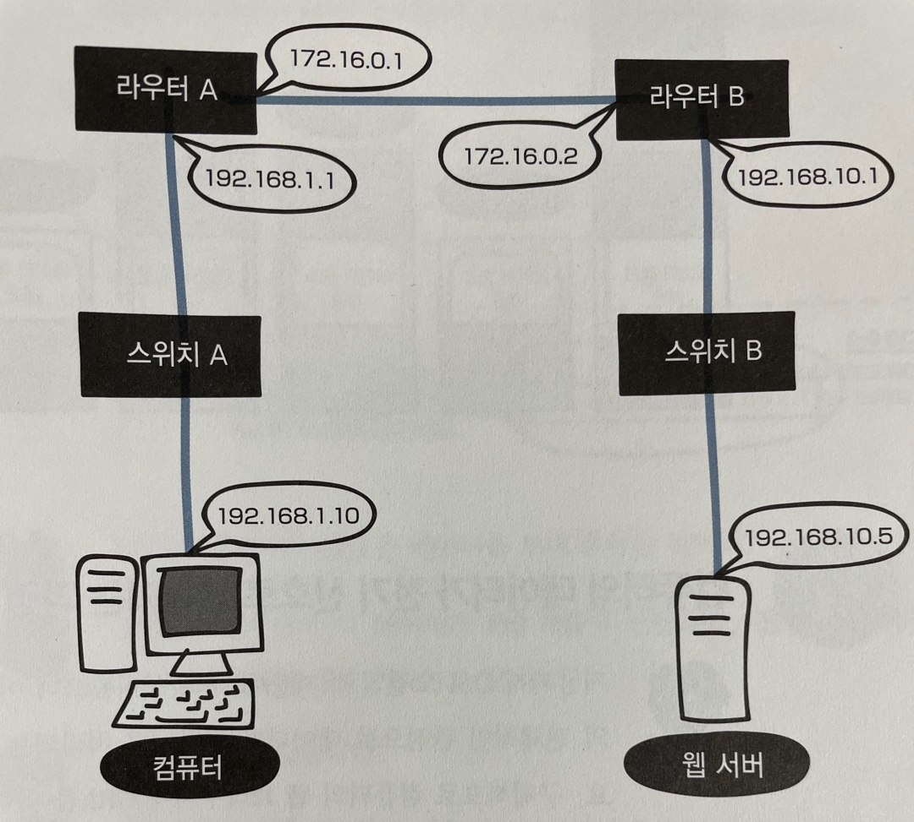
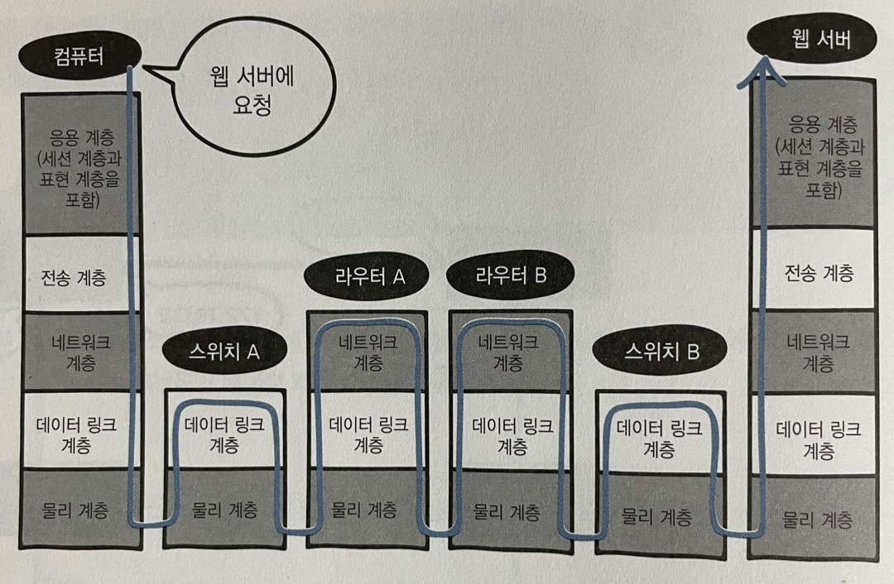
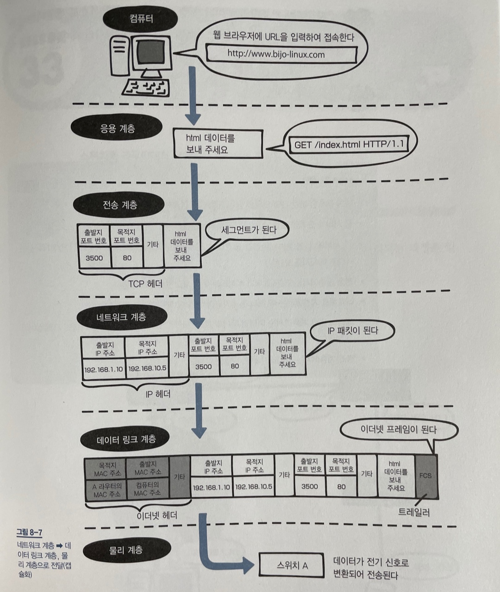

# 8장 네트워크의 전체 흐름 살펴보기

---

## LESSON 32. 랜 카드에서의 데이터 전달과 처리

> 2 ~ 7장까지 OSI 모델의 계층에 대해 알아봤다. 이번에는 웹 사이트에 방문했을 때 이루어지는 전체적인 데이터 처리 과정에 대해 알아보자.

### 1. 네트워크의 구성

* 물리 계층 : 데이터를 전기 신호로 변환하는 데 필요함

* 데이터 링크 계층 : LAN에서 데이터를 송수신하는 데 필요함

* 네트워크 계층 : 다른 네트워크에 있는 목적지에 데이터를 전달하는 데 필요함

* 전송 계층 : 목적지에 데이터를 정확하게 전달하는 데 필요함

* 응용 계층 (세션 계층 + 표현 계층) : 애플리케이션 등에서 사용하는 데이터를 송수신하는 데 필요함

위 이미지는 네트워크의 구성을 나타낸 그림이다. 이 그림은 몇 개의 네트워크로 나누어져있는지 알아보자.

192.168.1.10/24, 172.16.0.0/16, 192.168.10.0/24로 총 세 개이다.

위 그림은 OSI 모델로 나타낸 네트워크 구성이다.

### 2. 컴퓨터의 데이터가 전기 신호로 변환되는 과정

OSI 모델의 전체적인 관점으로 데이터가 전달되고 처리되는 과정을 살펴보자. 구체적으로 컴퓨터의 웹 브라우저에 URL을 입력할 때부터 웹 서버에 도착할 때까지 이루어지는 OSI 모델의 **캡슐화**와 **역캡슐화**에 대해 알아보자.

먼저 컴퓨터에서 OSI 모델의 캡슐화가 이루어진다. 웹 사이트에 접속해야 하므로 **응용 계층**에서 시작한다. 웹 브라우저에 URL을 입력하고 엔터 키를 누르면 캡슐화가 시작된다. 단 **3-way handshake**는 이미 완료되어 연결이 확립되어 있다고 가정한다.

컴퓨터에서 웹 브라우저를 이용하여 웹 서버의 웹 사이트에 접속하기 위한 요청을 보낼 때 사용하는 것이 HTTP 프로토콜이다. 응용 계층에서는 웹 서버에 있는 html 데이터를 얻어야 하므로  `GET /index.html HTTP/1.1 ~`과 같은 **HTTP 메세지**를 보낸다.

위 그림과 같은 구조로 전송이 된다.

* Lesson 32 정리
  * 웹에 접속할 때는 OSI 모델의 상위 계층부터 캡슐화가 이루어진다.
  * 웹 서버에 요청을 보낼 때는 HTTP를 사용한다.
  * 웹 서버에 있는 html 파일을 요청하는 경우에는 GET / index.html HTTP/1.1과 같은 HTTP 메세지를 보낸다.
  * 전송 계층에서는 TCP 헤더가 추가되며 이를 세그먼트라고 부른다.
  * 네트워크 계층에서는 IP헤더가 추가되며 이를 IP 패킷이라고 부른다.
  * 데이터 링크 계층에서는 이더넷 헤더와 트레일러(FCS)가 추가되며 이를 이더넷 프레임이라고 한다.
  * 물리 계층에서는 데이터가 전기 신호로 변환되어 전송된다.