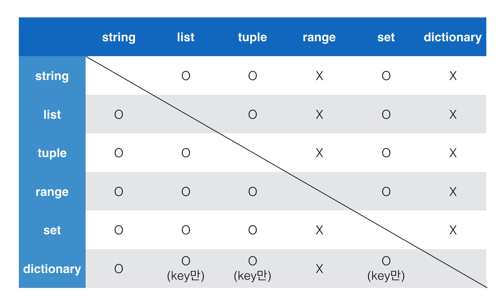

# Python 알지만 아는 게 아니였던 몰랐던 것들


### 데이터 타입

* 숫자 타입
* 글자 타입
* 참/ 거짓 타입

----

**실수 연산 오차 없애기**

파이썬에서 `0.1 + 0.2 `의 값은 `0.3`이 아니다. 그 이유는 파이썬은 실수를 부동소수점 방식으로 표현하는데 부동소수점은 실수를 정확히 표현할 수 없는 문제가 있다. 따라서 정확히 `0.3`이 아닌 `0.300000000004`가 나온다.

따라서 다음과 같은 방법으로 문제를 해결할 수 있다.

1. `round()`함수 사용

   ```python
   a = 0.1 + 0.2
   b = 0.3
   
   print(round(a,1) == b)		# => True
   ```

2. `1e-10 = 0.00000000001`과 비교

   ```python
   a = 0.1 + 0.2
   b = 0.3
   
   abs(a - b) <= 1e-10		# => True
   ```

3. `sys.float_info.epsilon` 모듈 사용

   ```python
   import sys
   
   a = 0.1 + 0.2
   b = 0.3
   
   abs(a - b) <= sys.float_info.epsilon	# => True
   ```

4. `math` 모듈 사용 => 파이썬 3.5부터 활용 가능

   ```python
   import math
   
   a = 0.1 + 0.2
   b = 0.3
   
   math.isclose(a,b)		# => True
   ```

5. `Decimal` 모듈 사용

   ```python
   from decimal import Decimal
   
   a = Decimal('0.1') + Decimal('0.2')
   
   print(a)		# => 0.3
   ```

   


---

####  `is` 연산자

```python
a = []
b = []

print(a == b)		# => True
print(a is b)		# => False
```

`is`연산자를 통해 동일한 object(객체)인지 확인할 수 있다. 하지만 의도적으로 공백 없는 알파벳 문자열은 같게끔 해놨고, 특정 범위(256까지)의 숫자 id 값은 동일하다.

```python
a = 1004
b = 1004
c = 256
d = 256
print(a is b)		# => False
print(c is d)		# => True
```


---

#### 연산자 우선순위

1. `()`을 통한 grouping
2. Slicing
3. Indexing
4. 제곱연산자 `**`
5. 단항연산자 `+`, `-` (음수/양수 부호)
6. 산술연산자 `*`, `/`, `%`
7. 산술연산자 `+`, `-`
8. 비교연산자, `in`, `is`
9. `not`
10. `and`
11. `or`

```python
print(-3 ** 6)		# => -729 (** 연산자가 우선순위에 있기 때문)

print((-3)** 6)		# => 729
```


---

#### Tuple( 튜플 )

tuple에 값을 넣을 때 `('hello', )`로 뒤에 값이 없더라도 '쉼표'를 넣어줘야 된다는 것을 책에서 본 적이 있다. 그 이유를 몰랐는데 이제야 알았다. 그 이유는

```python
a = ('hello')
b = ('hello',)

print(type(a))		# => <class 'str'>
print(type(b))		# => <class 'tuple'>
```

이렇게 같은 문자열을 튜플에 넣어도 쉼표가 있고 없고에 따라서 Type이 str이 될 수 있고 tuple이 될 수 있기 때문이다.


---

#### Container

> 값을 여러 개 저장할 수 있는 것( 객체 )

* Sequence(시퀀스)형 : 순서가 있는(ordered) 데이터		=> 정렬(sorted) 되었다는 뜻은 아님.
* Non-Sequence(비 시퀀스)형 : 순서가 없는(unordered) 데이터


#### Sequence(시퀀스) 형 컨테이너 특징 및 종류

특징 : 순서를 가질 수 있으며 특정 위치의 데이터를 가리킬 수 있다.

종류

	* 리스트
	* 튜플
	* range
	* 문자형
	* binary


#### Non-Sequence(비 시퀀스) 형 컨테이너 종류

종류

	* Set
	* Dictionary


#### Container  형 변환



 => 다른 컨테이너 들은 range와 dictionary로는 형변환이 어렵다고 생각하자. 하지만 range를 str, list, tuple, set으로, dictionary를 str, list, tuple,set으로는 형변환이 가능하다.


---

#### 데이터 분류

> `mutable` VS. `immutable`

데이터는 크게 변경 가능한(mutable) 것과 변경 불가능한(immutable) 것으로 나뉜다.

* **Mutable**
  * list
  * dict
  * set
* **Imutable**
  * Literal(리터럴)
    * 숫자(Number)
    * 글자(String)
    * 참/거짓(Boolean)
  * range()
  * tuple
  * frozenset

---

#### `for - else`문 사용하기

공부하기 전에는 `for - else` 문이 있는지도 몰랐다. 하지만 `if - else` 문이 있듯이 `for` 문에도 `else`를 사용할 수 있다.

```python
numbers = [1,3,7,8]
```


* pow() 내장함수 => 제곱 구하는 파이썬 내장 함수

  ```python
  print(pow(2,10))		# => 1024
  ```

  

---

#### 함수와 스코프

> 함수는 코드 내부에 공간(scope)를 생성한다. 함수로 생선된 공간은 **지역 스코프(local scope)**라고 불리며, 그 외의 공간은 **전역 스코프(global scope)**로 불린다.

* 전역 스코프(global scope) : 코드 어디에서든 참조할 수 있는 공간
* 지역 스코프(local scope) : 함수가 만든 스코프로 함수 내부에서만 참조할 수 있는 공간


###  Namespace 규칙

Local => Enclosed => Global => Built-in function		(LEGB)


### 함수의 변수

#### 	위치인자

```python
def a(a,b):
    return a+b

a(2,3)		# => 2와 3은 위치인자
```


#### 	기본 인자

```python
def a(a, b=0):		# => b = 0은 기본 인자
    return a+b
```

​	**기본인자는 항상 맨 뒤에 와야 된다.** 즉 기본 인자값을 가진느 인자 다음에 기본 값이 없는 인자를 사용할 수 없다.


#### 키워드 인자

```python
def hello(age, name = '익명'):
    print(f' hi i\'m {name}, {age} years old')
    
hello(name ='길동', age = 1000)		# => 키워드 인자 (직접 변수의 이름으로 특정 인자를 전달할 수 있음)
```

* 단 키워드 인자를 활용한 다음에 위치 인자를 활용할 수는 없음.

  ```python
  hello(age = 1000, 'bear')		# => 오류 발생
  ```

  

# OOP ( Object-Oriented Programming)

---

> 위키백과 : [객체란?](https://ko.wikipedia.org/wiki/%EA%B0%9D%EC%B2%B4_(%EC%BB%B4%ED%93%A8%ED%84%B0_%EA%B3%BC%ED%95%99)) 
>
> 컴퓨터 과학에서 객체 또는 오브젝트(object)는 클래스에서 정의한 것을 토대로 메모리(실제 저장공간)에 할당된 것으로 프로그램에서 사용되는 데이터 또는 식별자에 의해 참조되는 공간을 의미하며, 변수, 자료구조, 함수 또는 메소드가 될 수 있다.


## 1. 객체 (Object)

> python의 모든 것은 객체이다.
>
> 모든 객체는 타입(Type), 속성(attribute), 조작법(method)를 가진다.


### 1.2 속성(Attribute)과 메서드(Method)

* 속성(Attribute)은 객체(object)의 상태/데이터를 뜻한다.

**활용법**

<객체>.<속성>

ex) 3+4j.real

.real 은 속성을 나타내므로 객체가 반환되는 것이 아니다. 복소수 안의 real이라는 상태와 imag라는 상태가 있으므로 새로운 객체가 반환되는 것은 아님.


* 메서드(Method)
  * 특정 객체에 적용할 수 있는 행위(behavior)를 뜻한다.

**활용법**

<객체>.<조작법>()

ex) [3,2,1].sort()