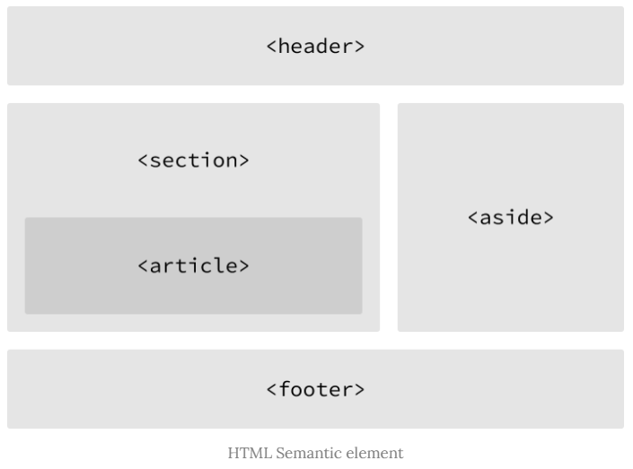

# HTML & CSS 스터디

* 스터디 참고 자료
  * [MDN web Docs](https://developer.mozilla.org/ko/)
  * [w3schools](https://www.w3schools.com/)

> 참고 [JSFiddle](https://jsfiddle.net/)

## HTML(Hyper Text Markup Language)

> Hyper : 텍시트 등의 정보가 동일 선상에 있는 것이 아니라 다중으로 연결되어 있는 상태
>
> Hyper Text : 참조(하이퍼링크)를 통해 사용자가 한 문서에서 다른 문서로 즉시 접근할 수 있는 텍스트
>
> Markup language : 특정 텍스트에 역할을 부여하는, 따라서 "마크업을 한다" 라고 하는 건 제목이 제목이라고 하고 본문이 본문이라고 마킹을 하는 것
>
> 

* 태그 등을 이용하여 문서나 데이터의 구조를 명시하는 언어
* 프로그래밍 언어와는 다르게 단순하게 데이터를 표현하기만 한다.


### DOM (Document Object Model)

- 문서의 구조화된 표현을 제공하며 프로그래밍 언어가 DOM 구조에 접근할 수 있는 방법을 제공하여 그들이 문서 구조, 스타일, 내용 등을 변경할 수 있게 도움
- DOM은 동일한 문서를 표현하고, 저장하고, 조작하는 방법을 제공
- 웹 페이지의 객체 지향 표현


### 요소(Element)

- HTML 요소는 시작 태그와 종료 태그 그리고 태그 사이에 위치한 내용으로 구성
  - 태그(Element 요소)는 컨텐츠(내용)를 감싸서 그 정보의 성격과 의미를 정의한다.

* 내용이 없는 태그들
  * br
  * hr
  * img
  * input
  * link
  * meta

- 요소는 중첩(nested)될 수 있다.
  - 이러한 중첩들로 하나의 문서를 완성해 나간다.
  - 그리고 항상 열고 닫는 태그 쌍이 잘 맞는지 확인한다.


### 속성(Attribute)

- 속성은 태그의 부가적인 정보가 들어온다.
- 요소는 속성을 가질 수 있으며 요소에 추가적 정보(이미지 파일의 경로, 크기 등)를 제공한다.
- 요소의 시작 태그에 위치해야 하며 **이름**과 **값**의 쌍을 이룬다.
- 태그와 상관없이 사용가능한 속성들(html global attribute)도 있다.

| Attribute |                         Description                          |
| :-------: | :----------------------------------------------------------: |
|    id     |  유일한 식별자(id)를 요소에 지정한다. 중복 지정이 불가하다.  |
|   class   | 스타일시트에 정의된 class를 요소에 지정한다. 중복 지정이 가능하다. |
|  hidden   | css의 hidden과는 다르게 의미상으로도 브라우저에 노출되지 않게 된다. |
|   lang    | 지정된 요소의 언어를 지정한다. 검색엔진의 크롤링 시 웹페이지의 언어를 인식할 수 있게 한다. |
|   style   |               요소에 인라인 스타일을 지정한다.               |
| tabindex  | 사용자가 키보드로 페이지를 내비게이션 시 이동 순서를 지정한다. |
|   title   |                 요소에 관한 제목을 지정한다.                 |


### Semantic tag(시맨틱 태그)

* HTML5에서 의미론적 요소를 담은 태그
* 장점
  1. 읽기 쉬워진다. (개발자)
     * 개발자가 의도한 요소의 의미가 명확히 드러나고 있다. 이것은 코드의 가독성을 높이고 유지보수를 쉽게 한다.
  2. 접근성이 좋아진다. (검색엔진 및 보조기술 -> 시력장애용 스크린 리더 => 더 나은 경험 제공)
     * HTML 문서는 html 언어 + 사람이 읽을 수 있는 content의 조합인데, 검색 엔진은 HTML 코드만 잘 읽는다.
     * 그래서 이 검색 엔진이 html을 잘 이해하도록 시맨틱 태그 사용이 권장되고, 그러면 검색 엔진도 무슨 내용인지 이해할 수 있게 된다.
* 요소
  * header : 문서 전체나 섹션의 헤더 (머릿말 부분)\
  * nav : 내비게이션
  * aside : 사이드에 위치한 공간, 메인 콘텐츠와 관련성이 적은 콘텐츠
  * article : 문서, 페이지, 사이트 안에서 독립적으로 구분되는 영역
  * footer : 문서 전체나 섹션의 마지막 부분
* Non semantic 요소는 `div`, `span` 등이 있으며 `h1`, `table` 태그들도 시맨틱 태그로 볼 수 있음




### Semantic Web(시맨틱 웹)

* 웹 상에 존재하는 수 많은 웹 페이지들에 메타데이터를 부여하여
* 기존의 단순한 데이터의 집합이었던 웹 페이지를 '의미'와 '관련성'을 가지는 거대한 데이터베이스로 구축하고자 하는 발상


a = anchor (링크)

href = hyper reference

ul = unordered list

ol = ordered list

i & em  = 이탤릭 채

input =  사용자로부터 데이터를 받음 타입 지정 가능!!


h1 태크 : 블록 속성 

div 태그 : 블록 속성

span 태그 : 인라인 속성


## CSS (Cascading Style Sheets)

----

HTML이 웹 사이트에서 화면에 표시되는 정보를 약속한 것이라고 했다면 `css`는 구체적으로 어떤 스타일로 요소가 표시 되는지를 정하는 규격이라고 할 수 있다.

초기 웹은 HTML 하나로 문서의 뼈대도 만들고 꾸미기도 함께 하였지만, 공통적인 디자인을 갖는 문서가 여럿 존재할 경우 하나의 디자인이 변경되면 모드 파일을 수정해야 하는 등의 번거로움이 있었다.

CSS는 이런 문제를 해결함과 동시에 웹 페이지의 내용과 스타일(표현)을 분리하여 역할 분담도 되는 효과를 가지고 있다.


### 사용법

CSS는 내부적으로 사용되는 문법은 동일하며, 어디에 기술하느냐의 차이가 존재한다. 이를 **CSS 정의 방법**이라고 한다.

CSS 정의 방법은 3가지가 있다.

1. HTML 태그의 `style 속성`을 사용하는 **inline**

   ```html
   <body>
       <h1 style="color: blue; font-size: 100px;">    <!--body 태그 안에 style 요소-->
           hello
       </h1>
   </body>
   ```

   

2. `<style>` 태그를 통해 HTML 문서 내부에 기술 (`<style>` 태그는 주로 `<head>` 태그 내부에 사용) : **내부참조**

   ```html
   <head>
       <style>
           h1 {
               color: blue;
               font-size: 100px;
           }
       </style>
   </head>
   ```

3. `.css`파일로 분리하여 HTML 문서에 연결 : **외부 참조(link file)**

   ```html
   <head>
       <title>example</title>
       <link rel = "stylesheet" href="./mystyle.css">
   </head>
   ```

   

### CSS Selector

* 기본 선택자
  * 전체 선택자( * ) , 요소 선택자
  * 클래스 선택자, 아이디 선택자, 속성 선택자
* 결합자 (Combination)
  * 자손 결합자, 자식 결합자
  * 일반 형제, 인접 형제 결합자


### CSS 적용 우선순위 (Cascading order)

* CSS 우선순위를 아래와 같이 그룹을 지어볼 수 있다.
  * 중요도 (Importance)
    * !important
  * 우선 순위
    * inline / id 선택자 / class 선택자 / 요소 선택자


### CSS 상속

- CSS는 상속을 통해 부모 요소의 속성을 자식에게 상속한다. (모두 상속하는 것은 아님)
  - 속성(property)중에는 상속이 되는 것과 되지 않는 것들이 있다.
  - 상속 예시
    - Text 관련 요소 (font, color, text-align), opacity, visibility 등
  - 상속 되지 않는 것 예시
    - box model 관련 요소 (width, height, margin, padding, border, box-sizing, display)
    - position 관련 요소 (position, top / right / bottom / left, z-index)

#### CSS position

* 문서 상에 요소를 배치하는 방법을 지정한다.
  * static(디폴트 값)
  * relative : 내가 원래 있어야 되는 위치로부터 이동하는 것 처럼
  * absolute : 부모를 대상으로 (절대적으로)이동
  * fixed : 무조건 고정 값 ( 스크롤을 내려도 위치는 유지 )


#### Box model 구성

* Margin : 테두리 바깥의 외부 여백,  배경색을 지정할 수 없다.

* Border : 테두리 영역

* Padding : 테두리 안쪽의 내부 여백 요소에 적용된 배경색, 이미지는 padding까지 적용

* content : 글이나 이미지 등 요소의 실제 내용

  ### box-sizing

  * 기본적으로 모든 요소의 <mark>box-sizing</mark>은 <mark>content-box</mark>
    * Padding을 제외한 순수 contents 영역만을 box로 지정
  * 다만, 우리가 일반적으로 영역을 볼 때 border까지의 너비를 100px로 보는 것을 원함
    * 그 경우 <mark>box-sizing</mark>을 <mark>border-box</mark>으로 설정


#### display

* `display : block`
  * 줄 바꿈이 일어나는 요소
  * 화면 크기 전체의 가로 폭을 차지한다.
  * 블록 레벨 요소 안에 인라인 레벨 요소가 들어갈 수 있음.

대표적인 블록레벨 요소

* div  /  ul, ol, li  / p  /  hr  /  form  /


* `display : inline`
  * 줄 바꿈이 일어나지 않는 행의 일부 요소
  * content 너비만큼 가로 폭을 차지한다.
  * `width`, `height`, `magin-top`, `margin-bottom`을 지정할 수 없다.
  * 상하 여백은 `line-height`로 지정한다.

대표적인 인라인 레벨 요소

* span  /  a  /  img  /  input,  label  /  b,  em,  i,  strong 등


* `display : inline-block`
  * block과 inline 레벨 요소의 특징을 모두 갖는다.
  * inline처럼 한 줄에 표시 가능하며,
  * block처럼 width, height, margin 속성을 모두 지정할 수 있다.


* `display : none`
  * 해당 요소를 화면에 표시하지 않는다. (공간조차 사라진다.)
  * 이와 비슷한 `visibility : hidden`은 해당 요소가 공간은 차지하나 화면에 표시만 하지 않는다.


### CSS position

- 문서 상에서 요소를 배치하는 방법을 지정한다.

- <mark>static</mark> : 디폴트 값(기준 위치)

  - 기본적인 요소의 배치 순서에 따름 (좌측 상단)
  - 부모 요소 내에서 배치될 때는 부모 요소의 위치를 기준으로 배치 된다.

  ---

* 아래는 좌표 property(top , bottom, left, right)를 사용하여 이동이 가능하다. (음수 값도 가능)
  * <mark>relative</mark> : static 위치를 기준으로 이동 (상대 위치)
  * <mark>absolute</mark> : static이 아닌 가장 가까이 있는 부모/조상 요소를 기준으로 이동(고정 위치)
  * <mark>fixed</mark> : 부모 요소와 관계 없이 브러우저를 기준으로 이동(고정 위치) => 스크롤 시에도 같은 곳에 위치

